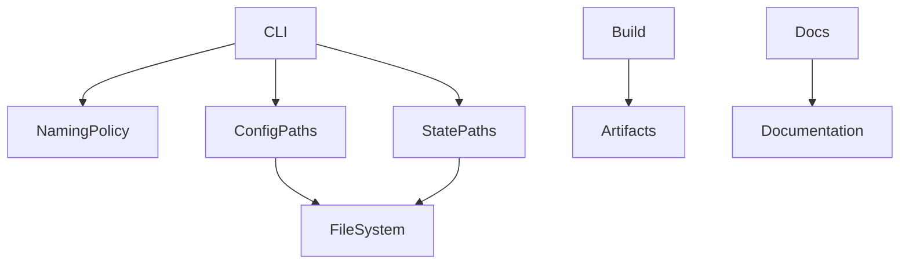

# Design Document

## Overview
本機能は、セキュリティソフトの誤検知を避けるためにアプリケーション名称をstratumからstrataへ統一する。CLI実行名、設定ファイル、状態ディレクトリ、配布物、ドキュメント表記を一貫して変更する。

対象ユーザーはCLI利用者および配布物の利用者であり、既存のスキーマ管理フロー（init/generate/apply/rollback/status/validate/export）を変更せずに名称のみを更新する。

### Goals
- CLI実行名と表示名を`strata`へ統一する
- `.strata.yaml`と`.strata/`を標準パスとし旧名称の出力を禁止する
- 配布物とドキュメント表記を`strata`へ統一する

### Non-Goals
- 旧名称の互換実行（`stratum`コマンドとしての継続利用）
- 既存ユーザー向けの詳細な移行ガイドの整備
- 機能追加や挙動変更（コマンドの処理内容は維持）

## Requirements Traceability

| Requirement | Summary | Components | Interfaces | Flows |
|-------------|---------|------------|------------|-------|
| 1.1 | `strata`で主要コマンドが実行可能 | CLICommandSurface | CLI | - |
| 1.2 | ヘルプ/バージョンの名称統一 | CLICommandSurface | CLI | - |
| 2.1 | 初期化で`.strata.yaml`を生成 | ConfigPathResolver | Service | - |
| 2.2 | 状態保存を`.strata/`に統一 | StateDirectoryResolver | Service | - |
| 2.4 | 旧名称パスへ書き込まない | ConfigPathResolver, StateDirectoryResolver | Service | - |
| 3.1 | 出力/エラーメッセージで`strata`を使用 | CLICommandSurface | CLI | - |
| 3.2 | ドキュメント表記の統一 | DocumentationSet | Doc | - |
| 4.1 | 実行ファイル名を`strata`に変更 | PackageMetadata | Build | - |
| 4.2 | クレート/メタデータを`strata`へ変更 | PackageMetadata | Build | - |
| 4.3 | 配布/インストール手順の更新 | PackageMetadata, DocumentationSet | Build, Doc | - |

## Architecture

### Existing Architecture Analysis
- CLI/Services/Core/Adaptersのレイヤー分離を維持する
- CLIでコマンド定義と表示文言を集中管理している
- 設定ファイルはCore定義のパス定数に依存している

### Architecture Pattern & Boundary Map


**Architecture Integration**:
- Selected pattern: 既存レイヤー拡張（CLI/Services/Core）で名称ポリシーを集約
- Domain/feature boundaries: 命名ポリシーはCore、表示はCLI
- Existing patterns preserved: Clean Architecture、CLIコマンド分離
- New components rationale: 旧名称検出と命名ポリシーを明確に分離するため
- Steering compliance: 依存方向（CLI → Services → Core）を維持

### Technology Stack

| Layer | Choice / Version | Role in Feature | Notes |
|-------|------------------|-----------------|-------|
| Frontend / CLI | clap 4.5 | コマンド名/ヘルプ表示の更新 | 既存設定を更新 |
| Backend / Services | Rust | 設定/状態パスの統一ロジック | 既存モジュールに追加 |
| Data / Storage | Filesystem | `.strata.yaml`と`.strata/`の生成/参照 | 旧パスは参照のみ |
| Infrastructure / Runtime | Cargo | クレート名とバイナリ名の更新 | ビルド/配布へ影響 |

## Components and Interfaces

| Component | Domain/Layer | Intent | Req Coverage | Key Dependencies (P0/P1) | Contracts |
|-----------|--------------|--------|--------------|--------------------------|-----------|
| CLICommandSurface | CLI | コマンド名と表示文言の統一 | 1.1, 1.2, 3.1 | NamingPolicy (P0) | Service |
| ConfigPathResolver | Core | 設定ファイルパスの標準化 | 2.1, 2.4 | NamingPolicy (P0) | Service |
| StateDirectoryResolver | Core | 状態ディレクトリパスの標準化 | 2.2, 2.4 | NamingPolicy (P0) | Service |
| PackageMetadata | Build | クレート名/バイナリ名/配布名の更新 | 4.1, 4.2, 4.3 | Cargo.toml (P0) | State |
| DocumentationSet | Docs | ドキュメント表記の統一 | 3.2, 4.3 | README/BUILDING等 (P1) | State |

### Core

#### NamingPolicy

| Field | Detail |
|-------|--------|
| Intent | 名称・パスの単一ソースを提供 |
| Requirements | 1.2, 2.1, 2.2, 2.4, 3.1 |

**Responsibilities & Constraints**
- `strata`を正として全参照元に提供する

**Dependencies**
- Inbound: CLICommandSurface — 表示名参照 (P0)
- Inbound: ConfigPathResolver — 設定パス参照 (P0)
- Inbound: StateDirectoryResolver — 状態パス参照 (P0)

**Contracts**: Service [x]

##### Service Interface
```rust
pub struct NamingProfile {
    pub app_name: String,
    pub config_path: String,
    pub state_dir: String,
    pub binary_name: String,
}

pub trait NamingPolicy {
    fn current() -> NamingProfile;
}
```
- Preconditions: なし
- Postconditions: すべての名称が`strata`に統一されている
- Invariants: すべての参照が`strata`系名称に統一される

**Implementation Notes**
- Integration: CLI/Config/Stateの各参照点に集約
- Validation: 起動時にprofileの一貫性を確認
- Risks: 定数の二重管理を避ける

## Data Models

### Domain Model
- NamingProfile: 現行名称の参照を集約する値オブジェクト

## Error Handling

### Error Strategy
- 設定ファイル未検出など既存エラー処理は維持する

### Error Categories and Responses
- User Errors: 不正な設定パス指定は既存のエラーメッセージを継続
- System Errors: ファイルI/O失敗は既存のエラー経路に従う

## Testing Strategy

- Unit Tests: 命名ポリシーの定数整合性、設定パスの解決
- Integration Tests: `init`で`.strata.yaml`生成、旧名称パスに書き込まないことの検証
- E2E Tests: `strata`コマンドで既存主要コマンドが動作

## Optional Sections

### Security Considerations
- 旧名称がセキュリティソフトにブロックされる問題への対策として、表示/生成物から旧名称を排除する
