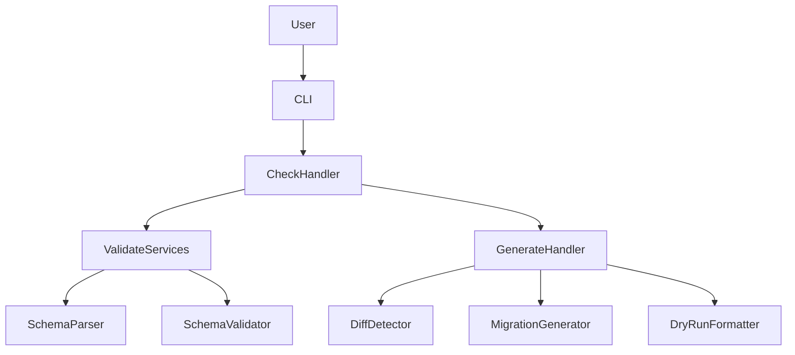
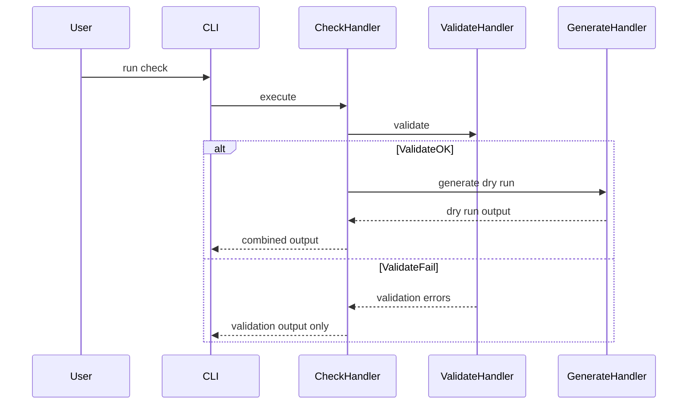

# 設計書: check-command-wrapper

**作成日**: 2026-02-02
**仕様ID**: check-command-wrapper
**ステータス**: Draft

---

## Overview

本機能は Strata CLI に `check` サブコマンドを追加し、`validate` と `generate --dry-run` を安全に連結して実行できるようにする。これにより、スキーマ整合性の検証と生成結果の事前確認を単一コマンドで完結させる。

対象ユーザーは Strata CLI を CI やローカル検証に利用する開発者であり、失敗時の原因特定と成功時の確認を迅速に行えることが重要である。既存の `validate` と `generate` の意味論を維持しつつ、入力継承と出力統合を提供する。

### Goals
- `check` が `validate` → `generate --dry-run` を順に実行し、成功/失敗を明確に示す
- `validate` と `generate --dry-run` の入力設定を統一して受け付ける
- Text/JSON 出力の一貫した構造化結果を提供する

### Non-Goals
- 実際のマイグレーション適用
- `generate` の通常実行（ファイル生成）
- `validate`/`generate` 以外の新しい検証ルール追加

## Architecture

### Existing Architecture Analysis
- CLI 層は `commands/{command}.rs` 単位でハンドラーを実装し、`CommandOutput` で Text/JSON を切替える。
- `validate` は `schema_dir` 上書きに対応する一方、`generate` は config の schema_dir 固定であり入力継承に制約がある。
- `validate` は JSON 失敗時に stdout へ JSON を出力する副作用があり、合成コマンドでは出力統合の設計が必要。

### Architecture Pattern & Boundary Map

**Architecture Integration**:
- Selected pattern: CLI 層のオーケストレーション（既存パターン踏襲）
- Domain/feature boundaries: `check` は CLI 層に限定し、サービス層の検証と既存 generate dry-run 出力を調停する
- Existing patterns preserved: `CommandOutput` による出力切替、`CommandContext` による設定解決
- New components rationale: `CheckCommandHandler` と `CheckOutput` により出力統合と制御を明確化する
- Steering compliance: Clean Architecture の CLI 層責務を維持



### Technology Stack

| Layer | Choice / Version | Role in Feature | Notes |
|-------|------------------|-----------------|-------|
| CLI | Rust 1.92, clap 4.5 | `check` サブコマンド追加と引数処理 | 既存パターン踏襲 | 
| Services | strata-db services | validate 実行の再利用 | `SchemaParserService` / `SchemaValidatorService` | 
| Output | serde 1.x | JSON 構造化出力 | 新規 `CheckOutput` | 

## System Flows



- validate 成功時のみ generate dry-run を実行する。
- validate 失敗時は generate を実行しない。

## Requirements Traceability

| Requirement | Summary | Components | Interfaces | Flows |
|-------------|---------|------------|------------|-------|
| 1.1 | check 実行時に validate を実行 | CheckCommandHandler | CheckService | CheckSequence |
| 1.2 | validate 成功時に dry-run 実行 | CheckCommandHandler, GenerateCommandHandler | CheckService | CheckSequence |
| 1.3 | validate 失敗時は dry-run を行わない | CheckCommandHandler | CheckService | CheckSequence |
| 1.4 | validate/generate の意味論一致 | CheckCommandHandler | CheckService | CheckSequence |
| 2.1 | validate に入力/設定を継承 | CheckCommandHandler | CheckService | CheckSequence |
| 2.2 | generate dry-run に入力/設定を継承 | CheckCommandHandler, GenerateCommandHandler | CheckService | CheckSequence |
| 2.3 | 主要入力経路の受け付け | CheckCommandHandler | CheckService | CheckSequence |
| 3.1 | validate 成功の明示 | CheckOutput | CheckOutput | CheckSequence |
| 3.2 | dry-run 成功の概要表示 | CheckOutput | CheckOutput | CheckSequence |
| 3.3 | validate 失敗理由の表示 | CheckOutput | CheckOutput | CheckSequence |
| 3.4 | dry-run 失敗理由の表示 | CheckOutput | CheckOutput | CheckSequence |
| 4.1 | 両成功時に成功コード | CheckCommandHandler | CheckService | CheckSequence |
| 4.2 | validate 失敗時に失敗コード | CheckCommandHandler | CheckService | CheckSequence |
| 4.3 | dry-run 失敗時に失敗コード | CheckCommandHandler | CheckService | CheckSequence |
| 5.1 | マイグレーション適用しない | GenerateCommandHandler | GenerateCommand | CheckSequence |
| 5.2 | 破壊的変更を行わない | GenerateCommandHandler | GenerateCommand | CheckSequence |

## Components and Interfaces

### コンポーネント概要

| Component | Domain/Layer | Intent | Req Coverage | Key Dependencies (P0/P1) | Contracts |
|-----------|--------------|--------|--------------|--------------------------|-----------|
| CheckCommandHandler | CLI | validate と generate dry-run の統合実行 | 1.1-5.2 | SchemaParserService (P0), SchemaValidatorService (P0), GenerateCommandHandler (P0) | Service, State |
| CheckOutput | CLI | 結果の構造化出力 | 3.1-3.4 | serde (P1) | State |
| GenerateCommandHandler 拡張 | CLI | schema_dir 上書きの受け入れ | 2.2, 2.3 | CommandContext (P0) | Service |

### CLI

#### CheckCommandHandler

| Field | Detail |
|-------|--------|
| Intent | validate 成功時のみ generate dry-run を実行し、出力を統合する |
| Requirements | 1.1, 1.2, 1.3, 1.4, 2.1, 2.2, 2.3, 4.1, 4.2, 4.3, 5.1, 5.2 |

**Responsibilities & Constraints**
- validate の実行と結果収集（失敗時は generate を実行しない）
- generate dry-run の実行と出力の統合
- Text/JSON 出力の統一と終了コード制御
- `--schema-dir` を `validate` と同等に受け付け、`generate` にも伝播する
- `--config` などの既存グローバル設定は `CommandContext` 経由で継承する

**Dependencies**
- Inbound: `CLI` — 引数解析と dispatch (P0)
- Outbound: `SchemaParserService` — スキーマ読込 (P0)
- Outbound: `SchemaValidatorService` — 検証実行 (P0)
- Outbound: `GenerateCommandHandler` — dry-run 実行 (P0)
- External: `serde` — JSON 構造化出力 (P1)

**Contracts**: Service [x] / API [ ] / Event [ ] / Batch [ ] / State [x]

##### Service Interface
```rust
pub struct CheckCommand {
    pub project_path: std::path::PathBuf,
    pub config_path: Option<std::path::PathBuf>,
    pub schema_dir: Option<std::path::PathBuf>,
    pub format: crate::cli::OutputFormat,
}

pub struct CheckOutput {
    pub validate: ValidateOutput,
    pub generate: Option<GenerateOutput>,
    pub summary: CheckSummary,
}

pub struct CheckSummary {
    pub validate_success: bool,
    pub generate_success: Option<bool>,
}

pub enum CheckErrorStage {
    Validate,
    Generate,
}

pub struct CheckError {
    pub stage: CheckErrorStage,
    pub message: String,
}

pub trait CheckService {
    fn execute(&self, command: &CheckCommand) -> Result<CheckOutput, CheckError>;
}
```
- Preconditions: 設定ファイルが存在し、schema_dir が解決可能である
- Postconditions: validate 成功時のみ generate dry-run が実行される
- Invariants: `dry-run` のみ実行され、ファイルは作成しない

**Implementation Notes**
- Integration: `validate` はサービス層を直接利用し、副作用のない出力を構成する
- Validation: validate のエラーは CheckOutput に含め、generate は `None` とする
- Risks: `schema_dir` 上書きが generate に伝わらない場合、要件 2 が満たせない

#### GenerateCommandHandler 拡張

| Field | Detail |
|-------|--------|
| Intent | check からの schema_dir 上書きを受け付ける |
| Requirements | 2.2, 2.3 |

**Responsibilities & Constraints**
- `GenerateCommand` に `schema_dir` オプションを追加し、`load_schemas` で優先的に利用する
- 既存 CLI の挙動（未指定時は config の schema_dir）を維持する

**Dependencies**
- Inbound: `CheckCommandHandler` — schema_dir 上書き (P0)
- Outbound: `CommandContext` — パス解決 (P0)

**Contracts**: Service [x] / API [ ] / Event [ ] / Batch [ ] / State [ ]

##### Service Interface
```rust
pub struct GenerateCommand {
    pub project_path: std::path::PathBuf,
    pub config_path: Option<std::path::PathBuf>,
    pub schema_dir: Option<std::path::PathBuf>,
    pub description: Option<String>,
    pub dry_run: bool,
    pub allow_destructive: bool,
    pub verbose: bool,
    pub format: crate::cli::OutputFormat,
}
```
- Preconditions: schema_dir が指定されている場合は存在する
- Postconditions: dry-run 実行時はファイル生成を行わない
- Invariants: 既存 generate の挙動（dry-run, allow-destructive）を維持する

**Implementation Notes**
- Integration: `GenerateCommandHandler::load_schemas` で `schema_dir` を優先解決する
- Validation: schema_dir が存在しない場合は明確なエラーメッセージを返す
- Risks: 既存 CLI との互換性を損なわないようデフォルト動作を維持する

#### CheckOutput

| Field | Detail |
|-------|--------|
| Intent | validate と generate dry-run の結果を統合し、Text/JSON で一貫した表現を提供する |
| Requirements | 3.1, 3.2, 3.3, 3.4 |

**Responsibilities & Constraints**
- Text 出力でセクションを分離し、成功/失敗を明示する
- JSON 出力で `validate` と `generate` をネストし、機械判定を容易にする
- validate 失敗時は `generate: null` を返し、失敗箇所を明確化する

**Dependencies**
- Inbound: `CheckCommandHandler` — 出力生成 (P0)
- External: `serde` — JSON シリアライズ (P1)

**Contracts**: Service [ ] / API [ ] / Event [ ] / Batch [ ] / State [x]

**Implementation Notes**
- Integration: Text 出力は `validate` セクション → `generate dry-run` セクションの順で結合する
- Validation: validate 失敗時は generate を省略し、失敗理由を明示する
- Risks: JSON と Text の内容差分が拡大しないよう共通サマリーを持たせる

## Data Models

### Domain Model
- ドメインモデルの変更はない
- 既存の `Schema` / `SchemaDiff` / `Migration` に変更を加えない

### Logical Data Model
- 追加の永続データなし

## Error Handling

### Error Strategy
- validate 失敗時: `CheckErrorStage::Validate` を返し、`generate` を実行しない
- generate 失敗時: `CheckErrorStage::Generate` を返し、dry-run の失敗理由を明示する
- JSON 出力時も `CheckOutput` と `ErrorOutput` が一貫した形式を持つようにする

### Error Categories and Responses
- User Errors: スキーマ不正、パス不正 → validate の詳細エラーを返す
- System Errors: 設定ファイル不在、読み込み失敗 → 明確なエラーメッセージ
- Business Logic Errors: dry-run 生成失敗 → generate の失敗理由を表示

### Monitoring
- `tracing` による既存のログ出力に準拠し、`check` 実行開始/完了を debug レベルで記録する

## Testing Strategy

- Unit Tests: `CheckCommandHandler` の制御フロー（validate 成功/失敗分岐）
- Unit Tests: JSON 出力の構造（validate/generate ネスト、summary）
- Integration Tests: `strata check` の CLI パースと実行（成功/失敗）
- Integration Tests: schema_dir 上書き時の `check` 動作
- E2E Tests: dry-run 出力におけるセクション分割
