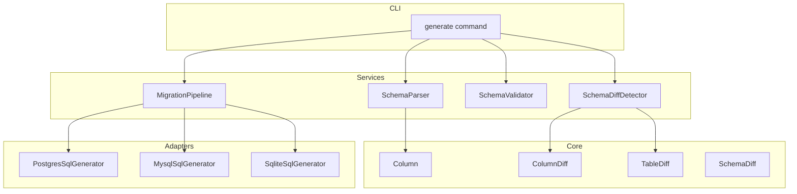
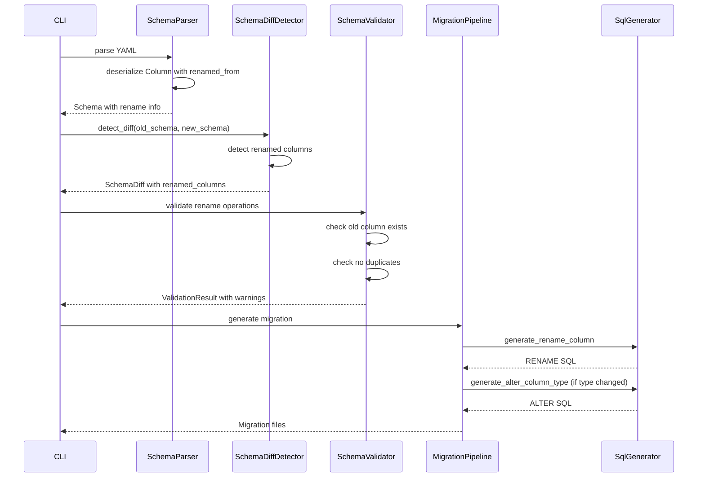
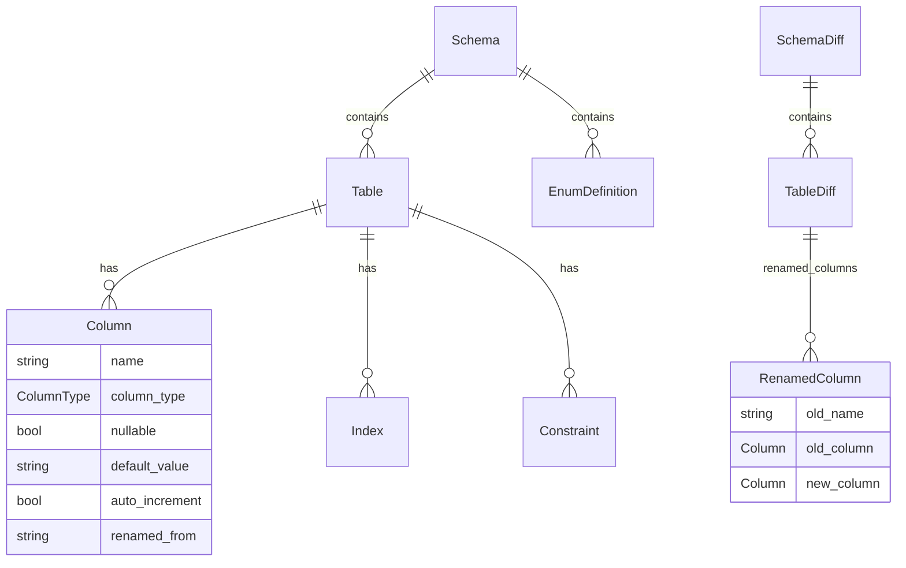

# Design Document

## Overview

**Purpose**: カラムリネーム機能は、YAMLスキーマ定義でカラム名の変更を明示的に指定し、データを保持したまま安全にマイグレーションを実行できるようにする機能です。

**Users**: バックエンドエンジニアがスキーマ変更時にカラム名を変更する際、従来のDROP+ADDではなくRENAME操作としてマイグレーションを生成できます。

**Impact**: 既存のスキーマ差分検出・SQL生成パイプラインを拡張し、カラムリネームを新たな変更種別として認識・処理します。

### Goals
- `renamed_from`属性によるカラムリネームの明示的指定
- PostgreSQL/MySQL/SQLite各方言でのリネームSQL生成
- リネームと型変更の同時処理（適切な実行順序）
- 検証エラー・警告による安全なマイグレーション生成

### Non-Goals
- カラム名の自動推測（ヒューリスティックによるリネーム検出）
- テーブルリネームのサポート（別機能として検討）
- SQLite 3.25未満のサポート（テーブル再作成が必要）

## Architecture

### Existing Architecture Analysis

現在のStratumアーキテクチャは以下のレイヤ構造を持ちます：

```
CLI Layer → Services Layer → Core Domain → Adapters
```

カラムリネーム機能は以下のコンポーネントに影響します：

| レイヤ | コンポーネント | 現状 | 必要な変更 |
|--------|--------------|------|-----------|
| Core | `Column` | `renamed_from`なし | フィールド追加 |
| Core | `ColumnDiff` | リネーム未対応 | `ColumnChange::Renamed`追加 |
| Core | `TableDiff` | `modified_columns`のみ | `renamed_columns`追加 |
| Services | `SchemaDiffDetector` | 名前ベース比較 | リネーム検出ロジック追加 |
| Services | `SchemaValidator` | リネーム検証なし | リネーム検証追加 |
| Adapters | `SqlGenerator` | リネームメソッドなし | `generate_rename_column`追加 |

### Architecture Pattern & Boundary Map



**Architecture Integration**:
- Selected pattern: 既存コンポーネント拡張（レイヤードアーキテクチャ維持）
- Domain boundaries: Core（モデル）→ Services（ロジック）→ Adapters（SQL生成）の依存方向を維持
- Existing patterns preserved: `ColumnChange`列挙型の拡張、`SqlGenerator`トレイトのメソッド追加
- New components rationale: 新規コンポーネントは不要、既存構造に自然統合
- Steering compliance: 型安全性、エラーハンドリング、テスト駆動の原則を維持

### Technology Stack

| Layer | Choice / Version | Role in Feature | Notes |
|-------|------------------|-----------------|-------|
| Backend / Services | Rust 1.92+ | ビジネスロジック実装 | 既存スタック |
| Data / Storage | serde, serde-saphyr | YAML構造のデシリアライズ | `renamed_from`フィールド追加 |
| Database Adapters | PostgreSQL, MySQL, SQLite | リネームSQL生成 | 方言別実装 |

## System Flows

### カラムリネーム検出・SQL生成フロー



**Key Decisions**:
- リネーム検出は`renamed_from`属性の有無で判定（ヒューリスティック不使用）
- リネームと型変更が同時にある場合、Up方向は「リネーム→型変更」の順序
- 旧カラム不存在時は警告を出して処理継続（エラー停止しない）

## Requirements Traceability

| Requirement | Summary | Components | Interfaces | Flows |
|-------------|---------|------------|------------|-------|
| 1.1 | renamed_from属性のパース | Column, SchemaParser | Column struct | YAML Parse |
| 1.2 | リネーム情報の保持 | Column | Column::renamed_from | - |
| 1.3 | YAMLデシリアライズ | Column | serde derive | YAML Parse |
| 2.1 | リネーム検出 | SchemaDiffDetector, TableDiff | detect_column_diff | Diff Detection |
| 2.2 | SchemaDiffへの含有 | TableDiff, ColumnDiff | renamed_columns field | Diff Detection |
| 2.3 | 型/NULL変更の同時検出 | ColumnDiff | ColumnChange enum | Diff Detection |
| 2.4 | 複数リネーム検出 | SchemaDiffDetector | detect_column_diff | Diff Detection |
| 3.1 | PostgreSQL RENAME SQL | PostgresSqlGenerator | generate_rename_column | SQL Generation |
| 3.2 | MySQL CHANGE SQL | MysqlSqlGenerator | generate_rename_column | SQL Generation |
| 3.3 | SQLite RENAME SQL | SqliteSqlGenerator | generate_rename_column | SQL Generation |
| 3.4 | down.sql逆リネーム | SqlGenerator | generate_rename_column | SQL Generation |
| 3.5 | リネーム+型変更の順序 | MigrationPipeline | generate_migration | SQL Generation |
| 4.1 | 旧カラム不存在時の警告 | SchemaValidator | validate_renames | Validation |
| 4.2 | 重複リネームエラー | SchemaValidator | validate_renames | Validation |
| 4.3 | 名前衝突エラー | SchemaValidator | validate_renames | Validation |
| 4.4 | FK参照警告 | SchemaValidator | validate_renames | Validation |
| 4.5 | 属性削除推奨警告 | CLI generate command | - | CLI Output |
| 5.1 | エラーメッセージ詳細 | CLI | - | CLI Output |
| 5.2 | dry-runプレビュー | CLI generate command | - | CLI Output |
| 5.3 | DB操作エラー詳細 | DatabaseMigrator | - | Migration Apply |

## Components and Interfaces

### Component Summary

| Component | Domain/Layer | Intent | Req Coverage | Key Dependencies | Contracts |
|-----------|--------------|--------|--------------|------------------|-----------|
| Column | Core | カラム定義モデル | 1.1, 1.2, 1.3 | serde | State |
| ColumnDiff | Core | カラム差分モデル | 2.2, 2.3 | Column | State |
| TableDiff | Core | テーブル差分モデル | 2.1, 2.2, 2.4 | ColumnDiff | State |
| SchemaDiffDetector | Services | 差分検出ロジック | 2.1, 2.2, 2.3, 2.4 | Schema, SchemaDiff | Service |
| SchemaValidator | Services | リネーム検証 | 4.1, 4.2, 4.3, 4.4 | Schema, ValidationResult | Service |
| PostgresSqlGenerator | Adapters | PostgreSQL SQL生成 | 3.1, 3.4 | Table, ColumnDiff | Service |
| MysqlSqlGenerator | Adapters | MySQL SQL生成 | 3.2, 3.4 | Table, ColumnDiff | Service |
| SqliteSqlGenerator | Adapters | SQLite SQL生成 | 3.3, 3.4 | Table, ColumnDiff | Service |
| MigrationPipeline | Services | マイグレーション生成 | 3.5 | SchemaDiff, SqlGenerator | Service |

### Core Domain

#### Column

| Field | Detail |
|-------|--------|
| Intent | カラム定義を表現するドメインモデル |
| Requirements | 1.1, 1.2, 1.3 |

**Responsibilities & Constraints**
- カラムの名前、型、制約、デフォルト値を保持
- `renamed_from`フィールドで旧カラム名を保持（オプショナル）
- Serdeによるシリアライズ/デシリアライズ対応

**Contracts**: State

##### State Management

```rust
#[derive(Debug, Clone, PartialEq, Serialize, Deserialize)]
pub struct Column {
    pub name: String,
    #[serde(rename = "type")]
    pub column_type: ColumnType,
    pub nullable: bool,
    pub default_value: Option<String>,
    pub auto_increment: Option<bool>,
    /// リネーム元のカラム名（オプショナル）
    #[serde(default, skip_serializing_if = "Option::is_none")]
    pub renamed_from: Option<String>,
}
```

- State model: 不変データ構造
- Persistence: YAMLファイルとしてシリアライズ
- Concurrency strategy: N/A（読み取り専用）

**Implementation Notes**
- `renamed_from`は`Option<String>`とし、未指定時は`None`
- `skip_serializing_if`でNone時はYAML出力から除外

#### ColumnDiff / ColumnChange

| Field | Detail |
|-------|--------|
| Intent | カラムの変更内容を表現 |
| Requirements | 2.2, 2.3 |

**Contracts**: State

##### State Management

```rust
#[derive(Debug, Clone, PartialEq, Serialize, Deserialize)]
pub enum ColumnChange {
    TypeChanged { old_type: String, new_type: String },
    NullableChanged { old_nullable: bool, new_nullable: bool },
    DefaultValueChanged { old_default: Option<String>, new_default: Option<String> },
    AutoIncrementChanged { old_auto_increment: Option<bool>, new_auto_increment: Option<bool> },
    /// カラム名の変更
    Renamed { old_name: String, new_name: String },
}
```

**Implementation Notes**
- `Renamed`バリアントを追加
- `ColumnDiff`は既存構造を維持し、`changes`ベクターに`Renamed`を含める

#### TableDiff

| Field | Detail |
|-------|--------|
| Intent | テーブルの変更内容を表現 |
| Requirements | 2.1, 2.2, 2.4 |

**Contracts**: State

##### State Management

```rust
#[derive(Debug, Clone, PartialEq, Serialize, Deserialize)]
pub struct TableDiff {
    pub table_name: String,
    pub added_columns: Vec<Column>,
    pub removed_columns: Vec<String>,
    pub modified_columns: Vec<ColumnDiff>,
    /// リネームされたカラム（旧名→新カラム定義）
    pub renamed_columns: Vec<RenamedColumn>,
    // ... 他のフィールド
}

#[derive(Debug, Clone, PartialEq, Serialize, Deserialize)]
pub struct RenamedColumn {
    pub old_name: String,
    /// 旧カラム定義（MySQL Down方向で必要）
    pub old_column: Column,
    /// 新カラム定義
    pub new_column: Column,
    /// リネームと同時に変更された属性
    pub changes: Vec<ColumnChange>,
}
```

**Implementation Notes**
- `renamed_columns`フィールドを追加
- `RenamedColumn`構造体で旧カラム定義、新カラム定義、同時変更を保持
- `old_column`はMySQLの`CHANGE COLUMN`でDown方向に必要な完全定義を提供

**old_column の取得ポリシー**
- `old_column`は旧スキーマから**そのままコピー**する（クリア処理なし）
- 旧スキーマのカラムに`renamed_from`が残存していても、そのまま保持
- 理由:
  - SQL生成では`renamed_from`を参照しないため影響なし
  - 余計なクリア処理による複雑化を回避
  - 履歴情報として正確性を維持

### Services Layer

#### SchemaDiffDetector

| Field | Detail |
|-------|--------|
| Intent | 2つのスキーマ間の差分を検出 |
| Requirements | 2.1, 2.2, 2.3, 2.4 |

**Responsibilities & Constraints**
- 新スキーマのカラムに`renamed_from`がある場合、旧カラムが存在すればリネームとして検出
- リネームされたカラムは`removed_columns`と`added_columns`から除外
- リネームと同時の型/NULL変更も検出
- **無効なリネームのフォールバック**: `renamed_from`で指定された旧カラムが存在しない場合、警告を収集しリネームとして扱わない

**Dependencies**
- Inbound: CLI generate command — 差分検出要求 (P0)
- Outbound: Schema, SchemaDiff, ValidationResult — 入出力データ (P0)

**Contracts**: Service

##### Service Interface

```rust
impl SchemaDiffDetector {
    /// 差分検出（警告も返す）
    pub fn detect_diff_with_warnings(
        &self,
        old_schema: &Schema,
        new_schema: &Schema,
    ) -> (SchemaDiff, Vec<ValidationWarning>);

    /// カラム差分を検出（リネーム対応）
    fn detect_column_diff(
        &self,
        old_table: &Table,
        new_table: &Table,
        table_diff: &mut TableDiff,
        warnings: &mut Vec<ValidationWarning>,
    );
}
```

- Preconditions: old_schema, new_schemaが有効なSchema
- Postconditions: SchemaDiffにリネーム情報が含まれる、無効リネームは警告として返却
- Invariants: リネームされたカラムはadded/removedに含まれない

**Implementation Notes**
- Integration: 既存の`detect_column_diff`メソッドを拡張
- **無効リネームの処理フロー**:
  1. 新カラムに`renamed_from`がある場合、旧テーブルに該当カラムが存在するか確認
  2. 存在する → `renamed_columns`に追加、`removed_columns`から除外
  3. 存在しない → 警告を追加、通常の追加/変更として処理（旧スキーマに同名カラムがあれば`modified_columns`、なければ`added_columns`）
- Risks: 複雑なリネームチェーン（A→B, B→C）の検出が必要な場合、追加ロジックが必要

#### SchemaValidator

| Field | Detail |
|-------|--------|
| Intent | リネーム操作の妥当性を検証 |
| Requirements | 4.1, 4.2, 4.3, 4.4 |

**Responsibilities & Constraints**
- 旧カラム不存在時は警告（エラーではない）
- 重複リネーム（同じ旧名を複数指定）はエラー
- 名前衝突（リネーム先が既存カラム名）はエラー
- FK参照カラムのリネームは警告

**Dependencies**
- Inbound: CLI generate command — 検証要求 (P0)
- Outbound: Schema, ValidationResult — 入出力データ (P0)

**Contracts**: Service

##### Service Interface

```rust
impl SchemaValidatorService {
    /// リネーム操作の検証
    pub fn validate_renames(
        &self,
        old_schema: &Schema,
        new_schema: &Schema,
    ) -> ValidationResult;
}
```

- Preconditions: old_schema, new_schemaが有効なSchema
- Postconditions: ValidationResultにエラー/警告が含まれる
- Invariants: 重複・衝突はエラー、不存在は警告

### Adapters Layer

#### SqlGenerator Trait Extension

| Field | Detail |
|-------|--------|
| Intent | カラムリネームSQLの生成 |
| Requirements | 3.1, 3.2, 3.3, 3.4 |

**Contracts**: Service

##### Service Interface

```rust
pub trait SqlGenerator {
    // ... 既存メソッド

    /// カラムリネームのALTER TABLE文を生成
    fn generate_rename_column(
        &self,
        table: &Table,
        renamed_column: &RenamedColumn,
        direction: MigrationDirection,
    ) -> Vec<String>;
}
```

- Preconditions: tableとrenamed_columnが有効
- Postconditions: 方言に適したRENAME SQLが生成される
- Invariants: Down方向では逆リネーム（new→old）を生成

#### PostgresSqlGenerator

| Field | Detail |
|-------|--------|
| Intent | PostgreSQL用リネームSQL生成 |
| Requirements | 3.1, 3.4 |

**Implementation Notes**
```sql
-- Up
ALTER TABLE users RENAME COLUMN old_name TO new_name;

-- Down
ALTER TABLE users RENAME COLUMN new_name TO old_name;
```

#### MysqlSqlGenerator

| Field | Detail |
|-------|--------|
| Intent | MySQL用リネームSQL生成 |
| Requirements | 3.2, 3.4 |

**Implementation Notes**
```sql
-- Up (CHANGE COLUMNを使用、new_columnの定義を使用)
ALTER TABLE users CHANGE COLUMN old_name new_name VARCHAR(100) NOT NULL;

-- Down (old_columnの定義を使用してロールバック)
ALTER TABLE users CHANGE COLUMN new_name old_name VARCHAR(100) NOT NULL;
```
- 既存の`generate_column_definition_for_modify`メソッドを活用
- Up方向: `renamed_column.new_column`の定義を使用
- Down方向: `renamed_column.old_column`の定義を使用（MySQLロールバックに必須）
- リネームと型変更が同時の場合、単一のCHANGE COLUMN文で対応可能

#### SqliteSqlGenerator

| Field | Detail |
|-------|--------|
| Intent | SQLite用リネームSQL生成 |
| Requirements | 3.3, 3.4 |

**Implementation Notes**
```sql
-- Up (SQLite 3.25.0+)
ALTER TABLE users RENAME COLUMN old_name TO new_name;

-- Down
ALTER TABLE users RENAME COLUMN new_name TO old_name;
```
- SQLite 3.25.0以降を前提
- リネームと型変更が同時の場合、別々のSQL文として生成

## Data Models

### Domain Model



**Business Rules & Invariants**:
- `renamed_from`は一意である必要がある（同一テーブル内で重複不可）
- `renamed_from`で指定された名前は新スキーマ内の他のカラム名と衝突不可

### Logical Data Model

**YAML Schema Structure**:
```yaml
tables:
  users:
    columns:
      - name: user_name
        renamed_from: name  # 旧カラム名
        type:
          kind: VARCHAR
          length: 100
        nullable: false
```

**Consistency & Integrity**:
- `renamed_from`属性はマイグレーション生成後に削除推奨
- 適用済みマイグレーションで`renamed_from`が残存している場合は警告

## Error Handling

### Error Strategy
- **検証エラー**: 重複リネーム、名前衝突 → マイグレーション生成を停止
- **検証警告**: 旧カラム不存在、FK参照、属性残存 → 警告表示して処理継続

### Warning Integration
CLI `generate`コマンドでは、複数ソースからの警告を統合して表示する：

```
SchemaDiffDetector.detect_diff_with_warnings()
    → 無効リネーム警告（旧カラム不存在）

SchemaValidator.validate_renames()
    → 重複/衝突エラー、FK参照警告

        ↓ CLI Layer でマージ

ValidationResult (統合)
    ├── errors: Vec<ValidationError>
    └── warnings: Vec<ValidationWarning>
```

両方の結果を`ValidationResult`にマージし、一括でユーザーに表示する。

### Error Categories and Responses

**User Errors (Validation)**:
- 重複リネーム → `ValidationError::Constraint` + 具体的なカラム名を含むメッセージ
- 名前衝突 → `ValidationError::Constraint` + 衝突するカラム名を含むメッセージ

**Business Logic Warnings**:
- 旧カラム不存在 → `ValidationWarning` + 属性削除推奨
- FK参照 → `ValidationWarning` + 参照制約の情報

### Monitoring
- 検証警告はCLI出力で黄色表示
- 検証エラーはCLI出力で赤色表示 + 非ゼロ終了コード

## Testing Strategy

### Unit Tests
- `Column`の`renamed_from`フィールドのシリアライズ/デシリアライズ
- `ColumnChange::Renamed`の生成と比較
- `SchemaDiffDetector`のリネーム検出ロジック
- `SchemaValidator`のリネーム検証ロジック
- 各`SqlGenerator`のリネームSQL生成

### Integration Tests
- 完全なYAMLスキーマからのリネーム検出→SQL生成フロー
- PostgreSQL/MySQL/SQLiteそれぞれでのマイグレーション適用
- リネーム+型変更の同時処理
- dry-runモードでのSQL出力確認

### E2E Tests
- `stratum generate`コマンドでのリネームマイグレーション生成
- testcontainersを使用した実DB上でのマイグレーション適用・ロールバック
