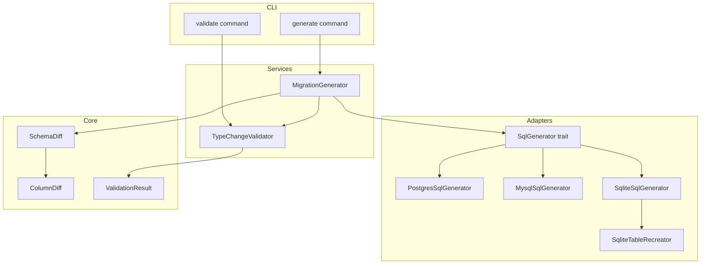
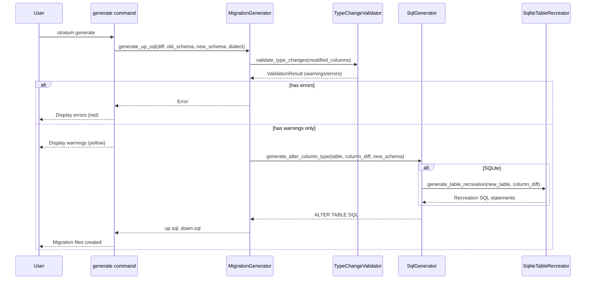

# Design Document: column-type-migration

## Overview

**Purpose**: 既存テーブルのカラム型変更を検出し、対応するマイグレーションSQL（up/down）を自動生成する機能を提供する。

**Users**: バックエンドエンジニア、DevOps/SREチームがスキーマ定義ファイルでカラム型を変更した際に、安全なマイグレーションを自動生成するために使用する。

**Impact**: 既存の`SchemaDiffDetector` → `MigrationGenerator`パイプラインを拡張し、`modified_columns`の型変更に対応するSQL生成を追加する。

### Goals
- カラム型変更を差分として検出し、変更前後の型情報を保持する
- PostgreSQL/MySQL/SQLite各方言に対応したALTER TABLE文を生成する
- 危険な型変更に対して警告を表示し、不正な変換はエラーとする
- dry-runモードでマイグレーションSQLをプレビューできる

### Non-Goals
- データマイグレーション（ETL）：スキーマ変更のみを対象
- 自動型変換の推奨：ユーザーが明示的に型を指定する前提
- オンラインスキーマ変更（pt-online-schema-change等）のサポート

## Architecture

### Existing Architecture Analysis

現在のマイグレーション生成パイプライン:
- `SchemaDiffDetector`: YAMLスキーマ間の差分を検出し`SchemaDiff`を生成
- `ColumnDiff`: `old_column`/`new_column`を保持し、`ColumnChange::TypeChanged`を検出
- `MigrationGenerator`: `SchemaDiff`からup/down SQLを生成
- `SqlGenerator`トレイト: 方言別のCREATE TABLE/INDEX/CONSTRAINT生成

**現状のギャップ**:
- `MigrationGenerator`は`modified_columns`を処理していない
- `SqlGenerator`にALTER COLUMN系APIがない
- SQLiteはALTER COLUMN TYPEをサポートしない（テーブル再作成が必要）

### Architecture Pattern & Boundary Map



**Architecture Integration**:
- **Selected pattern**: ハイブリッドアプローチ - 既存拡張 + 複雑部の分離
- **Domain boundaries**: SQL生成は`SqlGenerator`、検証は`TypeChangeValidator`、SQLite再作成は`SqliteTableRecreator`
- **Existing patterns preserved**: トレイトベースSQL生成、`ValidationResult`による警告/エラー集約
- **New components rationale**:
  - `TypeChangeValidator`: 型変更の互換性検証を集中管理
  - `SqliteTableRecreator`: SQLite固有の複雑なテーブル再作成ロジックを隔離
- **Steering compliance**: Clean Architecture（Services → Adapters → Core）を維持

### Technology Stack

| Layer | Choice / Version | Role in Feature | Notes |
|-------|------------------|-----------------|-------|
| CLI | clap 4.5 | dry-runフラグの追加 | 既存`generate`コマンド拡張 |
| Services | Rust | 型変更検証、マイグレーション生成 | `TypeChangeValidator`新設 |
| Adapters | sqlx 0.8 | 型マッピング参照 | 既存`SqlGenerator`拡張 |
| Core | Rust | `ColumnChange`、`ValidationWarning` | 既存モデル活用 |

## System Flows

### 型変更マイグレーション生成フロー



**Key Decisions**:
- 型変更検証は SQL生成前に実行し、エラーがあれば早期終了
- **警告のみの場合は続行**し、警告を表示後にマイグレーション生成
- SQLiteの場合のみ`SqliteTableRecreator`に委譲
- **旧/新Schemaを注入**し、SQLite再作成時に完全なテーブル定義を取得

## Requirements Traceability

| Requirement | Summary | Components | Interfaces | Flows |
|-------------|---------|------------|------------|-------|
| 1.1 | 型変更を差分として検出 | SchemaDiffDetector | ColumnDiff | - |
| 1.2 | 変更前後の型情報保持 | ColumnDiff | old_column, new_column | - |
| 1.3 | 複数カラムの同時検出 | SchemaDiffDetector | TableDiff.modified_columns | - |
| 1.4 | 他変更との区別 | ColumnChange | TypeChanged variant | - |
| 2.1 | ALTER TABLE文生成(up) | MigrationGenerator, SqlGenerator | generate_alter_column_type | 生成フロー |
| 2.2 | ロールバックSQL生成(down) | MigrationGenerator, SqlGenerator | generate_alter_column_type | 生成フロー |
| 2.3 | PostgreSQL ALTER COLUMN TYPE | PostgresSqlGenerator | generate_alter_column_type | - |
| 2.4 | MySQL MODIFY COLUMN | MysqlSqlGenerator | generate_alter_column_type | - |
| 2.5 | SQLiteテーブル再作成 | SqliteSqlGenerator, SqliteTableRecreator | generate_table_recreation | 生成フロー |
| 3.1 | 標準型マッピング | SqlGenerator implementations | map_column_type | - |
| 3.2 | 方言制約エラー | TypeChangeValidator | validate_dialect_constraints | 生成フロー |
| 3.3 | 方言間マッピング適用 | SqlGenerator implementations | generate_alter_column_type | - |
| 4.1 | 危険変更警告 | TypeChangeValidator | validate_type_changes | 生成フロー |
| 4.2 | 精度低下警告 | TypeChangeValidator | validate_precision_loss | 生成フロー |
| 4.3 | 不正変換エラー | TypeChangeValidator | validate_type_changes | 生成フロー |
| 5.1 | dry-run SQL表示 | CLI (generate) | --dry-run flag | - |
| 5.2 | ファイル作成抑止 | CLI (generate) | --dry-run flag | - |
| 5.3 | 型差分表示 | CLI (generate) | format_type_change | - |

## Components and Interfaces

| Component | Domain/Layer | Intent | Req Coverage | Key Dependencies | Contracts |
|-----------|--------------|--------|--------------|------------------|-----------|
| SqlGenerator | Adapters | ALTER COLUMN SQL生成 | 2.1-2.5, 3.1, 3.3 | ColumnDiff, Table, Schema | Service |
| TypeChangeValidator | Services | 型変更の検証 | 3.2, 4.1-4.3 | ColumnDiff, Dialect | Service |
| SqliteTableRecreator | Adapters | SQLiteテーブル再作成SQL生成 | 2.5 | Table, ColumnDiff | Service |
| MigrationGenerator | Services | マイグレーションファイル生成 | 2.1, 2.2 | SqlGenerator, TypeChangeValidator, Schema | Service |
| CLI generate | CLI | dry-runモード対応、警告/エラー表示 | 5.1-5.3 | MigrationGenerator | API |

### Adapters Layer

#### SqlGenerator (Trait Extension)

| Field | Detail |
|-------|--------|
| Intent | 方言別のALTER COLUMN TYPE SQL文を生成する |
| Requirements | 2.1, 2.2, 2.3, 2.4, 3.1, 3.3 |

**Responsibilities & Constraints**
- 方言固有のALTER TABLE文構文を生成
- up SQLとdown SQLの両方を生成
- NULLable、DEFAULT値の保持

**Dependencies**
- Inbound: MigrationGenerator — SQL生成依頼 (P0)
- Outbound: ColumnDiff — 変更情報取得 (P0)
- Outbound: Table — 完全なテーブル定義（SQLite再作成用） (P0)

**Contracts**: Service [x]

##### Service Interface
```rust
pub trait SqlGenerator {
    // 既存メソッド...

    /// カラム型変更のALTER TABLE文を生成
    ///
    /// # Arguments
    /// * `table` - 対象テーブルの完全な定義（direction=Upなら新定義、Downなら旧定義）
    /// * `column_diff` - カラム差分情報
    /// * `direction` - マイグレーション方向（Up/Down）
    ///
    /// # Returns
    /// ALTER TABLE文のベクター（SQLiteは複数文）
    fn generate_alter_column_type(
        &self,
        table: &Table,
        column_diff: &ColumnDiff,
        direction: MigrationDirection,
    ) -> Vec<String>;
}

pub enum MigrationDirection {
    Up,
    Down,
}
```
- Preconditions: `column_diff.changes`に`TypeChanged`が含まれる、`table`は方向に応じた完全な定義
- Postconditions: 有効なSQL文のベクターを返す
- Invariants: 生成されたSQLは対象方言で実行可能

**Implementation Notes**
- PostgreSQL: `ALTER TABLE {table} ALTER COLUMN {col} TYPE {type} [USING {col}::{type}]`
- MySQL: `ALTER TABLE {table} MODIFY COLUMN {col} {type} [NOT NULL] [DEFAULT {val}]`
- SQLite: `SqliteTableRecreator`に`table`（完全定義）を渡して委譲
- **テーブル定義の取得**: `MigrationGenerator`が`old_schema`/`new_schema`を保持し、方向に応じて適切なテーブル定義を渡す

---

#### PostgresSqlGenerator

| Field | Detail |
|-------|--------|
| Intent | PostgreSQL用のALTER COLUMN TYPE文を生成 |
| Requirements | 2.3 |

**Responsibilities & Constraints**
- `USING`句の自動付与（型変換が必要な場合）
- `SET DATA TYPE`または`TYPE`構文の選択

**Dependencies**
- Inbound: SqlGenerator trait — 実装 (P0)
- Outbound: ColumnType — 型マッピング (P0)

**Contracts**: Service [x]

##### Service Interface
```rust
impl SqlGenerator for PostgresSqlGenerator {
    fn generate_alter_column_type(
        &self,
        table: &Table,
        column_diff: &ColumnDiff,
        direction: MigrationDirection,
    ) -> Vec<String> {
        // PostgreSQL固有の実装
        // tableはPostgreSQLでは使用しない（ALTER COLUMN TYPEで十分）
    }
}
```

**Implementation Notes**
- TypeCategoryベースで`USING`句の自動生成を判定
- 将来的にユーザー指定の変換式（YAMLオーバーライド）への拡張を検討

##### USING句生成ルール（TypeCategoryベース）

| From Category | To Category | USING | Example |
|---------------|-------------|-------|---------|
| String | Numeric | 必要 | `USING col::INTEGER` |
| String | Boolean | 必要 | `USING col::BOOLEAN` |
| Numeric | String | 不要 | 暗黙変換 |
| DateTime | String | 不要 | 暗黙変換 |
| Boolean | Numeric | 不要 | 暗黙変換（false→0, true→1） |
| Same Category | Same Category | 不要 | サイズ変更等は暗黙変換 |
| Json | String | 不要 | 暗黙変換 |
| String | Json | 必要 | `USING col::JSONB` |

---

#### MysqlSqlGenerator

| Field | Detail |
|-------|--------|
| Intent | MySQL用のMODIFY COLUMN文を生成 |
| Requirements | 2.4 |

**Responsibilities & Constraints**
- `MODIFY COLUMN`で完全なカラム定義を再指定
- NULL制約とDEFAULT値を保持

**Dependencies**
- Inbound: SqlGenerator trait — 実装 (P0)
- Outbound: Column — カラム定義取得（`table.get_column()`経由） (P0)

**Contracts**: Service [x]

##### Service Interface
```rust
impl SqlGenerator for MysqlSqlGenerator {
    fn generate_alter_column_type(
        &self,
        table: &Table,
        column_diff: &ColumnDiff,
        direction: MigrationDirection,
    ) -> Vec<String> {
        // MySQL固有の実装
        // tableから対象カラムの完全な定義を取得してMODIFY COLUMN文を生成
    }
}
```

**Implementation Notes**
- `MODIFY COLUMN`は完全なカラム定義が必要 → `table.get_column(column_name)`で取得
- AUTO_INCREMENTの保持に注意

---

#### SqliteSqlGenerator

| Field | Detail |
|-------|--------|
| Intent | SQLite用のテーブル再作成SQL生成を委譲 |
| Requirements | 2.5 |

**Responsibilities & Constraints**
- `SqliteTableRecreator`への委譲
- トランザクション境界の管理

**Dependencies**
- Inbound: SqlGenerator trait — 実装 (P0)
- Outbound: SqliteTableRecreator — 再作成ロジック (P0)
- Outbound: Table — 完全なテーブル定義 (P0)

**Contracts**: Service [x]

##### Service Interface
```rust
impl SqlGenerator for SqliteSqlGenerator {
    fn generate_alter_column_type(
        &self,
        table: &Table,
        column_diff: &ColumnDiff,
        direction: MigrationDirection,
    ) -> Vec<String> {
        let recreator = SqliteTableRecreator::new();
        // tableは再作成後の完全なテーブル定義
        recreator.generate_table_recreation(table, column_diff, direction)
    }
}
```

---

#### SqliteTableRecreator

| Field | Detail |
|-------|--------|
| Intent | SQLiteのテーブル再作成パターンによる型変更SQL生成 |
| Requirements | 2.5 |

**Responsibilities & Constraints**
- 12ステップのテーブル再作成手順を生成
- 外部キー制約の一時無効化と再有効化
- インデックスと制約の再作成
- **型変更を含むTableDiffの全変更を一度の再作成で処理**（型変更＋他変更の一本化）

**Dependencies**
- Inbound: SqliteSqlGenerator — 再作成依頼 (P0)
- Outbound: Table — テーブル定義取得 (P0)

**Contracts**: Service [x]

##### Service Interface
```rust
pub struct SqliteTableRecreator;

impl SqliteTableRecreator {
    pub fn new() -> Self;

    /// テーブル再作成SQLを生成
    ///
    /// # Returns
    /// 以下の順序のSQL文ベクター:
    /// 1. PRAGMA foreign_keys=off
    /// 2. BEGIN TRANSACTION
    /// 3. CREATE TABLE new_table (新スキーマ)
    /// 4. INSERT INTO new_table SELECT * FROM old_table
    /// 5. DROP TABLE old_table
    /// 6. ALTER TABLE new_table RENAME TO old_table
    /// 7. インデックス再作成
    /// 8. COMMIT
    /// 9. PRAGMA foreign_keys=on
    /// 10. PRAGMA foreign_key_check
    pub fn generate_table_recreation(
        &self,
        table: &Table,
        column_diff: &ColumnDiff,
        direction: MigrationDirection,
    ) -> Vec<String>;
}
```
- Preconditions: `table`は有効なテーブル定義
- Postconditions: 実行可能なSQL文のベクターを返す
- Invariants: トランザクション内でアトミックに実行される

**Implementation Notes**
- down方向では逆の型変更でテーブル再作成
- データコピー時の型変換は暗黙的（SQLiteの型アフィニティに依存）
- **型変更＋他変更の一本化**: 型変更を含む`TableDiff`の場合、NULL変更・DEFAULT変更等も含めて一度のテーブル再作成で処理
- 型変更がない`TableDiff`（カラム追加のみ等）は既存の`ALTER TABLE ADD COLUMN`を使用

##### データコピー方式

**列交差ベースの明示的カラムリスト方式**:
```sql
-- old_schema と new_schema の共通カラムのみを明示的に指定
INSERT INTO new_table (col1, col2, col3)
SELECT col1, col2, col3 FROM old_table;
```

**追加列の扱い**:
| 条件 | 動作 |
|------|------|
| DEFAULT あり | DEFAULT値が自動適用 |
| DEFAULT なし（NULLable） | NULL が挿入 |
| NOT NULL かつ DEFAULT なし | エラー（型変更と同時に追加不可、事前に検証でエラー検出） |

**削除列の扱い**:
- 削除されたカラムは SELECT リストから除外（データは破棄）

---

### Services Layer

#### MigrationGenerator (Extension)

| Field | Detail |
|-------|--------|
| Intent | 旧/新Schemaを受け取り、型変更を含むマイグレーションSQLを生成 |
| Requirements | 2.1, 2.2 |

**Responsibilities & Constraints**
- **旧Schema・新Schemaの注入を受ける**
- 型変更検証を実行し、エラー時は早期リターン
- 方向（up/down）に応じて適切なテーブル定義をSqlGeneratorに渡す

**Dependencies**
- Inbound: CLI generate — マイグレーション生成依頼 (P0)
- Outbound: TypeChangeValidator — 型変更検証 (P0)
- Outbound: SqlGenerator — SQL生成 (P0)
- Outbound: Schema — 旧/新スキーマ参照 (P0)

**Contracts**: Service [x]

##### Service Interface (Updated)
```rust
impl MigrationGenerator {
    /// up.sqlを生成
    ///
    /// # Arguments
    /// * `diff` - スキーマ差分
    /// * `old_schema` - 変更前のスキーマ（down.sql生成およびエラーメッセージ用）
    /// * `new_schema` - 変更後のスキーマ（up.sql生成用、SQLiteテーブル再作成で使用）
    /// * `dialect` - データベース方言
    ///
    /// # Returns
    /// 生成されたSQL文字列、または検証エラー
    pub fn generate_up_sql(
        &self,
        diff: &SchemaDiff,
        old_schema: &Schema,
        new_schema: &Schema,
        dialect: Dialect,
    ) -> Result<(String, ValidationResult), String>;

    /// down.sqlを生成
    ///
    /// # Arguments
    /// * `diff` - スキーマ差分
    /// * `old_schema` - 変更前のスキーマ（down.sqlの「戻り先」、SQLiteテーブル再作成で使用）
    /// * `new_schema` - 変更後のスキーマ
    /// * `dialect` - データベース方言
    pub fn generate_down_sql(
        &self,
        diff: &SchemaDiff,
        old_schema: &Schema,
        new_schema: &Schema,
        dialect: Dialect,
    ) -> Result<(String, ValidationResult), String>;
}
```
- Preconditions: `diff`は`old_schema`と`new_schema`の差分として正しい
- Postconditions: up/downでペアとなる可逆なSQLを生成
- Invariants: 検証エラーがある場合は`Err`を返し、警告のみの場合は`Ok`と共に`ValidationResult`を返す

**Implementation Notes**
- **up.sql生成時**: `new_schema.get_table(table_name)`で新テーブル定義を取得
- **down.sql生成時**: `old_schema.get_table(table_name)`で旧テーブル定義を取得
- `modified_columns`の各カラムについて`SqlGenerator::generate_alter_column_type`を呼び出し

---

#### TypeChangeValidator

| Field | Detail |
|-------|--------|
| Intent | カラム型変更の互換性検証と警告/エラー生成 |
| Requirements | 3.2, 4.1, 4.2, 4.3 |

**Responsibilities & Constraints**
- 型変更の互換性ルール適用
- 危険な変更への警告生成
- 不正な変換へのエラー生成

**Dependencies**
- Inbound: MigrationGenerator — 検証依頼 (P0)
- Outbound: ColumnDiff — 変更情報取得 (P0)
- Outbound: ValidationResult — 結果集約 (P0)

**Contracts**: Service [x]

##### Service Interface
```rust
pub struct TypeChangeValidator;

impl TypeChangeValidator {
    pub fn new() -> Self;

    /// 型変更の検証を実行
    ///
    /// # Arguments
    /// * `column_diffs` - 検証対象のカラム差分リスト
    /// * `dialect` - 対象データベース方言
    ///
    /// # Returns
    /// 警告とエラーを含むValidationResult
    pub fn validate_type_changes(
        &self,
        column_diffs: &[ColumnDiff],
        dialect: &Dialect,
    ) -> ValidationResult;

    /// 精度損失の検証
    fn validate_precision_loss(
        &self,
        old_type: &ColumnType,
        new_type: &ColumnType,
        table_name: &str,
        column_name: &str,
    ) -> Option<ValidationWarning>;

    /// 型互換性の検証
    fn validate_type_compatibility(
        &self,
        old_type: &ColumnType,
        new_type: &ColumnType,
        table_name: &str,
        column_name: &str,
    ) -> Result<Option<ValidationWarning>, ValidationError>;
}
```
- Preconditions: `column_diffs`の各要素に`TypeChanged`が含まれる
- Postconditions: すべての型変更が検証される
- Invariants: エラーがない場合のみマイグレーション生成が続行される

**Implementation Notes**
- 型カテゴリ: Numeric, String, DateTime, Binary, JSON, Other
- カテゴリ間変換は警告、サイズ縮小は警告、互換性なしはエラー

---

### CLI Layer

#### generate command (Extension)

| Field | Detail |
|-------|--------|
| Intent | dry-runモードと型変更プレビュー機能の追加、警告/エラーの構造化表示 |
| Requirements | 5.1, 5.2, 5.3 |

**Responsibilities & Constraints**
- `--dry-run`フラグの追加
- 型変更の人間可読な表示
- ファイル作成の抑止（dry-run時）
- **警告/エラーの構造化表示**

**Dependencies**
- Inbound: User — コマンド実行 (P0)
- Outbound: MigrationGenerator — SQL生成 (P0)

**Contracts**: API [x]

##### API Contract
| Flag | Type | Description | Default |
|------|------|-------------|---------|
| --dry-run | bool | SQLをプレビュー表示しファイルを作成しない | false |

**Implementation Notes**
- dry-run時は生成されるSQLをコンソールに色付きで表示
- 型変更は `old_type → new_type` 形式で表示

##### 警告/エラー出力フォーマット

**出力例**:
```
⚠ Warning: VARCHAR(255) → VARCHAR(100) in column 'users.email' may cause data truncation
  (table: users, column: email)

⚠ Warning: TEXT → INTEGER in column 'products.price' may cause data loss for non-numeric values
  (table: products, column: price)

✗ Error: JSONB → INTEGER in column 'documents.data' is not supported
  (table: documents, column: data)
  Suggestion: Use TEXT as an intermediate type or keep JSONB

Generated 2 warnings, 1 error
Migration generation aborted due to errors.
```

**色スキーム**:
| Element | Color | Example |
|---------|-------|---------|
| 警告ヘッダー | Yellow | `⚠ Warning:` |
| エラーヘッダー | Red | `✗ Error:` |
| 位置情報 | Cyan | `(table: users, column: email)` |
| 修正提案 | Green | `Suggestion: ...` |
| サマリー | Bold | `Generated X warnings, Y errors` |

**出力順序**:
1. 警告（テーブル名 → カラム名でソート）
2. エラー（テーブル名 → カラム名でソート）
3. サマリー（`Generated X warnings, Y errors`）

**中止条件**:
- **エラーがある場合**: マイグレーション生成を中止、終了コード1
- **警告のみの場合**: 警告を表示後、生成を続行、終了コード0

## Data Models

### Domain Model

#### ColumnChange (Extension)
既存の`ColumnChange`列挙型は変更不要。`TypeChanged`バリアントで型変更を表現済み。

```rust
pub enum ColumnChange {
    TypeChanged { old_type: String, new_type: String },
    NullableChanged { old_nullable: bool, new_nullable: bool },
    DefaultValueChanged { old_default: Option<String>, new_default: Option<String> },
    AutoIncrementChanged { old_auto_increment: Option<bool>, new_auto_increment: Option<bool> },
}
```

#### MigrationDirection (New)
```rust
pub enum MigrationDirection {
    Up,
    Down,
}
```

#### TypeCategory (New)
型変更検証用の型カテゴリ分類。

```rust
pub enum TypeCategory {
    Numeric,   // INTEGER, DECIMAL, FLOAT, DOUBLE
    String,    // VARCHAR, TEXT, CHAR
    DateTime,  // DATE, TIME, TIMESTAMP
    Binary,    // BLOB
    Json,      // JSON, JSONB
    Boolean,   // BOOLEAN
    Uuid,      // UUID
    Other,     // ENUM, DialectSpecific
}

impl TypeCategory {
    pub fn from_column_type(column_type: &ColumnType) -> Self;

    /// 他のカテゴリへの変換が警告対象かどうか
    pub fn is_warning_conversion(&self, other: &Self) -> bool;

    /// 他のカテゴリへの変換がエラー対象かどうか
    pub fn is_error_conversion(&self, other: &Self) -> bool;
}
```

### Logical Data Model

#### 型変更の互換性マトリクス

| From \ To | Numeric | String | DateTime | Binary | Json | Boolean | Uuid |
|-----------|---------|--------|----------|--------|------|---------|------|
| Numeric | Safe* | Safe | Error | Error | Error | Warn | Error |
| String | Warn | Safe* | Warn | Safe | Safe | Warn | Safe |
| DateTime | Error | Safe | Safe* | Error | Error | Error | Error |
| Binary | Error | Safe | Error | Safe | Error | Error | Error |
| Json | Error | Safe | Error | Error | Safe | Error | Error |
| Boolean | Safe | Safe | Error | Error | Error | Safe | Error |
| Uuid | Error | Safe | Error | Error | Error | Error | Safe |

- **Safe**: 警告なし
- **Safe***: サイズ縮小の場合は警告
- **Warn**: データ損失の可能性があるため警告
- **Error**: 互換性がないため禁止

## Error Handling

### Error Strategy

型変更検証のエラーはマイグレーション生成前に検出し、早期終了する。

### Error Categories and Responses

**User Errors** (ValidationError):
- `TypeConversion`: 互換性のない型変換 → エラーメッセージと修正提案を表示

**Warnings** (ValidationWarning):
- `DataLoss`: データ損失の可能性 → 警告メッセージを表示、続行可能
- `PrecisionLoss`: 精度低下の可能性 → 警告メッセージを表示、続行可能

### Monitoring
- 型変更検証のエラー/警告はCLI出力で表示
- 将来的にはログ出力も検討

## Testing Strategy

### Unit Tests
- `TypeChangeValidator::validate_type_changes`: 各型カテゴリ間の変換テスト
- `TypeChangeValidator::validate_precision_loss`: DECIMAL/VARCHAR等の精度チェック
- `SqliteTableRecreator::generate_table_recreation`: 再作成SQL生成の正確性
- `TypeCategory::from_column_type`: 型分類の網羅性

### Integration Tests
- PostgreSQL ALTER COLUMN TYPE生成と実行
- MySQL MODIFY COLUMN生成と実行
- SQLiteテーブル再作成生成と実行
- dry-runモードの出力確認

### E2E Tests
- YAMLスキーマの型変更 → マイグレーション生成 → 適用 → ロールバック

## Migration Strategy

既存コードへの影響を最小化するため、段階的に実装:

1. **Phase 1**: `SqlGenerator`トレイトに`generate_alter_column_type`を追加（デフォルト実装で空Vec）
2. **Phase 2**: PostgreSQL/MySQL実装を追加
3. **Phase 3**: `SqliteTableRecreator`と`TypeChangeValidator`を追加
4. **Phase 4**: `MigrationGenerator`で`modified_columns`処理を追加
5. **Phase 5**: CLIにdry-runフラグを追加
