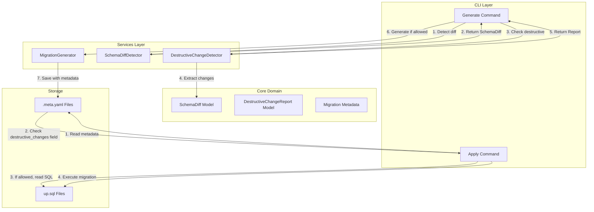
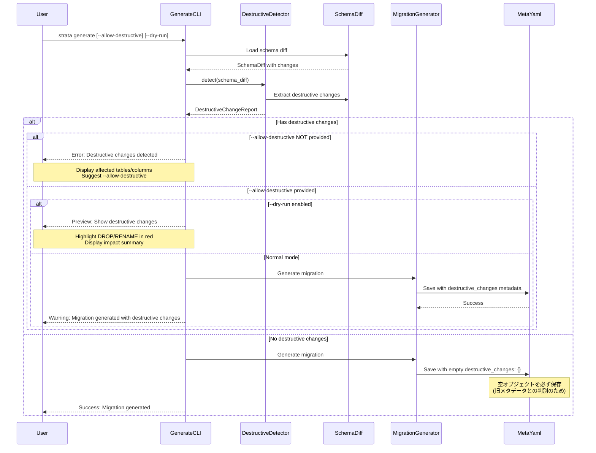
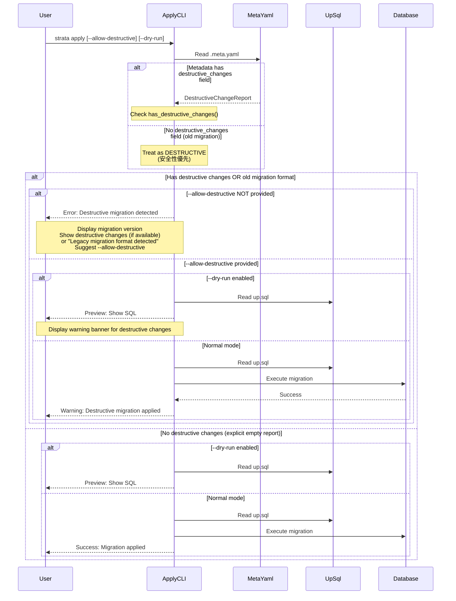
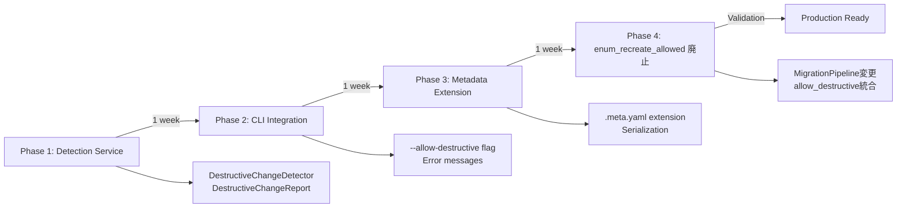

# 技術設計: 破壊的変更の安全ガード

## 概要

本機能は、データベーススキーマの破壊的変更（テーブル削除、カラム削除、カラムリネーム、ENUM削除、ENUM再作成）を検出し、ユーザーが明示的に許可しない限りマイグレーション生成と適用を拒否する安全ガードメカニズムを提供します。デフォルト拒否の原則に基づき、誤操作によるデータ損失を防止します。

**目的**: 運用環境での破壊的スキーマ変更の事故を防止し、慎重な判断を促すセーフティネットを構築します。

**ユーザー**: 以下のユーザーグループが対象です：
- **開発者**: dry-runで破壊的変更を事前確認し、安全にマイグレーションを生成
- **運用者**: 破壊的変更を含むマイグレーションの適用を明示的に承認
- **チームリーダー**: レビュープロセスで破壊的変更を検出し、リスク評価を実施

**影響**: 既存の `strata generate` および `strata apply` コマンドの動作を拡張し、破壊的変更検出と拒否メカニズムを追加します。既存のマイグレーションワークフローに対する後方互換性を維持しつつ、新しい安全ガード機能を導入します。

### 目標
- 破壊的変更（DROP/RENAME/ENUM削除）を自動検出し、明示的な許可なしでは実行を拒否
- dry-runプレビューで破壊的変更を視覚的に強調表示し、影響範囲を明示
- エラーメッセージで具体的な理由と次のアクション（dry-run、許可フラグ、スキーマ見直し）を提示
- 既存の `enum_recreate_allowed` を `--allow-destructive` フラグに統合し、破壊的変更の許可を一元管理

### 対象外
- 破壊的変更の自動修正や代替案の提案（ユーザー判断に委ねる）
- データマイグレーション（ETL）のサポート（スキーマ変更のみを対象）
- パフォーマンス影響の定量的分析（影響範囲の明示のみ）
- GUIベースの承認ワークフロー（CLIフラグベースの承認のみ）
- 古いメタデータフォーマット（`destructive_changes` フィールドなし）のSQL解析フォールバック（安全性優先）

---

## アーキテクチャ

### 既存アーキテクチャ分析

Strataは以下のレイヤードアーキテクチャを採用しています：

```
┌─────────────────────────────────────────┐
│  CLI Layer (User Interface)             │  ← clap-based commands
├─────────────────────────────────────────┤
│  Services Layer (Business Logic)        │  ← Orchestration & validation
├─────────────────────────────────────────┤
│  Core Domain (Models & Logic)           │  ← Schema, Migration, Config models
├─────────────────────────────────────────┤
│  Adapters (External Integration)        │  ← Database, FileSystem access
└─────────────────────────────────────────┘
```

**既存の関連コンポーネント**:
- `SchemaDiffDetector` サービス: スキーマ差分を検出（破壊的変更情報を含む）
- `SchemaDiff` モデル: `removed_tables`, `removed_columns`, `renamed_columns`, `removed_enums` を保持
- `MigrationGenerator` サービス: マイグレーションファイル（up.sql, down.sql, .meta.yaml）を生成
- `GenerateCommandHandler`: スキーマ差分からマイグレーション生成を制御
- `ApplyCommandHandler`: マイグレーションファイルをデータベースに適用

**既存の制約と統合ポイント**:
- `generate` コマンドは `SchemaDiff` にアクセス可能（破壊的変更検出が容易）
- `apply` コマンドは `up.sql` と `.meta.yaml` のみを参照（`.meta.yaml` の `destructive_changes` フィールドで判定）
- 既存の `enum_recreate_allowed` フラグは **廃止予定**（`--allow-destructive` に統合）

### アーキテクチャパターンと境界マップ



**Architecture Integration**:
- **選択パターン**: Metadata-based Detection（メタデータ依存型）
- **Domain/feature boundaries**:
  - **Services層**: 破壊的変更の検出ロジックを `DestructiveChangeDetector` に集約
  - **Core層**: 破壊的変更の表現を `DestructiveChangeReport` モデルで定義
  - **CLI層**: ユーザー入力（`--allow-destructive`）とエラー表示を担当
- **Existing patterns preserved**:
  - レイヤードアーキテクチャを維持（CLI → Services → Core → Adapters）
  - `SchemaDiff` を単一情報源（Single Source of Truth）として活用
  - `.meta.yaml` を拡張してメタデータ永続化
- **New components rationale**:
  - `DestructiveChangeDetector`: 破壊的変更検出ロジックを再利用可能なサービスとして実装
  - `DestructiveChangeReport`: 検出結果を構造化し、シリアライゼーション可能に
- **Design Decision: 古いマイグレーションの扱い**:
  - `.meta.yaml` に `destructive_changes` フィールドがない場合は **破壊的変更ありとみなす**
  - SQL解析フォールバックは実装しない（安全性優先、誤検出リスク回避）
  - 古いマイグレーションの適用には `--allow-destructive` が必須
- **Design Decision: enum_recreate_allowed の廃止**:
  - 既存の `enum_recreate_allowed` フラグを **廃止**
  - すべての破壊的変更許可を `--allow-destructive` に統合
  - `MigrationPipeline` 内部で `allow_destructive` フラグを参照するよう変更
- **Steering compliance**: 安全性優先（Design Principle 4: 安全性優先）、テスタビリティ（単体テストでサービス層を検証可能）

### 技術スタック

| Layer | Choice / Version | Role in Feature | Notes |
|-------|------------------|-----------------|-------|
| CLI | clap 4.5 | `--allow-destructive` フラグの追加 | derive macros使用、既存のCLI定義を拡張 |
| Services | Rust標準ライブラリ | `DestructiveChangeDetector` 実装 | 外部依存なし、軽量な検出ロジック |
| Core | serde 1.x, serde-saphyr 0.0.16 | `DestructiveChangeReport` シリアライゼーション | YAML形式で `.meta.yaml` に保存 |
| Data | YAML (serde-saphyr) | `.meta.yaml` フォーマット拡張 | 新規フィールド追加、古いメタデータは破壊的扱い |
| CLI Output | colored 3.1 | 破壊的変更の色付き表示 | 赤色でDROP/RENAME等を強調表示 |

**Technology Alignment**:
- 既存の技術スタックを最大限活用（新規依存関係なし）
- serde エコシステムで一貫性を維持（Core層のすべてのモデルで使用）
- パフォーマンス影響を最小化（`SchemaDiff` の再利用、軽量な検出ロジック）

---

## システムフロー

### Generate コマンドフロー（破壊的変更検出）



**Key Decisions**:
- dry-runモードでは `--allow-destructive` の有無に関わらずプレビュー表示（実行なし）
- 破壊的変更検出時のエラーメッセージに、影響範囲と次のアクションを含める
- `DestructiveChangeReport` を `.meta.yaml` に**必ず保存**（空オブジェクトでも保存し、旧メタデータとの判別を明確化）

### Apply コマンドフロー（破壊的変更拒否）



**Key Decisions**:
- `.meta.yaml` の `destructive_changes` フィールドのみで判定（SQL解析フォールバックなし）
- `destructive_changes` フィールドがない古いマイグレーションは **破壊的変更ありとみなす**（安全性優先）
- 古いマイグレーションの適用には `--allow-destructive` が必須
- `apply --dry-run --allow-destructive` でも破壊的変更の警告バナーを表示（実行はしない）
- **要件4.4の例外**: 旧メタデータ時は個別SQL文の強調表示は行わない（破壊的SQLの特定ができないため）。代替として「Legacy migration format detected」警告バナーを表示

**apply --dry-run 時の軽量キーワードハイライト**:
- **目的**: 新フォーマット（`destructive_changes` あり）のマイグレーションに対して、`up.sql` 内の破壊的SQLを視覚的にハイライト
- **検出方法**: 正規表現による簡易キーワードマッチング（精度は保証しない視覚的ヒント）
- **対象キーワード**:
  ```regex
  (?i)\b(DROP\s+(TABLE|COLUMN|TYPE|INDEX|CONSTRAINT)|ALTER\s+.*\s+(DROP|RENAME)|RENAME\s+(TABLE|COLUMN))\b
  ```
- **表示方式**: マッチした行を赤色（`colored::Color::Red`）で強調表示
- **フォールバック**: 旧フォーマットのマイグレーションでは、キーワードハイライトは行わず警告バナーのみ表示

---

## 要件トレーサビリティ

| 要件 | 概要 | コンポーネント | インターフェース | フロー |
|-----|------|--------------|----------------|-------|
| 1.1 | 5種類の破壊的変更を検出 | `DestructiveChangeDetector` | `detect()` | Generate, Apply |
| 1.2 | 影響範囲のリスト化 | `DestructiveChangeReport` | `tables_dropped`, `columns_dropped`, etc. | Generate, Apply |
| 1.3 | 複数変更の漏れなき検出 | `DestructiveChangeDetector` | `SchemaDiff` 走査ロジック | Generate |
| 1.4 | 検出サービス化 | `DestructiveChangeDetector` | サービスインターフェース | Generate, Apply |
| 1.5 | レポート返却 | `DestructiveChangeReport` | 構造化データモデル | Generate, Apply |
| 2.1 | generate拒否メカニズム | `GenerateCommandHandler` | フラグチェック + エラー返却 | Generate |
| 2.2 | apply拒否メカニズム | `ApplyCommandHandler` | メタデータ判定 + エラー返却 | Apply |
| 2.3 | 破壊的変更の一覧表示 | CLI出力整形ロジック | `format_destructive_error()` | Generate, Apply |
| 2.4 | 許可フラグの案内 | エラーメッセージテンプレート | エラーメッセージ生成 | Generate, Apply |
| 2.5 | 非破壊的変更の通常実行 | 既存のコマンドハンドラー | 既存フロー維持 | Generate, Apply |
| 3.1 | generate --allow-destructive | CLI引数定義 | clap derive macro | Generate |
| 3.2 | apply --allow-destructive | CLI引数定義 | clap derive macro | Apply |
| 3.3 | デフォルト拒否のバイパス | コマンドハンドラー | フラグチェック分岐 | Generate, Apply |
| 3.4 | CLI引数の受付 | `cli.rs` | clapパーサー | Generate, Apply |
| 3.5 | 警告メッセージ表示 | CLI出力整形ロジック | `format_destructive_warning()` | Generate, Apply |
| 3.6 | dry-runでのプレビュー | 既存dry-runロジック拡張 | プレビュー出力 | Generate, Apply |
| 4.1 | dry-run専用セクション追加 | `execute_dry_run()` 拡張 | プレビュー整形 | Generate |
| 4.2 | 色付き強調表示 | `colored` ライブラリ使用 | 赤色でDROP/RENAME表示 | Generate, Apply |
| 4.3 | 影響範囲の集計表示 | `DestructiveChangeReport` 集計 | カウント計算 | Generate, Apply |
| 4.4 | apply dry-runでの警告表示 | CLI出力整形ロジック | 警告バナー表示 | Apply |
| 4.5 | 続行方法の指示表示 | エラー/警告メッセージ | メッセージテンプレート | Generate, Apply |
| 4.6 | リネームプレビュー統合 | 既存のリネーム表示維持 | 一貫した表示形式 | Generate |
| 5.1 | generate拒否時のエラー詳細 | エラーメッセージ生成 | 影響範囲 + コマンド例 | Generate |
| 5.2 | apply拒否時のエラー詳細 | エラーメッセージ生成 | バージョン + 変更詳細 + 推奨手順 | Apply |
| 5.3 | 色付きエラー表示 | `colored` ライブラリ | 赤色強調 | Generate, Apply |
| 5.4 | 変更種別のグルーピング | エラーメッセージ整形 | "Tables to be dropped: ..." | Generate, Apply |
| 5.5 | 選択肢の提示 | エラーメッセージテンプレート | 3つの選択肢を明示 | Generate, Apply |

**要件4.4の例外仕様**:
- 旧メタデータ（`destructive_changes` フィールドなし）のマイグレーションに対する `apply --dry-run` では、個別SQL文の色付き強調表示は行わない
- 理由: 破壊的SQLの特定にはメタデータが必要だが、旧フォーマットには存在しないため
- 代替措置: 「Legacy migration format detected - treating as destructive」警告バナーを表示し、`--allow-destructive` の使用を案内

**旧メタデータ時の最小限情報表示（要件2.3, 5.2, 5.4の例外仕様）**:
- 旧フォーマットのマイグレーションでは、変更種別のグルーピング表示（要件2.3, 5.4）やマイグレーションバージョン+変更詳細（要件5.2）の一部を省略
- **表示項目（最小限）**:
  1. マイグレーションバージョン（ファイル名から取得）
  2. 「Legacy migration format detected」警告バナー
  3. `--allow-destructive` 使用の案内
- **省略項目**: 変更種別の詳細（Tables to be dropped: ... 等）、影響カラムのリスト
- **理由**: メタデータがない場合、正確な変更内容を特定できないため

---

## コンポーネントとインターフェース

### コンポーネント概要

| Component | Domain/Layer | Intent | Req Coverage | Key Dependencies (P0/P1) | Contracts |
|-----------|--------------|--------|--------------|--------------------------|-----------|
| DestructiveChangeDetector | Services | 破壊的変更の検出と分類 | 1.1, 1.2, 1.3, 1.4, 1.5 | SchemaDiff (P0) | Service |
| DestructiveChangeReport | Core | 検出結果の構造化モデル | 1.2, 1.5, 4.3 | - | State |
| GenerateCommandHandler (拡張) | CLI | generate実行制御と拒否 | 2.1, 2.3, 2.4, 3.1, 3.3, 3.5, 4.1, 5.1 | DestructiveChangeDetector (P0) | - |
| ApplyCommandHandler (拡張) | CLI | apply実行制御と拒否 | 2.2, 2.3, 2.4, 3.2, 3.3, 3.5, 4.4, 5.2 | MigrationMetadata (P0) | - |
| CLI引数定義 (cli.rs) | CLI | --allow-destructive フラグ | 3.1, 3.2, 3.4 | clap (P0) | - |
| MigrationMetadata (拡張) | Core | .meta.yaml フォーマット拡張 | 1.5, 2.2 | DestructiveChangeReport (P0) | State |
| MigrationPipeline (変更) | Services | enum_recreate_allowed廃止 | 3.3 | allow_destructive flag (P0) | - |

---

### サービス層

#### DestructiveChangeDetector

| Field | Detail |
|-------|--------|
| Intent | `SchemaDiff` から破壊的変更を抽出し、`DestructiveChangeReport` として返す |
| Requirements | 1.1, 1.2, 1.3, 1.4, 1.5 |

**Responsibilities & Constraints**:
- `SchemaDiff` の各フィールドを走査し、破壊的変更を分類
- 5種類の破壊的変更（テーブル削除、カラム削除、カラムリネーム、ENUM削除、ENUM再作成）を漏れなく検出
- 検出結果を `DestructiveChangeReport` にマッピング
- ドメイン境界: Services層の単純なデータ変換サービス（副作用なし、純粋関数）

**Dependencies**:
- Inbound: `GenerateCommandHandler` — マイグレーション生成前の検出 (P0)
- Outbound: `SchemaDiff` — 破壊的変更の元データ (P0)
- External: なし

**Contracts**: Service [x]

##### Service Interface
```rust
pub struct DestructiveChangeDetector;

impl DestructiveChangeDetector {
    /// 新しいDetectorを作成
    pub fn new() -> Self;

    /// スキーマ差分から破壊的変更を検出
    ///
    /// # Arguments
    /// * `schema_diff` - スキーマ差分
    ///
    /// # Returns
    /// 破壊的変更レポート
    pub fn detect(&self, schema_diff: &SchemaDiff) -> DestructiveChangeReport;
}
```

- **Preconditions**: `schema_diff` は有効な `SchemaDiff` インスタンスであること
- **Postconditions**: すべての破壊的変更を含む `DestructiveChangeReport` を返す
- **Invariants**: 同じ `SchemaDiff` に対して常に同じレポートを返す（冪等性）

**Implementation Notes**:
- **Integration**: `GenerateCommandHandler.execute()` 内で `SchemaDiffDetector` の直後に呼び出し
- **Validation**: `SchemaDiff` のフィールドが空でも正常動作（空のレポートを返す）
- **Risks**: なし（単純なデータ変換、外部依存なし）

---

### コアドメイン

#### DestructiveChangeReport

| Field | Detail |
|-------|--------|
| Intent | 破壊的変更の検出結果を構造化して表現し、シリアライゼーション可能にする |
| Requirements | 1.2, 1.5, 4.3 |

**Responsibilities & Constraints**:
- 5種類の破壊的変更を分類して保持
- 影響範囲（テーブル名、カラム名、ENUM名）を明示
- serde でシリアライズ可能（`.meta.yaml` に保存）
- ドメイン境界: Coreドメインの不変モデル（変更不可）

**Dependencies**:
- Inbound: `DestructiveChangeDetector` — 検出結果の生成元 (P0)
- Outbound: なし
- External: `serde`, `serde-saphyr` — シリアライゼーション (P0)

**Contracts**: State [x]

##### State Management
- **State model**:
  ```rust
  use serde::{Deserialize, Serialize};

  /// 破壊的変更レポート
  #[derive(Debug, Clone, PartialEq, Serialize, Deserialize)]
  pub struct DestructiveChangeReport {
      /// 削除されるテーブル名のリスト
      #[serde(default, skip_serializing_if = "Vec::is_empty")]
      pub tables_dropped: Vec<String>,

      /// 削除されるカラム（テーブルごと）
      #[serde(default, skip_serializing_if = "Vec::is_empty")]
      pub columns_dropped: Vec<DroppedColumn>,

      /// リネームされるカラム
      #[serde(default, skip_serializing_if = "Vec::is_empty")]
      pub columns_renamed: Vec<RenamedColumnInfo>,

      /// 削除されるENUM
      #[serde(default, skip_serializing_if = "Vec::is_empty")]
      pub enums_dropped: Vec<String>,

      /// 再作成されるENUM
      #[serde(default, skip_serializing_if = "Vec::is_empty")]
      pub enums_recreated: Vec<String>,
  }

  /// 削除されるカラム情報
  #[derive(Debug, Clone, PartialEq, Serialize, Deserialize)]
  pub struct DroppedColumn {
      pub table: String,
      pub columns: Vec<String>,
  }

  /// リネームされるカラム情報
  #[derive(Debug, Clone, PartialEq, Serialize, Deserialize)]
  pub struct RenamedColumnInfo {
      pub table: String,
      pub old_name: String,
      pub new_name: String,
  }

  impl DestructiveChangeReport {
      /// 新しい空のレポートを作成
      pub fn new() -> Self;

      /// 破壊的変更が含まれているかを判定
      pub fn has_destructive_changes(&self) -> bool;

      /// 破壊的変更の総数をカウント
      pub fn total_change_count(&self) -> usize;
  }
  ```

- **Persistence & consistency**: `.meta.yaml` にYAML形式で永続化、Option型でパース（後方互換性）
- **Concurrency strategy**: 不変モデルのため、並行性の問題なし

**Implementation Notes**:
- **Integration**: `MigrationGenerator.generate_migration_metadata()` で `.meta.yaml` に追加フィールドとして保存
- **Validation**: デシリアライゼーション時に `#[serde(default)]` で古いメタデータをサポート
- **Risks**: なし（単純なデータモデル）

---

### CLI層

#### CLI引数定義 (cli.rs)

| Field | Detail |
|-------|--------|
| Intent | `--allow-destructive` フラグをGenerateとApplyコマンドに追加 |
| Requirements | 3.1, 3.2, 3.4 |

**Responsibilities & Constraints**:
- clap derive macros で `--allow-destructive` を定義
- GenerateとApplyの両コマンドで共通のフラグ名を使用
- デフォルト値は `false`（デフォルト拒否の原則）

**Dependencies**:
- Inbound: `GenerateCommandHandler`, `ApplyCommandHandler` — フラグの読み取り (P0)
- Outbound: `clap` クレート — CLI引数パーサー (P0)
- External: なし

**Implementation Notes**:
```rust
/// Generate コマンド
Generate {
    /// Description for the migration
    #[arg(short, long, value_name = "DESCRIPTION")]
    description: Option<String>,

    /// Dry run - show SQL without creating files
    #[arg(long)]
    dry_run: bool,

    /// Allow destructive changes (DROP, RENAME, ENUM removal)
    #[arg(long)]
    allow_destructive: bool,
},

/// Apply コマンド
Apply {
    /// Dry run - show SQL without executing
    #[arg(long)]
    dry_run: bool,

    /// Target environment (development, staging, production)
    #[arg(short, long, value_name = "ENV", default_value = "development")]
    env: String,

    /// Timeout for database operations (in seconds)
    #[arg(long, value_name = "SECONDS")]
    timeout: Option<u64>,

    /// Allow destructive changes (DROP, RENAME, ENUM removal)
    #[arg(long)]
    allow_destructive: bool,
},
```

#### MigrationPipeline (変更)

| Field | Detail |
|-------|--------|
| Intent | 既存の `enum_recreate_allowed` フラグを廃止し、`--allow-destructive` に統合 |
| Requirements | 3.3 |

**Responsibilities & Constraints**:
- `enum_recreate_allowed` フラグを削除し、`allow_destructive` パラメータに置換
- `allow_destructive = true` の場合、ENUM再作成・削除を含むすべての破壊的変更を許可
- 既存のENUM再作成ガードロジックを `allow_destructive` フラグに移行

**Dependencies**:
- Inbound: `GenerateCommandHandler` — `allow_destructive` フラグの受け渡し (P0)
- Outbound: `SchemaDiff` — ENUM再作成の判定 (P0)
- External: なし

**Implementation Notes**:
- **Migration Path**: `enum_recreate_allowed` の参照箇所を `allow_destructive` に置換
- **Backward Compatibility**: API変更は内部のみ（CLIからは `--allow-destructive` のみ公開）
- **Risks**: なし（既存フラグの置換のみ）

**enum_recreate_allowed 互換性方針**:
- **読み取り時の動作**: 既存の設定やスキーマに `enum_recreate_allowed` フィールドが存在する場合
  - 警告メッセージを表示: "Warning: 'enum_recreate_allowed' is deprecated. Use '--allow-destructive' instead."
  - フィールドの値は**無視**（`--allow-destructive` フラグのみで動作を制御）
  - 古い設定ファイルがあってもエラーにはならない
- **段階的移行**:
  1. 初回リリース: 警告表示 + 無視
  2. 将来のバージョン: フィールドを完全に削除（ドキュメントで移行ガイドを提供）

---

## データモデル

### ドメインモデル

**Aggregates and Transactional Boundaries**:
- `DestructiveChangeReport` は Value Object（不変、同一性なし）
- `MigrationMetadata` への追加フィールドとして扱う（既存のトランザクション境界を維持）

**Entities, Value Objects, Domain Events**:
- **Value Object**: `DestructiveChangeReport`, `DroppedColumn`, `RenamedColumnInfo`
- **Domain Events**: なし（純粋なデータモデル）

**Business Rules & Invariants**:
- `DestructiveChangeReport` が空（すべてのフィールドが空）の場合、破壊的変更なしとみなす
- `DroppedColumn.columns` は空でないリストであること
- `RenamedColumnInfo` の `old_name` と `new_name` は異なること

### 論理データモデル

**Structure Definition**:
```yaml
# .meta.yaml の拡張フォーマット
version: "20260125120000"
description: "drop old tables"
dialect: PostgreSQL
checksum: "sha256:..."
destructive_changes:              # 新規追加フィールド（Option型）
  tables_dropped:
    - "old_users"
    - "deprecated_logs"
  columns_dropped:
    - table: "products"
      columns:
        - "legacy_field"
        - "unused_column"
  columns_renamed:
    - table: "items"
      old_name: "name"
      new_name: "item_name"
  enums_dropped:
    - "old_status_enum"
  enums_recreated:
    - "priority_enum"
```

**Consistency & Integrity**:
- **メタデータ表現の統一**: `destructive_changes` フィールドは**常に保存**する
  - 破壊的変更なしの場合: `destructive_changes: {}` （空オブジェクト）
  - 破壊的変更ありの場合: 該当するフィールドに値を設定
- **新旧メタデータの判別**:
  - `destructive_changes` フィールドあり → 新フォーマット（フィールド内容で判定）
  - `destructive_changes` フィールドなし → 旧フォーマット（**破壊的変更ありとみなす**）
- 空の配列は省略可能（`skip_serializing_if` を使用）ただし `destructive_changes` オブジェクト自体は必須
- トランザクション境界: `.meta.yaml` ファイル全体が単一の永続化単位

**Temporal aspects**:
- `.meta.yaml` は immutable（一度生成したら変更しない）
- バージョン管理システム（Git）でファイルの履歴を追跡

---

## エラーハンドリング

### エラー戦略

破壊的変更検出時のエラーは、ユーザーに明確な理由と次のアクションを提示する形式で返します。エラーメッセージは以下の構造を持ちます：
1. **エラータイトル**: "Destructive changes detected"
2. **影響範囲の詳細**: 変更種別ごとにグループ化（"Tables to be dropped: users, posts"）
3. **次のアクション**: 3つの選択肢を明示（dry-run確認、許可フラグ使用、スキーマ見直し）

### エラーカテゴリと対応

**User Errors (4xx相当)**:
- **破壊的変更の未承認**: `--allow-destructive` フラグなしで破壊的変更を含むマイグレーション生成/適用を試行
  - **Response**: エラーメッセージで影響範囲を明示し、`--allow-destructive` の使用を提案
  - **Example**:
    ```
    Error: Destructive changes detected

    Tables to be dropped:
      - users
      - posts

    Columns to be dropped:
      - products: legacy_field, unused_column

    To proceed, choose one of the following:
      1. Review changes: strata generate --dry-run
      2. Allow destructive changes: strata generate --allow-destructive
      3. Reconsider your schema changes
    ```

**System Errors (5xx相当)**:
- **メタデータのパースエラー**: `.meta.yaml` の破損または不正なフォーマット
  - **Response**: ファイルパスとエラー詳細を明示し、手動修正またはマイグレーション再生成を提案
- **メタデータの欠損**: `.meta.yaml` に `destructive_changes` フィールドがない（古いマイグレーション）
  - **Response**: 最小限の情報のみ表示（詳細な変更内容は不明のため）
  - **表示形式**:
    ```
    Error: Destructive migration detected

    Migration: 20250101120000
    ⚠️  Legacy migration format detected - treating as destructive

    To proceed, choose one of the following:
      1. Review SQL: strata apply --dry-run
      2. Allow destructive changes: strata apply --allow-destructive
      3. Regenerate migration with current version of strata
    ```

**Business Logic Errors (422相当)**:
- **破壊的変更の矛盾**: `SchemaDiff` に破壊的変更が含まれるが、`DestructiveChangeReport` が空の場合（ロジックバグ）
  - **Response**: 内部エラーとして記録し、Issue報告を促す

### モニタリング

- **Error tracking**: `generate` と `apply` での破壊的変更拒否回数を記録（将来的なメトリクス収集）
- **Logging**: 破壊的変更検出時にDEBUGレベルで詳細をログ出力
- **Health monitoring**: なし（CLIツールのため、ヘルスチェックエンドポイントは不要）

---

## テスト戦略

### 単体テスト
1. **DestructiveChangeDetector.detect()**:
   - 空の `SchemaDiff` → 空のレポートを返す
   - 5種類の破壊的変更を含む `SchemaDiff` → すべて正しく分類される
   - 複数テーブル/カラムの削除 → リストに正しく追加される
2. **DestructiveChangeReport シリアライゼーション**:
   - レポートを YAML にシリアライズ → デシリアライズで元に戻る
   - 空のフィールドは省略される（`skip_serializing_if`）
   - 古いメタデータ（`destructive_changes` なし）→ `None` としてパース
3. **MigrationMetadata 拡張**:
   - `destructive_changes` フィールドありのメタデータ → 正しくパース
   - `destructive_changes` フィールドなしのメタデータ → `None` として扱う
   - 空の `destructive_changes` → 破壊的変更なしと判定

### 統合テスト
1. **generate コマンド統合テスト**:
   - 破壊的変更を含むスキーマ差分で `generate` 実行 → エラーで拒否される
   - `--allow-destructive` 付きで `generate` → `.meta.yaml` に `destructive_changes` が保存される
   - `--dry-run` で破壊的変更のプレビュー表示 → 赤色で強調表示される
   - 破壊的変更なしの場合 → 空の `destructive_changes` オブジェクトが保存される
2. **apply コマンド統合テスト**:
   - `.meta.yaml` に `destructive_changes` を含むマイグレーション → エラーで拒否される
   - `--allow-destructive` 付きで `apply` → マイグレーション適用される
   - 古いマイグレーション（`destructive_changes` フィールドなし）→ 破壊的変更ありとして拒否
   - 古いマイグレーション + `--allow-destructive` → 適用される
3. **ENUM再作成テスト（enum_recreate_allowed 廃止後）**:
   - `--allow-destructive` 付きでENUM再作成を含む `generate` → 成功
   - `--allow-destructive` なしでENUM再作成 → エラーで拒否される
   - `MigrationPipeline` が `allow_destructive` フラグを参照 → ENUM再作成が制御される

### E2Eテスト
1. **ユーザーワークフロー**:
   - スキーマでテーブル削除 → `generate` でエラー → `--dry-run` で確認 → `--allow-destructive` で生成 → `apply --allow-destructive` で適用
   - カラムリネーム → `generate --allow-destructive` → `.meta.yaml` にリネーム情報保存 → `apply` で検出
   - 非破壊的変更のみ → `generate` → 空の `destructive_changes` → `apply` で即適用
2. **古いマイグレーションの扱い**:
   - `destructive_changes` フィールドなしの古いマイグレーション → `apply` でエラー
   - `--allow-destructive` 付きで `apply` → 適用成功
   - エラーメッセージに「Legacy migration format detected」と表示

---

## 補足セクション

### パフォーマンスとスケーラビリティ

**Target Metrics**:
- 破壊的変更検出のオーバーヘッドは、スキーマ差分検出の総実行時間に対して **10%以内**（要件: 非機能要件パフォーマンス1）
- `DestructiveChangeDetector.detect()` は O(n) で動作（n = テーブル数 + カラム数）
- `.meta.yaml` の読み取りは O(1)（ファイルサイズに依存、通常は数KB以下）

**Scaling Approaches**:
- 検出ロジックは純粋関数のため、並列化可能（将来的な最適化）
- `.meta.yaml` のサイズ増加は最小限（数百バイト程度）

**Caching Strategies**:
- `DestructiveChangeReport` は不変のため、キャッシュ不要
- メタデータは一度読み込んだら変更されない（ファイル単位でのキャッシュ可能）

### 移行戦略

本機能は既存のマイグレーションワークフローに対して非破壊的に追加されます。以下のフェーズで段階的に導入します：



**Phase Breakdown**:
1. **Phase 1**: `DestructiveChangeDetector` と `DestructiveChangeReport` の実装とテスト
2. **Phase 2**: `generate` と `apply` コマンドへの統合、`--allow-destructive` フラグ追加
3. **Phase 3**: `.meta.yaml` フォーマット拡張とメタデータ永続化
4. **Phase 4**: `enum_recreate_allowed` を廃止し `allow_destructive` に統合

**Rollback Triggers**:
- Phase 2/3/4 で重大なバグが発見された場合、該当フェーズを無効化
- 古いマイグレーションの扱いに関する問題が発生した場合、警告表示のみに変更

**Validation Checkpoints**:
- Phase 1: ユニットテストで100%カバレッジ
- Phase 2: 統合テストで既存ワークフローへの影響なしを確認
- Phase 3: 古いメタデータ（`destructive_changes` なし）の扱いテスト
- Phase 4: ENUM再作成が `--allow-destructive` で制御されることを確認

---

generated_at: 2026-01-26T07:30:00Z
updated_at: 2026-01-27T09:00:00Z
