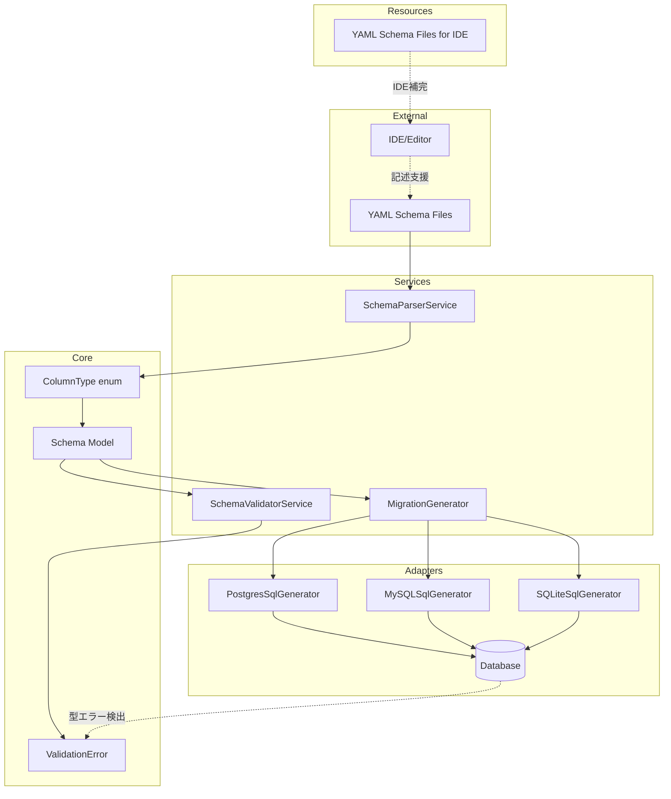
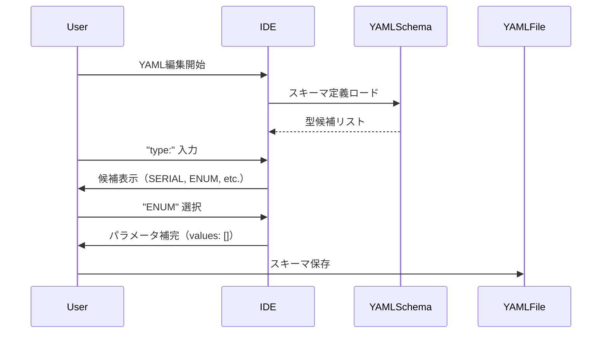
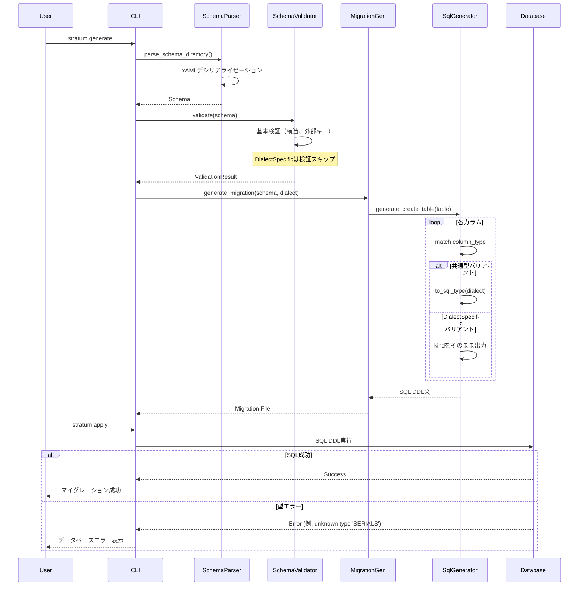
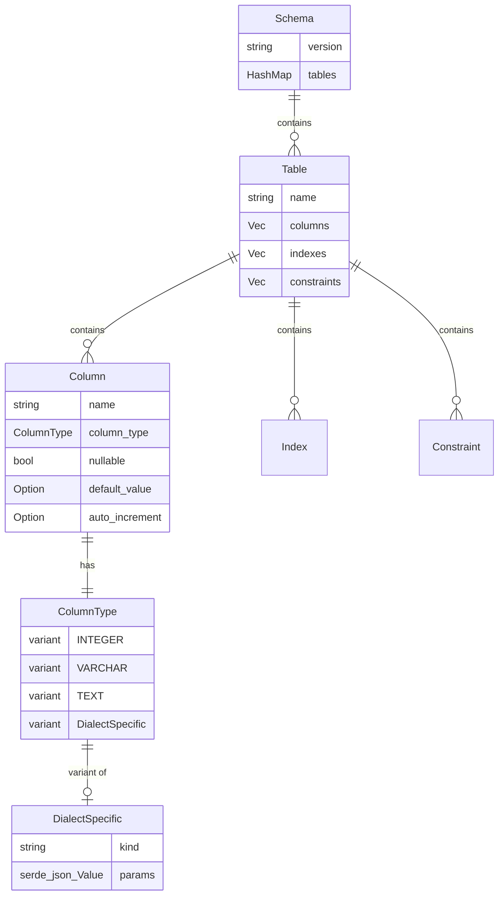
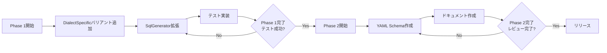

# Design Document: dialect-specific-column-types

**作成日**: 2026-01-22T09:54:21Z
**仕様ID**: dialect-specific-column-types
**ステータス**: Draft
**言語**: 日本語

---

## Overview

本設計は、Stratumのカラム型定義システムを拡張し、各データベース方言（PostgreSQL, MySQL, SQLite）固有の型を直接指定可能にします。現状の共通型抽象化システム（15種類の `ColumnType` enum）を維持しつつ、`DialectSpecific` バリアントを導入し、方言固有型をそのままSQL DDLに出力します。型の妥当性検証はデータベースエンジン側に委譲し、Stratumはシンプルな橋渡し役に徹します。

**Purpose**: スキーマ開発者がデータベース方言の機能を最大限活用できるようにし、方言固有型（PostgreSQLの `SERIAL`, MySQLの `ENUM`, `TINYINT` 等）を宣言的に定義可能にする。

**Users**: Stratumを使用するバックエンドエンジニア、DevOps/SREチーム。特定の方言に特化したスキーマ設計を行う開発者。

**Impact**: 既存の共通型システムは変更なく動作。新しい方言固有型定義により、データベース固有の機能をYAML定義から直接利用可能に。型エラーはデータベース実行時に検出され、データベースの正確なエラーメッセージがユーザーに伝達される。

### Goals

- 方言固有カラム型の定義機能の実装（要件1）
- IDE補完用のYAML Schema（JSON Schema形式）の提供（要件2の一部）
- 方言固有型のSQL DDL生成（`kind`をそのまま出力）（要件4）
- データベースエラーの透過的な伝達（要件5）

### Non-Goals

- Stratum内部での方言固有型の検証（データベースに委譲）
- 方言間の型自動変換機能（各方言の型はそのままSQL出力）
- GUIベースのスキーマエディター
- 既存の共通型定義の廃止または変更
- YAML行番号の取得（`serde-saphyr`の制約）
- マルチ方言対応スキーマ（Phase 1では単一方言）

## Architecture

### Existing Architecture Analysis

**現在のアーキテクチャパターン**:
- Clean Architecture: CLI → Services → Core ← Adapters
- 依存性方向: 外側から内側（Adapters → Core, Services → Core）
- 型システム: 単一の `ColumnType` enum で全方言を抽象化
- 検証戦略: ハードコードされたバリデーションロジック（`SchemaValidatorService`）

**尊重すべきドメイン境界**:
- **Core Domain** ([src/core/schema.rs](../../../src/core/schema.rs)): ドメインモデル（Schema, Table, Column, ColumnType, Constraint）
- **Services Layer** ([src/services/](../../../src/services/)): ビジネスロジック（パース、検証、差分検出）
- **Adapters Layer** ([src/adapters/](../../../src/adapters/)): 外部統合（SQL生成、データベース接続）

**統合ポイントの維持**:
- YAML → `SchemaParserService` → `Schema` オブジェクト
- `SchemaValidatorService` による基本検証（テーブル構造、外部キー整合性）
- `SqlGenerator` トレイト実装による方言別SQL生成

**技術的負債の対応**:
- 方言固有型の検証ロジックをデータベース側に委譲（Stratumの責務を明確化）
- 方言別マッピングロジックの簡素化（`DialectSpecific`はそのまま出力）

### Architecture Pattern & Boundary Map

**選択パターン**: Simplified Approach（シンプルアプローチ）
- 既存の共通型システム（`ColumnType` enum）を維持
- `DialectSpecific` バリアントを追加（検証なし、そのまま出力）
- JSON Schemaは IDE補完用リソースとして提供（Stratum内部では未使用）

**ドメイン/機能境界**:
- **Core Domain**: `ColumnType` enumの拡張（`DialectSpecific` バリアント追加）
- **Validation Domain**: 基本的な構造検証のみ（型の妥当性はデータベースに委譲）
- **Generation Domain**: SQL生成ロジックの拡張（`kind`をそのまま出力）



**既存パターンの保持**:
- Serdeによる宣言的デシリアライゼーション（`#[serde(tag = "kind")]`）
- トレイトベースのSQL生成（`SqlGenerator` トレイト）
- バリデーション結果の集約（`ValidationResult`）

**新規コンポーネントの根拠**:
- **`ColumnType::DialectSpecific`**: 方言固有型の橋渡し（検証なし、そのまま出力）
- **YAML Schemaファイル**: IDE補完用リソース（VSCode等でのYAML記述支援）

**ステアリング適合性**:
- Clean Architectureの依存性方向を維持（Core → Services → Adapters）
- パニックフリー設計（`serde-saphyr`の活用）
- シンプルさの優先（型検証はデータベース側に委譲）

### Technology Stack

| Layer | Choice / Version | Role in Feature | Notes |
|-------|------------------|-----------------|-------|
| Core / Domain | `ColumnType` enum拡張 | `DialectSpecific` バリアント追加 | 既存の共通型バリアントは変更なし |
| Resources | YAML Schema (JSON Schema形式) | IDE補完用リソース | VSCode等での記述支援、Stratum内部では未使用 |
| Serialization | `serde-saphyr = "0.0.16"` | YAMLパーサー（既存） | パニックフリー、位置情報なし |
| Error Handling | `thiserror = "2"` | エラー型定義（既存） | データベースエラーの透過的伝達 |

**技術選択の根拠**:
- **YAML Schema（JSON Schema形式）**: IDE補完でのDX向上、公式仕様で広くサポート
- **検証なしアプローチ**: データベースエンジンの正確なエラーメッセージを活用、Stratumの実装をシンプルに保つ
- **既存スタック維持**: 新規依存関係なし（`jsonschema` crate不要）

詳細な調査結果と選定理由は [`research.md`](./research.md) を参照。

## System Flows

### 方言固有型のYAML記述フロー（IDE補完）



**フローレベルの決定事項**:
- **IDE補完**: YAML Schemaにより、方言固有型の候補とパラメータを自動表示
- **検証タイミング**: IDE側でリアルタイム検証（任意）、Stratum側では構造チェックのみ

### 方言固有型のSQL生成・実行フロー



**フローレベルの決定事項**:
- **検証スキップ**: `DialectSpecific` バリアントは構造のみチェック、型の妥当性は検証しない
- **エラー検出**: データベース実行時に型エラーを検出、エラーメッセージをそのまま伝達
- **SQL出力の透過性**: `kind` をそのままSQL DDL文に出力（型変換なし）

## Requirements Traceability

| 要件 | 概要 | コンポーネント | インターフェース | フロー |
|------|------|---------------|----------------|-------|
| 1.1 | 方言固有`kind`値の受け入れ | `ColumnType::DialectSpecific`, `SchemaParserService` | `DialectSpecific { kind, params }` | SQL生成フロー |
| 1.2 | 方言専用バリアントのサポート | `ColumnType::DialectSpecific` | `DialectSpecific { kind, params }` | SQL生成フロー |
| 1.3 | 複数方言対応構造 | (Phase 2で検討) | - | - |
| 1.4 | 方言固有パラメータのシリアライゼーション | `ColumnType::DialectSpecific`, Serde | `params: serde_json::Value` | SQL生成フロー |
| 2.1 | YAML Schemaファイル提供 | `resources/schemas/*.yaml-schema.json` | - | IDE補完フロー |
| 2.2 | 型候補の提供（IDE補完） | YAML Schemaファイル | - | IDE補完フロー |
| 2.3 | 型エラーの検出 | Database（データベースエンジン） | - | SQL実行フロー |
| 2.4 | パラメータエラーの検出 | Database（データベースエンジン） | - | SQL実行フロー |
| 2.5 | 拡張性（新規型追加） | YAML Schemaファイル更新 | - | IDE補完フロー |
| 3.1 | 共通型の継続サポート | `ColumnType` enum（既存バリアント） | 既存インターフェース | SQL生成フロー |
| 3.2 | 混在スキーマのサポート | `SchemaValidator`, `SqlGenerator` | 両バリアント対応 | SQL生成フロー |
| 3.3 | デフォルト共通型解釈 | `SchemaParserService` | Serde Tagged Union | SQL生成フロー |
| 4.1 | 方言固有型のSQL出力 | `SqlGenerator` 実装 | `generate_create_table()` | SQL生成フロー |
| 4.2 | 方言別up/down SQL | `MigrationGenerator` | `generate_migration()` | SQL生成フロー |
| 4.3 | 型変換なしでSQL出力 | `SqlGenerator` 実装 | `DialectSpecific` 分岐 | SQL生成フロー |
| 4.4 | 未サポート型の警告 | (データベース実行時に検出) | - | SQL実行フロー |
| 5.1 | 詳細エラーメッセージ | Database → CLI | データベースエラー透過伝達 | SQL実行フロー |
| 5.2 | パラメータエラー詳細 | Database → CLI | データベースエラー透過伝達 | SQL実行フロー |
| 5.3 | 適切な終了コード | CLI commands（既存） | `std::process::exit()` | - |
| 5.4 | 複数エラー一括表示 | `ValidationResult`（既存） | `add_error()` | 基本検証フロー |
| 6.1 | 型リファレンス | ドキュメント（新規作成） | - | - |
| 6.2 | サンプルスキーマ | `example/schema/`（新規ファイル） | - | - |
| 6.3 | マイグレーションガイド | ドキュメント（新規作成） | - | - |
| 6.4 | トラブルシューティング | ドキュメント（新規作成） | - | - |

## Components and Interfaces

### Component Summary

| Component | Domain/Layer | Intent | Req Coverage | Key Dependencies (P0/P1) | Contracts |
|-----------|--------------|--------|--------------|--------------------------|-----------|
| `ColumnType::DialectSpecific` | Core/Domain | 方言固有型の橋渡し（検証なし） | 1.1, 1.2, 1.4 | Serde (P0) | State |
| `SchemaValidatorService` | Services | 基本的な構造検証のみ | 3.2, 5.4 | ValidationResult (P0) | Service |
| `PostgresSqlGenerator` | Adapters | PostgreSQL SQL生成 | 4.1, 4.2, 4.3 | ColumnType (P0) | Service |
| `MySQLSqlGenerator` | Adapters | MySQL SQL生成 | 4.1, 4.2, 4.3 | ColumnType (P0) | Service |
| `SQLiteSqlGenerator` | Adapters | SQLite SQL生成 | 4.1, 4.2, 4.3 | ColumnType (P0) | Service |
| YAML Schemaファイル | Resources | IDE補完用リソース | 2.1, 2.2, 2.5 | - | - |

### Core Domain

#### `ColumnType::DialectSpecific`

| Field | Detail |
|-------|--------|
| Intent | 方言固有型のデータ保持（型名、パラメータ）、検証なしでSQL出力 |
| Requirements | 1.1, 1.2, 1.4 |

**Responsibilities & Constraints**
- 方言固有型の `kind` 値とパラメータを保持
- Serdeによる自動シリアライゼーション/デシリアライゼーション
- 検証は行わず、SQL生成時にそのまま出力
- 既存の共通型バリアントと共存（`#[serde(tag = "kind")]` パターン維持）

**Dependencies**
- Inbound: `SchemaParserService` — YAMLデシリアライゼーション (P0)
- Outbound: `serde_json::Value` — 型パラメータの柔軟な保持 (P0)

**Contracts**: State [✓]

##### State Management

**State model**:
```rust
#[derive(Debug, Clone, PartialEq, Serialize, Deserialize)]
#[serde(tag = "kind")]
pub enum ColumnType {
    // 既存の共通型バリアント（変更なし）
    INTEGER { precision: Option<u32> },
    VARCHAR { length: u32 },
    TEXT,
    BOOLEAN,
    TIMESTAMP { with_time_zone: Option<bool> },
    JSON,
    DECIMAL { precision: u32, scale: u32 },
    FLOAT,
    DOUBLE,
    CHAR { length: u32 },
    DATE,
    TIME { with_time_zone: Option<bool> },
    BLOB,
    UUID,
    JSONB,

    // 新規: 方言固有型（検証なし）
    #[serde(untagged)]
    DialectSpecific {
        kind: String,  // 型名（例: "SERIAL", "ENUM"）
        #[serde(flatten)]
        params: serde_json::Value,  // 型パラメータ（任意）
    },
}
```

**YAML記述例**:
```yaml
# PostgreSQL SERIAL型
- name: id
  type:
    kind: SERIAL
  nullable: false

# MySQL ENUM型
- name: status
  type:
    kind: ENUM
    values: ["active", "inactive", "pending"]
  nullable: false

# PostgreSQL VARBIT型
- name: flags
  type:
    kind: VARBIT
    length: 16
  nullable: true
```

**Persistence & consistency**:
- YAMLファイルとのシリアライゼーション/デシリアライゼーション
- `#[serde(tag = "kind")]` による Tagged Union パターン
- `DialectSpecific` は `#[serde(untagged)]` により柔軟な構造を許容

**Concurrency strategy**:
- Immutable（変更不可）
- スレッドセーフ（`Clone`, `PartialEq` 実装）

**Implementation Notes**
- **Integration**: 既存の `ColumnType` enumに新規バリアントを追加、後方互換性維持
- **Validation**: Stratum内部では検証せず、データベース実行時にエラー検出
- **Risks**: タイプミスによる型エラーはデータベース実行時に検出（軽減策: IDE補完、YAML Schema提供）

### Services Layer

#### `SchemaValidatorService` (変更最小限)

| Field | Detail |
|-------|--------|
| Intent | 基本的な構造検証のみ（型の妥当性はスキップ） |
| Requirements | 3.2, 5.4 |

**Responsibilities & Constraints**
- 既存の共通型検証ロジックの維持（DECIMAL, CHARのパラメータチェック）
- `DialectSpecific` バリアントは検証スキップ（データベースに委譲）
- テーブル構造、外部キー整合性の検証（既存機能）
- エラーの集約と `ValidationResult` への追加

**Dependencies**
- Inbound: CLI commands — スキーマ検証の実行 (P0)
- Outbound: `ValidationResult` — エラー集約 (P0)

**Contracts**: Service [✓]

##### Service Interface

```rust
impl SchemaValidatorService {
    /// スキーマ定義の全体的な検証を実行
    ///
    /// # Arguments
    /// * `schema` - 検証対象のスキーマ
    ///
    /// # Returns
    /// 検証結果（エラーのリストを含む）
    pub fn validate(&self, schema: &Schema) -> ValidationResult {
        let mut result = ValidationResult::new();

        // 既存の検証ロジック（共通型、テーブル構造、外部キー）
        for (table_name, table) in &schema.tables {
            // テーブルが少なくとも1つのカラムを持つか
            if table.columns.is_empty() {
                result.add_error(ValidationError::Constraint { ... });
            }

            // 各カラムの型固有バリデーション
            for column in &table.columns {
                match &column.column_type {
                    ColumnType::DECIMAL { precision, scale } => {
                        // 既存の検証ロジック
                    }
                    ColumnType::CHAR { length } => {
                        // 既存の検証ロジック
                    }
                    ColumnType::DialectSpecific { .. } => {
                        // 検証スキップ（データベースに委譲）
                    }
                    _ => {}
                }
            }

            // 外部キー整合性、インデックス、制約の検証（既存ロジック）
            // ...
        }

        result
    }
}
```

- **Preconditions**: なし
- **Postconditions**: 基本的な構造エラーが `ValidationResult` に集約
- **Invariants**: `DialectSpecific` バリアントは常に検証スキップ

**Implementation Notes**
- **Integration**: `DialectSpecific` バリアント検出時は何もしない（スキップ）
- **Validation**: 既存の共通型検証ロジックは変更なし
- **Risks**: なし（既存の動作を維持）

### Adapters Layer

#### `PostgresSqlGenerator` / `MySQLSqlGenerator` / `SQLiteSqlGenerator` (拡張)

| Field | Detail |
|-------|--------|
| Intent | 方言固有型のSQL DDL生成（`kind`をそのまま出力） |
| Requirements | 4.1, 4.2, 4.3 |

**Responsibilities & Constraints**
- `DialectSpecific` バリアントの `kind` をそのままSQL DDL文に出力
- パラメータがある場合は適切にフォーマット（例: `ENUM('a', 'b')`）
- 既存の共通型生成ロジックの維持
- 型エラーはデータベース実行時に検出（Stratumは関与しない）

**Dependencies**
- Inbound: `MigrationGenerator` — SQL生成の委譲 (P0)
- Outbound: `ColumnType` — 型情報の取得 (P0)

**Contracts**: Service [✓]

##### Service Interface (拡張部分)

```rust
impl SqlGenerator for PostgresSqlGenerator {
    fn generate_create_table(&self, table: &Table) -> String {
        // カラム定義の生成
        let column_defs: Vec<String> = table.columns.iter().map(|column| {
            let type_str = match &column.column_type {
                // 既存の共通型
                ColumnType::INTEGER { precision } => self.map_column_type(...),
                ColumnType::VARCHAR { length } => format!("VARCHAR({})", length),
                // ...

                // 新規: 方言固有型（kindをそのまま出力）
                ColumnType::DialectSpecific { kind, params } => {
                    self.format_dialect_specific_type(kind, params)
                }
            };

            format!("{} {}", column.name, type_str)
        }).collect();

        format!("CREATE TABLE {} ({});", table.name, column_defs.join(", "))
    }

    /// 方言固有型のフォーマット
    fn format_dialect_specific_type(&self, kind: &str, params: &serde_json::Value) -> String {
        // パラメータがある場合の処理例
        if let Some(values) = params.get("values").and_then(|v| v.as_array()) {
            // ENUM('a', 'b', 'c') 形式
            let values_str = values.iter()
                .filter_map(|v| v.as_str())
                .map(|s| format!("'{}'", s))
                .collect::<Vec<_>>()
                .join(", ");
            format!("{}({})", kind, values_str)
        } else if let Some(length) = params.get("length").and_then(|v| v.as_u64()) {
            // VARBIT(16) 形式
            format!("{}({})", kind, length)
        } else {
            // パラメータなし
            kind.to_string()
        }
    }
}
```

- **Preconditions**: `DialectSpecific` バリアントのYAMLパースが成功していること
- **Postconditions**: `kind` がそのままSQL DDL文に含まれる
- **Invariants**: 既存の共通型生成ロジックは変更なし

**Implementation Notes**
- **Integration**: `match` 式で `DialectSpecific` バリアントを追加、`format_dialect_specific_type()` で柔軟な型フォーマット
- **Validation**: SQL生成時の検証は行わず、データベース実行時にエラー検出
- **Risks**: タイプミスによる型エラーはデータベースで検出（軽減策: IDE補完、ドキュメント提供）

### Resources

#### YAML Schemaファイル（IDE補完用）

**構造定義**: PostgreSQL, MySQL, SQLiteごとに個別のYAML Schema（JSON Schema形式）

**PostgreSQL型定義例** (`postgres-types.yaml-schema.json`):
```json
{
  "$schema": "http://json-schema.org/draft-07/schema#",
  "title": "PostgreSQL Column Types",
  "description": "PostgreSQL-specific column type definitions for IDE completion",
  "definitions": {
    "postgresql_type": {
      "oneOf": [
        {
          "type": "object",
          "properties": {
            "kind": {
              "const": "SERIAL",
              "description": "Auto-incrementing integer (equivalent to INTEGER + SEQUENCE)"
            }
          },
          "required": ["kind"],
          "additionalProperties": false
        },
        {
          "type": "object",
          "properties": {
            "kind": {
              "const": "BIGSERIAL",
              "description": "Auto-incrementing big integer"
            }
          },
          "required": ["kind"],
          "additionalProperties": false
        },
        {
          "type": "object",
          "properties": {
            "kind": {
              "const": "VARBIT",
              "description": "Variable-length bit string"
            },
            "length": {
              "type": "integer",
              "minimum": 1,
              "description": "Maximum length in bits"
            }
          },
          "required": ["kind"]
        },
        {
          "type": "object",
          "properties": {
            "kind": {
              "const": "INET",
              "description": "IPv4 or IPv6 network address"
            }
          },
          "required": ["kind"],
          "additionalProperties": false
        }
      ]
    }
  }
}
```

**MySQL型定義例** (`mysql-types.yaml-schema.json`):
```json
{
  "$schema": "http://json-schema.org/draft-07/schema#",
  "title": "MySQL Column Types",
  "description": "MySQL-specific column type definitions for IDE completion",
  "definitions": {
    "mysql_type": {
      "oneOf": [
        {
          "type": "object",
          "properties": {
            "kind": {
              "const": "TINYINT",
              "description": "Very small integer (-128 to 127 or 0 to 255)"
            },
            "unsigned": {
              "type": "boolean",
              "description": "If true, range is 0 to 255"
            }
          },
          "required": ["kind"]
        },
        {
          "type": "object",
          "properties": {
            "kind": {
              "const": "ENUM",
              "description": "String object with a value chosen from a list"
            },
            "values": {
              "type": "array",
              "items": {
                "type": "string"
              },
              "minItems": 1,
              "description": "List of allowed values"
            }
          },
          "required": ["kind", "values"]
        }
      ]
    }
  }
}
```

**Consistency & Integrity**:
- YAML Schemaファイルは `resources/schemas/` に配置（IDE参照用）
- VSCode等のエディタが自動的にYAML Schemaを認識
- 拡張性: 新しい型の追加は `oneOf` 配列に新規エントリを追加

**IDE設定例（VSCode）**:
```json
{
  "yaml.schemas": {
    "./resources/schemas/postgres-types.yaml-schema.json": "schema/**/*.yaml",
    "./resources/schemas/mysql-types.yaml-schema.json": "schema/**/*.yaml",
    "./resources/schemas/sqlite-types.yaml-schema.json": "schema/**/*.yaml"
  }
}
```

**Implementation Notes**
- **Integration**: ユーザーがVSCode等のIDEでYAML編集時に自動補完を利用
- **Validation**: IDE側でリアルタイム検証（任意）、Stratum側では未使用
- **Risks**: YAML Schemaの更新忘れ（軽減策: ドキュメント化、リリースノート記載）

## Data Models

### Domain Model

**Aggregates and transactional boundaries**:
- **Schema Aggregate**: `Schema` がルートエンティティ、`Table`, `Column`, `Index`, `Constraint` を集約
- トランザクション境界: YAMLファイル単位（パース、検証、SQL生成は原子的）

**Entities, value objects, domain events**:
- **Entity**: `Schema`, `Table`, `Column`
- **Value Object**: `ColumnType`, `Constraint`, `Index`
- **Domain Events**: なし（現状はイベント駆動ではない）

**Business rules & invariants**:
- テーブルは少なくとも1つのカラムを持つ
- テーブルは必ずプライマリキーを持つ（バリデーション時にチェック）
- 外部キーは参照先テーブル・カラムが存在する
- 方言固有型の妥当性はデータベースエンジン側で検証

### Logical Data Model

**Structure Definition**:
- `ColumnType` enum: 共通型 + 方言固有型の Union Type
- `DialectSpecific` バリアント: `kind` (String), `params` (JSON)



**Consistency & Integrity**:
- `ColumnType` enum: Tagged Union (`#[serde(tag = "kind")]`) で型安全性を担保
- `DialectSpecific`: 検証なし、データベースエンジンに委譲
- Serdeによる自動シリアライゼーション/デシリアライゼーション

### Data Contracts & Integration

**API Data Transfer**:
- YAML → `Schema` オブジェクト（Serdeによる自動変換）
- `DialectSpecific` バリアント: `serde_json::Value` でパラメータを柔軟に保持

**Serialization format**:
- YAML入力: `serde-saphyr` によるパニックフリーパース
- SQL出力: 文字列生成（方言別、`kind`をそのまま出力）

## Error Handling

### Error Strategy

**具体的なエラーハンドリングパターン**:
1. **パース時エラー**: YAML構文エラー → `IoError::FileRead` + ファイルパス
2. **検証時エラー**: 基本的な構造エラー → `ValidationError::Constraint` + テーブル名・カラム名
3. **SQL実行時エラー**: 型エラー → データベースエラーを透過的に伝達

### Error Categories and Responses

**User Errors (4xx相当)**:
- **Invalid YAML**: YAML構文エラー → パースエラー + ファイルパス
- **Missing table**: テーブル定義なし → `ValidationError::Constraint`
- **Invalid type**: 方言固有型のタイプミス → データベースエラー（例: `ERROR: type "SERIALS" does not exist`）

**System Errors (5xx相当)**:
- **Database connection**: 接続エラー → `anyhow::Error`（既存エラーハンドリング）

**Business Logic Errors (422相当)**:
- **Type mismatch**: 方言固有型がデータベース側で不正 → データベースエラー透過伝達

**データベースエラー例（PostgreSQL）**:
```
ERROR:  type "SERIALS" does not exist
LINE 1: CREATE TABLE users (id SERIALS);
                               ^
HINT:  Did you mean "SERIAL"?
```

**Stratumの出力例**:
```
Error: Failed to apply migration
Caused by:
  Database error: type "SERIALS" does not exist
  LINE 1: CREATE TABLE users (id SERIALS);
                                 ^
  HINT: Did you mean "SERIAL"?

File: migrations/20260122_create_users/up.sql
```

### Monitoring

- **Error tracking**: `ValidationResult` による基本エラーの集約
- **Database errors**: データベースエラーをそのまま表示（透過的伝達）
- **Logging**: `tracing` crateによる構造化ログ（将来的な拡張）
- **Health monitoring**: CLI終了コード（0: 成功, 1: エラー）

## Testing Strategy

### Unit Tests

1. **`ColumnType::DialectSpecific` のシリアライゼーション**: YAMLとの相互変換
   - YAML → `DialectSpecific` のデシリアライゼーション（`SERIAL`, `ENUM`）
   - `DialectSpecific` → YAML のシリアライゼーション
   - 既存の共通型との混在スキーマのパース

2. **`SchemaValidatorService::validate()`**: 基本的な構造検証
   - `DialectSpecific` バリアントは検証スキップ
   - 既存の共通型検証ロジックは変更なし

3. **`SqlGenerator::generate_create_table()`**: 方言固有型のSQL生成
   - PostgreSQL `SERIAL` → `CREATE TABLE ... id SERIAL`
   - MySQL `ENUM` → `CREATE TABLE ... status ENUM('active', 'inactive')`
   - MySQL `TINYINT` → `CREATE TABLE ... age TINYINT`
   - 既存の共通型と方言固有型の混在テーブル

### Integration Tests

1. **E2EマイグレーションSQLフロー**: YAML → パース → 検証 → SQL生成
   - PostgreSQL方言でのマイグレーションSQL生成（`SERIAL` 含む）
   - MySQL方言でのマイグレーションSQL生成（`ENUM` 含む）
   - 既存の共通型と方言固有型の混在スキーマのSQL生成

2. **データベース実行テスト**: SQL生成 → データベース実行 → エラー確認
   - PostgreSQL `SERIAL` 型の正常動作確認（testcontainers使用）
   - MySQL `ENUM` 型の正常動作確認（testcontainers使用）
   - タイプミス（`SERIALS`）によるデータベースエラー検出

3. **後方互換性テスト**: 既存のYAMLスキーマファイルの動作確認
   - `example/schema/users.yaml` の検証とSQL生成（共通型のみ）
   - `example/schema/products.yaml` の検証とSQL生成（共通型のみ）
   - 既存の統合テストがすべて成功

## Optional Sections

### Migration Strategy

**Phase 1: `DialectSpecific` バリアントの導入**
1. `ColumnType::DialectSpecific` バリアントの追加
2. `SqlGenerator` 実装の拡張（`format_dialect_specific_type()` メソッド）
3. 単体テスト・統合テストの実装
4. サンプルスキーマファイルの追加（`postgres_advanced.yaml`, `mysql_advanced.yaml`）

**Phase 2: YAML Schemaとドキュメントの提供**
1. YAML Schemaファイルの作成（PostgreSQL, MySQL, SQLite）
2. IDE設定ガイドの作成（VSCode, IntelliJ）
3. 型リファレンスドキュメントの作成
4. マイグレーションガイドの作成（既存の共通型から方言固有型への移行手順）



**Rollback triggers**:
- Phase 1: 既存の統合テストが失敗（後方互換性の問題）
- Phase 2: なし（ドキュメントのみの変更）

**Validation checkpoints**:
- Phase 1完了時: すべての単体テスト・統合テスト成功、既存YAMLスキーマの動作確認
- Phase 2完了時: YAML SchemaでのIDE補完動作確認、ドキュメントレビュー完了

## Supporting References

### YAML Schemaファイルの完全定義

詳細な型定義は以下のファイルを参照（実装時に作成）:
- [`postgres-types.yaml-schema.json`](../../../resources/schemas/postgres-types.yaml-schema.json)
- [`mysql-types.yaml-schema.json`](../../../resources/schemas/mysql-types.yaml-schema.json)
- [`sqlite-types.yaml-schema.json`](../../../resources/schemas/sqlite-types.yaml-schema.json)

### 方言別型リファレンス

各データベース方言でサポートされる型の一覧:
- **PostgreSQL**: `SERIAL`, `BIGSERIAL`, `SMALLSERIAL`, `INT2`, `INT4`, `INT8`, `VARBIT`, `INET`, `CIDR`, `ARRAY`
- **MySQL**: `TINYINT`, `MEDIUMINT`, `ENUM`, `SET`, `YEAR`
- **SQLite**: `INTEGER PRIMARY KEY`（その他は共通型で対応可能）

詳細は [`research.md`](./research.md) の「方言型定義の網羅性調査」を参照。
