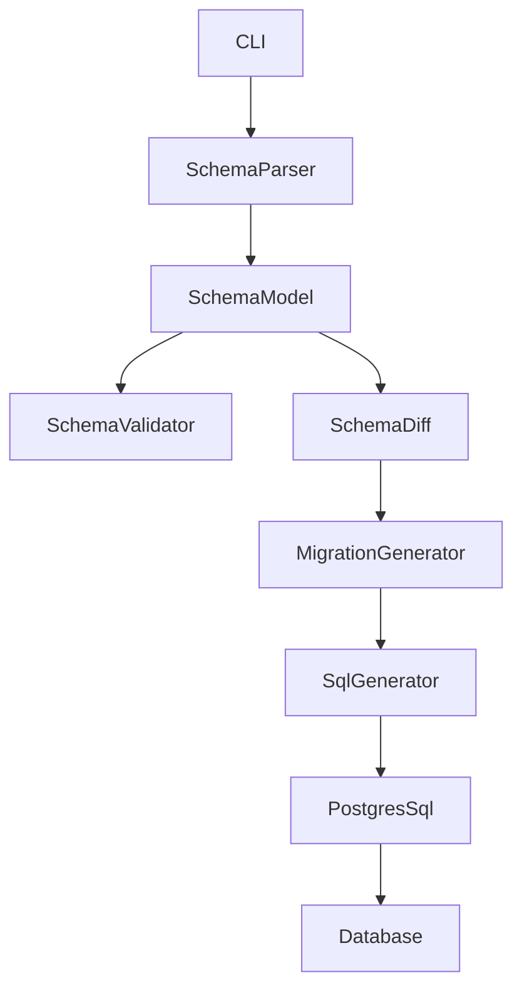
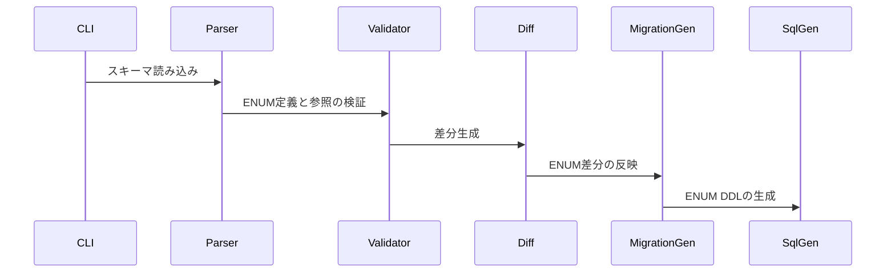
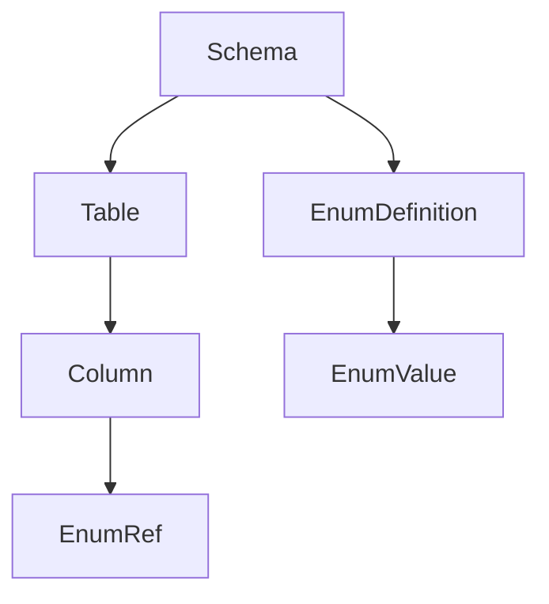
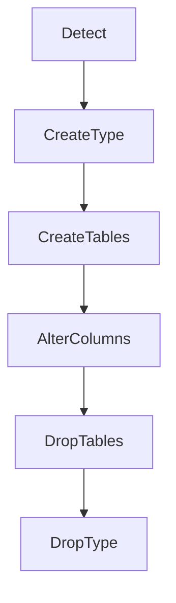

# Design Document

---
**Purpose**: Provide sufficient detail to ensure implementation consistency across different implementers, preventing interpretation drift.

**Approach**:
- Include essential sections that directly inform implementation decisions
- Omit optional sections unless critical to preventing implementation errors
- Match detail level to feature complexity
- Use diagrams and tables over lengthy prose

**Warning**: Approaching 1000 lines indicates excessive feature complexity that may require design simplification.
---

> Sections may be reordered (e.g., surfacing Requirements Traceability earlier or moving Data Models nearer Architecture) when it improves clarity. Within each section, keep the flow **Summary → Scope → Decisions → Impacts/Risks** so reviewers can scan consistently.

## Overview
StratumにPostgreSQLのENUM型サポートを追加し、スキーマ定義、検証、差分検出、マイグレーション生成、エクスポートの全工程で一貫して扱えるようにする。既存の方言固有型の扱いではDDLの作成順序や変更の追跡ができないため、ENUMをスキーマの一級要素として扱う。

対象ユーザーは、PostgreSQLを利用するバックエンドエンジニアおよび運用チームである。ENUM型の追加・変更・削除が環境間で再現できるようになり、DB状態とスキーマコードの乖離を減らす。

### Goals
- PostgreSQL ENUMをスキーマに定義・参照できる
- ENUMの変更を差分として検知し、マイグレーションに反映できる
- エクスポートでENUM定義と値順序を保持できる

### Non-Goals
- PostgreSQL以外の方言でのENUM共通化
- ENUM値のデータ移行（既存データの変換）
- GUIや対話型編集の提供

## Architecture

### Existing Architecture Analysis (if applicable)
- 既存は`ColumnType::DialectSpecific`で方言固有型を表現しているが、検証や差分検出から除外されている。
- マイグレーション生成はテーブル中心で、型定義の作成/削除を扱わない。
- PostgreSQL SQL生成は`ENUM(values...)`をカラム型として出力するため、型作成DDLが欠落している。

### Architecture Pattern & Boundary Map
**Architecture Integration**:
- Selected pattern: 既存のレイヤードアーキテクチャに沿い、CoreにENUM定義、Servicesに検証/差分/生成を追加する
- Domain/feature boundaries: ENUMはSchema配下の新しいドメイン要素として扱い、SQL生成はAdapterに閉じる
- Existing patterns preserved: YAML解析→検証→差分→SQL生成の流れ
- New components rationale: ENUM定義と参照整合性を維持するため
- Steering compliance: 型安全と方言抽象化を維持



### Technology Stack

| Layer | Choice / Version | Role in Feature | Notes |
|-------|------------------|-----------------|-------|
| Frontend / CLI | clap 4.5 | ENUM定義の入力とエクスポート結果の表示 | 既存利用継続 |
| Backend / Services | Rust 1.92 | ENUM検証・差分・DDL生成 | 追加ロジックのみ |
| Data / Storage | PostgreSQL | ENUM型の作成/変更/削除対象 | 新規依存なし |
| Infrastructure / Runtime | Tokio 1.49 | 非同期DBアクセス | 既存利用継続 |

## System Flows



マイグレーション生成では、ENUMの新規作成は`CREATE TYPE ... AS ENUM (...)`を先行し、テーブル作成前に実行されるよう順序を制御する。値の追加は`ALTER TYPE ... ADD VALUE`で行い、削除や並び替えはデフォルトでは拒否する。削除/並び替えを明示的に許可するオプトイン設定がある場合のみ、再作成フローで対応する。削除時は参照が外れた後に型削除が行われる。

## Requirements Traceability

| Requirement | Summary | Components | Interfaces | Flows |
|-------------|---------|------------|------------|-------|
| 1.1 | ENUM定義の表現 | SchemaModel, SchemaParser | Schema YAML Contract | - |
| 1.2 | 空値リスト拒否 | SchemaValidator | Validation Contract | - |
| 1.3 | 値重複の検出 | SchemaValidator | Validation Contract | - |
| 1.4 | 未定義ENUM参照の検出 | SchemaValidator | Validation Contract | - |
| 1.5 | 非PostgreSQLで無効扱い | SchemaValidator, CLI | Validation Contract | - |
| 2.1 | ENUM作成DDLの生成 | MigrationGenerator, PostgresSqlGenerator | Migration Contract | Sequence | 
| 2.2 | ENUM変更DDLの生成 | MigrationGenerator, PostgresSqlGenerator | Migration Contract | Sequence | 
| 2.3 | ENUM削除DDLの生成 | MigrationGenerator, PostgresSqlGenerator | Migration Contract | Sequence | 
| 2.4 | 変更なしのDDL抑制 | SchemaDiff, MigrationGenerator | Migration Contract | - |
| 3.1 | 適用失敗の報告 | MigrationApplier | Apply Contract | - |
| 3.2 | 失敗時に未適用扱い | MigrationApplier | Apply Contract | - |
| 3.3 | ロールバックで復元 | MigrationApplier | Rollback Contract | - |
| 4.1 | ENUMのエクスポート | ExportCommand | Export Contract | - |
| 4.2 | 値順序の保持 | ExportCommand | Export Contract | - |
| 4.3 | 再読込の等価性 | SchemaParser | Schema YAML Contract | - |

## Components and Interfaces

| Component | Domain/Layer | Intent | Req Coverage | Key Dependencies (P0/P1) | Contracts |
|-----------|--------------|--------|--------------|--------------------------|-----------|
| EnumDefinition | Core | ENUM型の定義と値順序を保持 | 1.1, 4.3 | Schema (P0) | State |
| SchemaParserService | Services | ENUM定義の読み込みと参照解決 | 1.1, 4.3 | EnumDefinition (P0) | Service |
| SchemaValidatorService | Services | ENUM定義と参照の検証 | 1.2, 1.3, 1.4, 1.5 | EnumDefinition (P0) | Service |
| SchemaDiffDetector | Services | ENUM差分の抽出 | 2.4 | EnumDefinition (P0) | Service |
| MigrationGenerator | Services | ENUM DDLの順序制御 | 2.1, 2.2, 2.3 | SqlGenerator (P0) | Service |
| PostgresSqlGenerator | Adapters | ENUM作成・変更・削除DDLの生成 | 2.1, 2.2, 2.3 | - | Service |
| ExportCommand | CLI | ENUM定義の抽出と出力 | 4.1, 4.2 | Database (P0) | Service |
| MigrationApplier | Adapters | ENUM適用/ロールバックの整合性 | 3.1, 3.2, 3.3 | Database (P0) | Service |

### Core Domain

#### EnumDefinition

| Field | Detail |
|-------|--------|
| Intent | ENUM型名と値順序の一貫表現 |
| Requirements | 1.1, 4.3 |

**Responsibilities & Constraints**
- ENUM型名と値順序の保存
- Schemaの定義コレクションの一部として管理
- 値順序は比較と再生成の基準

**Dependencies**
- Inbound: Schema — ENUM定義の登録 (P0)
- Outbound: -
- External: -

**Contracts**: Service [ ] / API [ ] / Event [ ] / Batch [ ] / State [x]

**Implementation Notes**
- Integration: SchemaにENUM定義集合を追加する
- Validation: 空値・重複はValidatorで拒否
- Risks: 既存DialectSpecificとの境界が曖昧になる可能性

### Services Layer

#### SchemaParserService

| Field | Detail |
|-------|--------|
| Intent | YAMLからENUM定義を読み込む |
| Requirements | 1.1, 4.3 |

**Responsibilities & Constraints**
- ENUM定義セクションの解析
- カラム型がENUM参照を行う場合の解決
- 未定義参照はValidatorに委譲
- ENUM定義はトップレベルの`enums`セクションで宣言される

**Dependencies**
- Inbound: CLI — スキーマ読み込み (P0)
- Outbound: Schema — ENUM定義の追加 (P0)
- External: -

**Contracts**: Service [x] / API [ ] / Event [ ] / Batch [ ] / State [ ]

##### Service Interface
| Method | Input | Output | Errors |
|--------|-------|--------|--------|
| parse_schema_file | SchemaFile | Schema | ParseError, ValidationError |

**Implementation Notes**
- Integration: 既存のYAMLスキーマ構造にENUM定義を追加
- Validation: 定義の構文チェックはパース段階で実施
- Risks: 既存スキーマとの後方互換性

#### SchemaValidatorService

| Field | Detail |
|-------|--------|
| Intent | ENUM定義の妥当性と参照整合性の検証 |
| Requirements | 1.2, 1.3, 1.4, 1.5 |

**Responsibilities & Constraints**
- 空値リスト、重複値の検出
- 未定義ENUM参照の検出
- PostgreSQL以外の方言ではENUM定義を無効扱い

**Dependencies**
- Inbound: SchemaParserService — 検証対象Schema (P0)
- Outbound: -
- External: -

**Contracts**: Service [x] / API [ ] / Event [ ] / Batch [ ] / State [ ]

##### Service Interface
| Method | Input | Output | Errors |
|--------|-------|--------|--------|
| validate | Schema | ValidationResult | ValidationError |

**Implementation Notes**
- Integration: 既存のDialectSpecific検証スキップを再検討
- Validation: ENUMの検証エラーは明確なフィールド情報を含む
- Risks: PostgreSQL以外の方言での互換性

#### SchemaDiffDetector

| Field | Detail |
|-------|--------|
| Intent | ENUM定義の差分を抽出 |
| Requirements | 2.4 |

**Responsibilities & Constraints**
- ENUM定義の追加・削除・変更を検知
- 値順序の変更を差分として扱う

**Dependencies**
- Inbound: Schema — 比較対象 (P0)
- Outbound: MigrationGenerator — 差分通知 (P0)
- External: -

**Contracts**: Service [x] / API [ ] / Event [ ] / Batch [ ] / State [ ]

##### Service Interface
| Method | Input | Output | Errors |
|--------|-------|--------|--------|
| diff_schemas | SchemaPair | SchemaDiff | DiffError |

**Implementation Notes**
- Integration: 既存SchemaDiffにENUM差分を追加
- Validation: 値順序の比較ロジックを明示
- Risks: 大量ENUM時の差分性能

#### MigrationGenerator

| Field | Detail |
|-------|--------|
| Intent | ENUM DDLの順序制御と生成 |
| Requirements | 2.1, 2.2, 2.3 |

**Responsibilities & Constraints**
- ENUM作成DDLをテーブルDDLより先に配置
- ENUM削除DDLを依存解除後に配置
- ENUM変更は追加/再作成の戦略に基づき生成（削除/並び替えはオプトイン時のみ）

**Dependencies**
- Inbound: SchemaDiffDetector — ENUM差分 (P0)
- Outbound: PostgresSqlGenerator — ENUM DDL (P0)
- External: -

**Contracts**: Service [x] / API [ ] / Event [ ] / Batch [ ] / State [ ]

##### Service Interface
| Method | Input | Output | Errors |
|--------|-------|--------|--------|
| generate_up_sql | SchemaDiff | SqlScript | GenerationError |
| generate_down_sql | SchemaDiff | SqlScript | GenerationError |

**Implementation Notes**
- Integration: 既存のDDL順序にENUM段階を追加
- Validation: 依存関係の順序エラーを明示し、削除/並び替えは未許可時に拒否する
- Risks: 再作成時のカラム型変換の失敗

### Adapters Layer

#### PostgresSqlGenerator

| Field | Detail |
|-------|--------|
| Intent | ENUM作成・変更・削除DDLの生成 |
| Requirements | 2.1, 2.2, 2.3 |

**Responsibilities & Constraints**
- ENUM作成DDLは`CREATE TYPE ... AS ENUM (...)`を生成
- 追加のみの変更は`ALTER TYPE ... ADD VALUE`を使用
- 再作成が必要な変更は作成/移行/削除の手順を出力

**Dependencies**
- Inbound: MigrationGenerator — DDL要求 (P0)
- Outbound: -
- External: PostgreSQL (P0)

**Contracts**: Service [x] / API [ ] / Event [ ] / Batch [ ] / State [ ]

##### Service Interface
| Method | Input | Output | Errors |
|--------|-------|--------|--------|
| generate_enum_create | EnumDefinition | SqlFragment | GenerationError |
| generate_enum_alter | EnumChange | SqlFragment | GenerationError |
| generate_enum_drop | EnumName | SqlFragment | GenerationError |

**Implementation Notes**
- Integration: `ENUM(values...)`型出力を廃止し、`CREATE TYPE`を前段に追加
- Validation: 再作成が必要な変更の検出をMigrationGeneratorと連携
- Risks: 既存データのキャスト失敗

#### ExportCommand

| Field | Detail |
|-------|--------|
| Intent | ENUM定義と値順序の抽出 |
| Requirements | 4.1, 4.2 |

**Responsibilities & Constraints**
- PostgreSQLの型メタ情報からENUM定義を抽出
- 値順序を保持してスキーマに出力

**Dependencies**
- Inbound: CLI — exportコマンド (P0)
- Outbound: SchemaSerializer — YAML出力 (P0)
- External: PostgreSQL (P0)

**Contracts**: Service [x] / API [ ] / Event [ ] / Batch [ ] / State [ ]

##### Service Interface
| Method | Input | Output | Errors |
|--------|-------|--------|--------|
| export_schema | DatabaseConn | SchemaFile | ExportError |

**Implementation Notes**
- Integration: 既存のエクスポート情報にENUM定義を追加
- Validation: 値順序の保持を確認する
- Risks: DB権限不足によるメタ情報取得失敗

#### MigrationApplier

| Field | Detail |
|-------|--------|
| Intent | ENUM適用・ロールバック時の整合性を担保 |
| Requirements | 3.1, 3.2, 3.3 |

**Responsibilities & Constraints**
- 適用失敗時の未適用扱いを保証
- ロールバック時のENUM変更を順序通りに実行

**Dependencies**
- Inbound: CLI — apply/rollbackコマンド (P0)
- Outbound: Database — SQL実行 (P0)
- External: PostgreSQL (P0)

**Contracts**: Service [x] / API [ ] / Event [ ] / Batch [ ] / State [ ]

##### Service Interface
| Method | Input | Output | Errors |
|--------|-------|--------|--------|
| apply_migration | SqlScript | ApplyResult | DatabaseError |
| rollback_migration | SqlScript | RollbackResult | DatabaseError |

**Implementation Notes**
- Integration: 既存の適用フローにENUM DDLを追加
- Validation: 失敗時にチェックサムと履歴を更新しない
- Risks: ENUM再作成時の依存関係で失敗する可能性

## Data Models

### Domain Model
- SchemaはEnumDefinition集合とTable集合を保持する
- ColumnはEnum参照を含む型情報を持つ
- EnumDefinitionは名前と値順序を持つ値オブジェクト



### Logical Data Model

**Structure Definition**:
- Schemaはトップレベルに`enums`セクションを持ち、ENUM定義はそこで宣言される
- EnumDefinition: name, values (ordered)
- Column: typeがENUM参照の場合、nameでEnumDefinitionに結合

**Consistency & Integrity**:
- ENUM参照はSchema内で必ず解決可能であること
- 値順序は差分とDDL生成の基準

**Schema YAML Contract (ENUM)**:
```yaml
version: "1.0"
enums:
  status:
    name: status
    values: ["active", "inactive", "pending"]
tables:
  users:
    name: users
    columns:
      - name: status
        type:
          kind: ENUM
          name: status
```

## Error Handling

### Error Strategy
- ENUM定義の構文エラーはパース時に検出
- 参照整合性や重複は検証エラーとして報告
- DDL生成失敗はマイグレーション生成エラーとして伝播
- 削除/並び替えはオプトイン未指定の場合に明示的なエラーとして報告

### Error Categories and Responses
- **User Errors**: ENUM未定義参照、空値リスト、重複値 → 明示的な検証エラー
- **System Errors**: DDL適用失敗、メタ情報取得失敗 → 適用失敗として報告
- **Business Logic Errors**: ENUM削除を伴う変更の失敗 → 変更手順の案内

### Monitoring
- 既存のログ出力にENUM関連のエラー種別を追加

## Testing Strategy

### Unit Tests
- ENUM定義のパースと正規化
- ENUM値の重複検出と空値検出
- ENUM差分検出（追加/削除/並び替え）

### Integration Tests
- PostgreSQLでのENUM作成DDL生成
- ENUM追加のみの変更が`ALTER TYPE`になること
- ENUM削除/並び替えの再作成フロー

### E2E/UI Tests (if applicable)
- `generate`コマンドでENUM変更がマイグレーションに反映される
- `apply`/`rollback`でENUM含むマイグレーションが成功する
- `export`でENUM定義と順序が保持される

## Optional Sections (include when relevant)

### Migration Strategy



- 追加: `CREATE TYPE` を先行し、テーブル作成前に適用
- 変更: 追加は `ALTER TYPE ... ADD VALUE`、削除/並び替えはオプトイン時のみ再作成
- 削除: 参照が外れた後に型削除を実行
