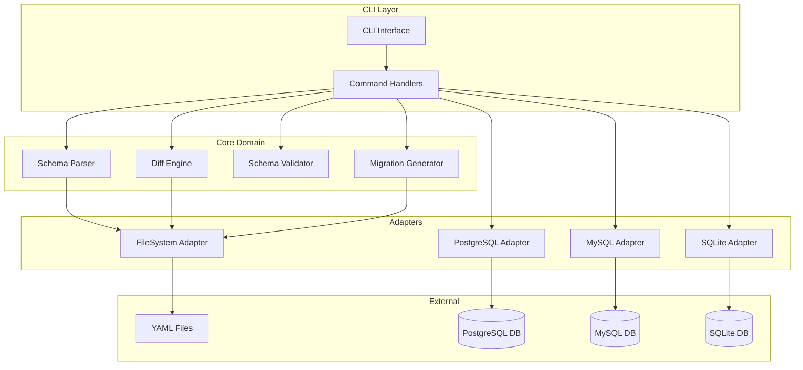
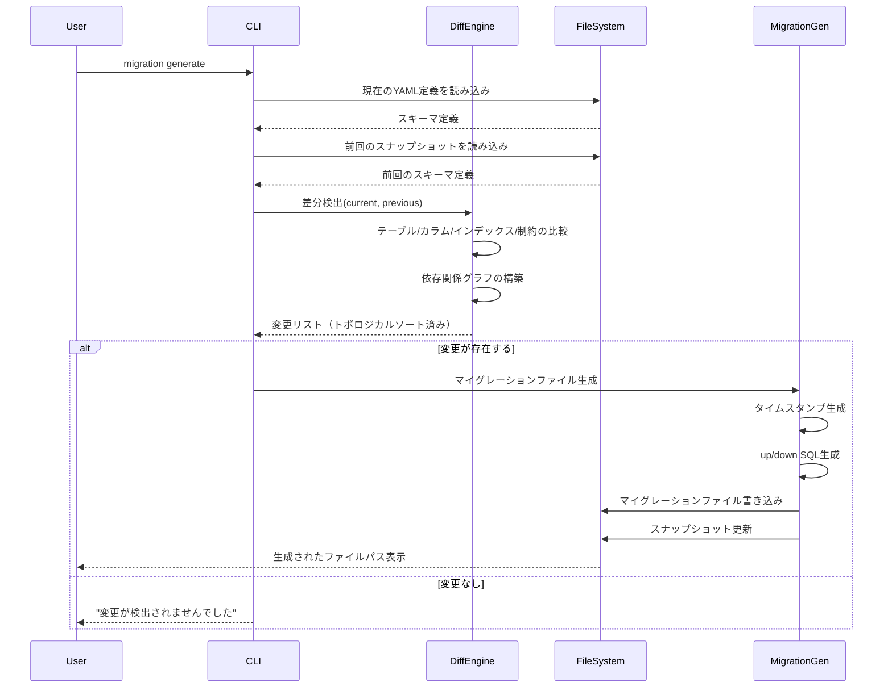
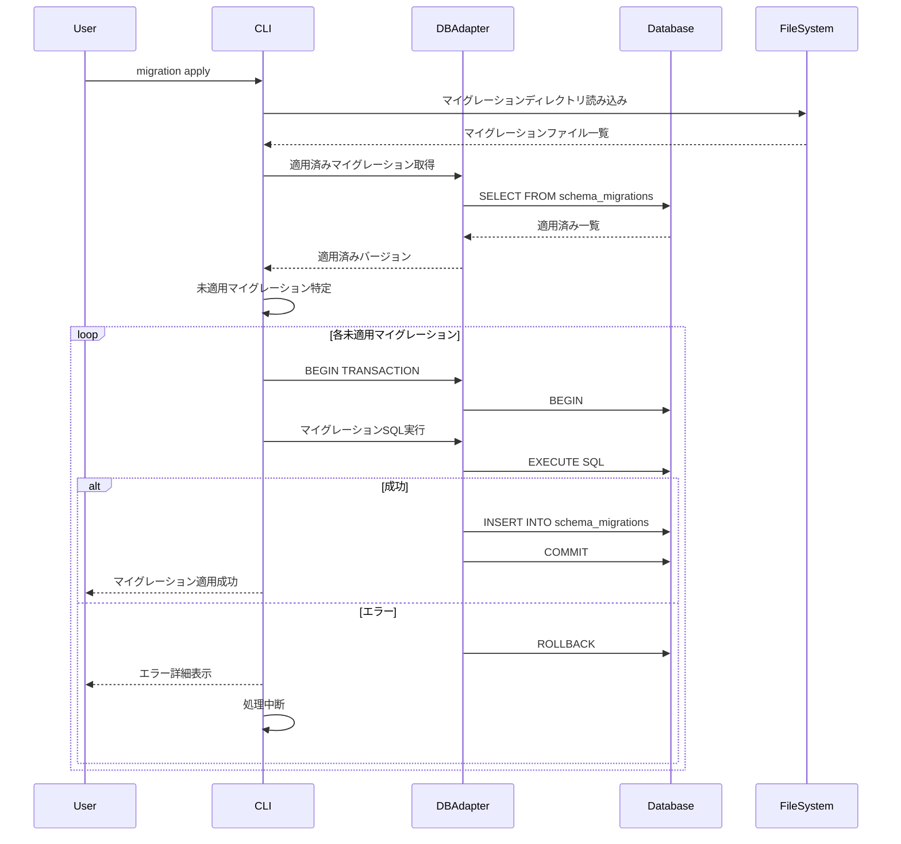
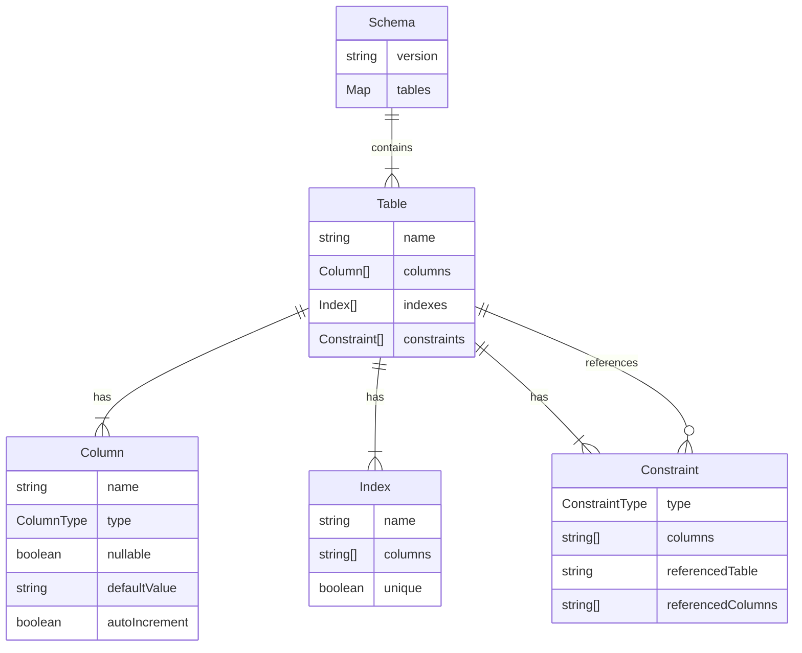

# Technical Design Document

## Overview

本機能は、データベーススキーマをYAML形式のコードとして定義・管理するCLIツールを提供します。開発者はスキーマ定義をバージョン管理システムで追跡し、自動生成されたマイグレーションファイルを通じて安全にデータベースへ変更を適用できます。Infrastructure as Code (IaC) の原則をデータベース管理に適用し、スキーマ変更の透明性、再現性、監査可能性を実現します。

**Purpose**: データベーススキーマの宣言的管理とマイグレーション自動化を通じて、開発者の生産性向上とデータベース変更の安全性を提供します。

**Users**: データベース管理者と開発者が、スキーマ定義の作成・編集、マイグレーション生成・適用、スキーマ検証、状態確認の各ワークフローで利用します。

**Impact**: 手動でのSQL実行によるスキーマ管理から、コードベースの宣言的管理へ移行し、変更履歴の追跡、環境間の一貫性、ロールバック機能を提供します。

### Goals

- YAML形式でのスキーマ定義の読み込み・解析・検証を実現
- スキーマ差分検出とマイグレーションファイルの自動生成
- トランザクション管理によるマイグレーションの安全な適用とロールバック
- PostgreSQL、MySQL、SQLite の3つのデータベースシステムへの対応
- CLI の一貫性のあるユーザーエクスペリエンス（ヘルプ、エラーメッセージ、進捗表示）

### Non-Goals

- GUI ベースのスキーマエディターの提供
- データマイグレーション機能（スキーマ変更のみを対象、データ移行は範囲外）
- リアルタイムスキーマ同期やレプリケーション管理
- 他の ORM ツール（Prisma、TypeORM）からのマイグレーション変換機能
- エンタープライズ向けのロールベースアクセス制御（RBAC）

## Architecture

### Architecture Pattern & Boundary Map

本ツールは **Hexagonal Architecture（ポート＆アダプター）** の簡略化版を採用し、コアドメインロジックを外部依存から分離します。



**Architecture Integration**:
- **選定パターン**: Hexagonal Architecture - コアロジックとインフラストラクチャの明確な分離により、テスト容易性とデータベース間の切り替えを実現
- **Domain/Feature Boundaries**:
  - CLI Layer: ユーザー入力の受付とコマンドルーティング
  - Core Domain: スキーマ解析、差分検出、検証、マイグレーション生成の純粋なビジネスロジック
  - Adapters: データベースとファイルシステムへのアクセスを抽象化
- **新規コンポーネントの根拠**:
  - DatabaseAdapter インターフェース: SQL方言の違いを吸収し、新しいデータベースの追加を容易にする
  - FileSystemPort: テスト時にモック化可能なファイルアクセスを提供
- **Steering準拠**: 型安全性、依存性逆転原則、単一責任原則を遵守

### Technology Stack

| Layer | Choice / Version | Role in Feature | Notes |
|-------|------------------|-----------------|-------|
| Language | Rust 1.92+ | 型安全なコード実装、単一バイナリ配布 | 所有権システム、ゼロコスト抽象化 |
| CLI | clap ^4.x (derive) | コマンドライン引数のパース、サブコマンド管理 | derive マクロで宣言的CLI定義、型安全 |
| CLI | colored ^2.x | カラー出力、視覚的フィードバック | ターミナル出力の可読性向上 |
| CLI | indicatif ^0.17 | 進行状況インジケーター、プログレスバー | 長時間処理の視覚的フィードバック |
| Async Runtime | tokio ^1.x (full) | 非同期I/O実行環境 | エコシステム最大、SQLx互換性 |
| Data Parsing | serde-saphyr ^0.x | YAML解析、デシリアライズ | 中間構文木なし、直接パース、高性能 |
| Data Serialization | serde ^1.x (derive) | 構造体シリアライズ/デシリアライズ | Rust標準エコシステム |
| Database | sqlx ^0.7 (runtime-tokio) | PostgreSQL/MySQL/SQLite統一アクセス | コンパイル時SQL検証、pure Rust、接続プーリング |
| Hashing | sha2 ^0.10 | マイグレーションファイルのチェックサム生成 | SHA-256ハッシュ、改ざん検出 |
| Error Handling | anyhow ^1.x / thiserror ^1.x | エラーハンドリング | anyhow: アプリケーションエラー、thiserror: ライブラリエラー |

詳細な技術選定の根拠と比較は [research.md](./research.md) を参照。

## System Flows

### マイグレーション生成フロー



### マイグレーション適用フロー



**Key Decisions**:
- 各マイグレーションは個別のトランザクション内で実行し、失敗時の部分適用を防止
- トポロジカルソートにより、外部キー制約の依存関係を考慮した安全な適用順序を保証
- dry-run モードでは最後に必ず ROLLBACK を実行し、データベースを変更しない

## Requirements Traceability

| Requirement | Summary | Components | Interfaces | Flows |
|-------------|---------|------------|------------|-------|
| 1.1, 1.2, 1.3, 1.4, 1.5 | スキーマ定義管理 | SchemaParser, SchemaValidator, FileSystemAdapter | SchemaParserService, FileSystemPort | - |
| 2.1, 2.2, 2.3, 2.4, 2.5 | 初期化 | InitCommand, ConfigManager, FileSystemAdapter | ConfigService, FileSystemPort | - |
| 3.1, 3.2, 3.3, 3.4, 3.5 | マイグレーション生成 | DiffEngine, MigrationGenerator, SnapshotManager | DiffService, MigrationGeneratorService | Migration Generation Flow |
| 4.1, 4.2, 4.3, 4.4, 4.5, 4.6 | マイグレーション適用 | MigrationApplier, DatabaseAdapter | MigrationService, DatabasePort | Migration Apply Flow |
| 5.1, 5.2, 5.3, 5.4, 5.5 | ロールバック | MigrationRollbacker, DatabaseAdapter | MigrationService, DatabasePort | - |
| 6.1, 6.2, 6.3, 6.4, 6.5, 6.6 | スキーマ検証 | SchemaValidator, ReferenceValidator | ValidatorService | - |
| 7.1, 7.2, 7.3, 7.4, 7.5 | 状態確認 | StatusReporter, DatabaseAdapter | StatusService, DatabasePort | - |
| 8.1, 8.2, 8.3, 8.4, 8.5, 8.6 | データベース接続 | DatabaseAdapter, ConnectionManager | DatabasePort, ConnectionPool | - |
| 9.1, 9.2, 9.3, 9.4, 9.5 | エクスポート | SchemaExporter, DatabaseAdapter | ExportService, DatabasePort | - |
| 10.1, 10.2, 10.3, 10.4, 10.5 | ヘルプとドキュメント | CLI, CommandRegistry | - | - |

## Components and Interfaces

### Component Summary

| Component | Domain/Layer | Intent | Req Coverage | Key Dependencies (P0/P1) | Contracts |
|-----------|--------------|--------|--------------|--------------------------|-----------|
| CLI | CLI Layer | エントリーポイント、コマンドルーティング | 10.1-10.5 | Commander.js (P0) | - |
| SchemaParser | Core Domain | YAML解析とスキーマ構造変換 | 1.1, 1.2, 1.5 | js-yaml (P0), FileSystemPort (P0) | Service |
| SchemaValidator | Core Domain | スキーマ整合性検証 | 1.3, 6.1-6.6 | ajv (P0), SchemaParser (P0) | Service |
| DiffEngine | Core Domain | スキーマ差分検出 | 3.1, 3.2 | SchemaParser (P0), SnapshotManager (P0) | Service |
| MigrationGenerator | Core Domain | マイグレーションファイル生成 | 3.3, 3.4, 3.5 | DiffEngine (P0), FileSystemPort (P0) | Service |
| MigrationApplier | Core Domain | マイグレーション適用ロジック | 4.1-4.6 | DatabasePort (P0), FileSystemPort (P0) | Service |
| MigrationRollbacker | Core Domain | マイグレーションロールバック | 5.1-5.5 | DatabasePort (P0) | Service |
| ConfigManager | Core Domain | 設定ファイル管理 | 2.1, 2.2, 8.1, 8.2 | FileSystemPort (P0) | Service |
| DatabaseAdapter | Adapters | データベース抽象化レイヤー | 8.3-8.6 | pg/mysql2/better-sqlite3 (P0) | API, State |
| FileSystemAdapter | Adapters | ファイルシステム抽象化 | 1.1, 2.3, 3.3 | Node fs (P0) | API |
| StatusReporter | Core Domain | 状態レポート生成 | 7.1-7.5 | DatabasePort (P0), SchemaParser (P1) | Service |
| SchemaExporter | Core Domain | スキーマエクスポート | 9.1-9.5 | DatabasePort (P0), FileSystemPort (P0) | Service |

### Core Domain

#### SchemaParser

| Field | Detail |
|-------|--------|
| Intent | YAML形式のスキーマ定義ファイルを読み込み、内部スキーマ構造に変換 |
| Requirements | 1.1, 1.2, 1.5 |

**Responsibilities & Constraints**
- YAML ファイルの安全な解析（js-yaml.safeLoad使用）
- 複数ファイルの統合と単一スキーマ構造への変換
- 構文エラーの詳細なレポート（ファイル名、行番号、エラー内容）

**Dependencies**
- Inbound: CLI Commands, DiffEngine (P0)
- Outbound: FileSystemPort - YAML ファイル読み込み (P0)
- External: serde-saphyr - YAML パース (P0)

**Contracts**: Service [x]

##### Service Interface

```rust
use std::collections::HashMap;
use std::path::Path;
use anyhow::Result;

pub trait SchemaParserService {
    /// 指定されたディレクトリからすべてのYAMLファイルを読み込み、統合されたスキーマを返す
    fn parse_schema_directory(&self, schema_dir: &Path) -> Result<Schema>;

    /// 単一のYAMLファイルを解析してスキーマオブジェクトに変換
    fn parse_schema_file(&self, file_path: &Path) -> Result<Schema>;
}

#[derive(Debug, Clone, serde::Deserialize, serde::Serialize)]
pub struct Schema {
    pub tables: HashMap<String, Table>,
    pub version: String,
}

#[derive(Debug, Clone, serde::Deserialize, serde::Serialize)]
pub struct Table {
    pub name: String,
    pub columns: Vec<Column>,
    pub indexes: Vec<Index>,
    pub constraints: Vec<Constraint>,
}

#[derive(Debug, Clone, serde::Deserialize, serde::Serialize)]
pub struct Column {
    pub name: String,
    #[serde(rename = "type")]
    pub column_type: ColumnType,
    pub nullable: bool,
    pub default_value: Option<String>,
    pub auto_increment: Option<bool>,
}

#[derive(Debug, Clone, serde::Deserialize, serde::Serialize)]
#[serde(tag = "kind")]
pub enum ColumnType {
    INTEGER { precision: Option<u32> },
    VARCHAR { length: u32 },
    TEXT,
    BOOLEAN,
    TIMESTAMP { with_time_zone: Option<bool> },
    JSON,
}

#[derive(Debug, Clone, serde::Deserialize, serde::Serialize)]
pub struct Index {
    pub name: String,
    pub columns: Vec<String>,
    pub unique: bool,
}

#[derive(Debug, Clone, serde::Deserialize, serde::Serialize)]
#[serde(tag = "type")]
pub enum Constraint {
    PRIMARY_KEY {
        columns: Vec<String>,
    },
    FOREIGN_KEY {
        columns: Vec<String>,
        referenced_table: String,
        referenced_columns: Vec<String>,
    },
    UNIQUE {
        columns: Vec<String>,
    },
    CHECK {
        columns: Vec<String>,
        check_expression: String,
    },
}
```

- Preconditions: schemaDir が存在し、読み取り可能であること
- Postconditions: 有効な Schema オブジェクトが返される、またはエラーが throw される
- Invariants: Schema.tables の各 Table は一意の name を持つ

**Implementation Notes**
- **Integration**: FileSystemPort を通じてYAMLファイルを読み込み、serde-saphyr でデシリアライズ（中間構文木なしで直接Rust構造体に変換）
- **Validation**: YAML構文エラーは anyhow::Error として詳細な情報（ファイル名、行番号）を含めて報告
- **Risks**: 大規模スキーマ（1000+テーブル）の場合、メモリ使用量に注意。serde-saphyr は中間構文木を構築しないためメモリ効率が高い

#### SchemaValidator

| Field | Detail |
|-------|--------|
| Intent | スキーマ定義の整合性、参照整合性、命名規則の検証 |
| Requirements | 1.3, 6.1, 6.2, 6.3, 6.4, 6.5, 6.6 |

**Responsibilities & Constraints**
- JSON Schema ベースの構文検証
- 外部キー制約の参照整合性チェック
- テーブル名・カラム名の命名規則検証
- 重複インデックスの検出と警告

**Dependencies**
- Inbound: CLI Commands (P0)
- Outbound: SchemaParser - スキーマ取得 (P0)
- External: ajv - JSON Schema検証 (P0)

**Contracts**: Service [x]

##### Service Interface

```rust
use anyhow::Result;

pub trait SchemaValidatorService {
    /// スキーマ定義の全体的な検証を実行
    fn validate(&self, schema: &Schema) -> ValidationResult;

    /// 外部キー制約の参照整合性を検証
    fn validate_referential_integrity(&self, schema: &Schema) -> Vec<ValidationError>;

    /// 命名規則の検証
    fn validate_naming_conventions(&self, schema: &Schema) -> Vec<ValidationWarning>;
}

#[derive(Debug, Clone)]
pub struct ValidationResult {
    pub valid: bool,
    pub errors: Vec<ValidationError>,
    pub warnings: Vec<ValidationWarning>,
    pub statistics: ValidationStatistics,
}

#[derive(Debug, Clone)]
pub struct ValidationStatistics {
    pub total_tables: usize,
    pub total_columns: usize,
    pub total_indexes: usize,
    pub total_constraints: usize,
}

#[derive(Debug, Clone, thiserror::Error)]
pub enum ValidationError {
    #[error("Syntax error: {message} at {location:?}")]
    Syntax {
        message: String,
        location: Option<ErrorLocation>,
        suggestion: Option<String>,
    },
    #[error("Reference error: {message} at {location:?}")]
    Reference {
        message: String,
        location: Option<ErrorLocation>,
        suggestion: Option<String>,
    },
    #[error("Constraint error: {message} at {location:?}")]
    Constraint {
        message: String,
        location: Option<ErrorLocation>,
        suggestion: Option<String>,
    },
}

#[derive(Debug, Clone)]
pub struct ValidationWarning {
    pub warning_type: WarningType,
    pub message: String,
    pub location: Option<ErrorLocation>,
}

#[derive(Debug, Clone)]
pub enum WarningType {
    Naming,
    DuplicateIndex,
    Performance,
}

#[derive(Debug, Clone)]
pub struct ErrorLocation {
    pub table: Option<String>,
    pub column: Option<String>,
    pub line: Option<usize>,
}
```

- Preconditions: Schema が SchemaParser によって正常にパースされていること
- Postconditions: ValidationResult が返され、すべてのエラーと警告が含まれる
- Invariants: 参照整合性エラーが存在する場合、valid は false

**Implementation Notes**
- **Integration**: カスタムバリデーターで参照整合性と命名規則をチェック（serde のデシリアライズ時に基本構造検証）
- **Validation**: 外部キー参照先テーブルとカラムの存在確認、命名規則（snake_case推奨）の検証
- **Risks**: 循環参照の検出漏れ。petgraph crate によるトポロジカルソートでサイクル検出を実装

#### DiffEngine

| Field | Detail |
|-------|--------|
| Intent | 現在のスキーマ定義と前回のスナップショットを比較し、差分を検出 |
| Requirements | 3.1, 3.2 |

**Responsibilities & Constraints**
- テーブル追加/削除/変更の検出
- カラム追加/削除/変更の検出
- インデックス追加/削除の検出
- 制約追加/削除の検出
- 依存関係グラフの構築とトポロジカルソート

**Dependencies**
- Inbound: MigrationGenerator (P0)
- Outbound: SchemaParser (P0), SnapshotManager (P0)

**Contracts**: Service [x]

##### Service Interface

```rust
pub trait DiffEngineService {
    /// 2つのスキーマ間の差分を検出
    fn detect_diff(&self, current: &Schema, previous: &Schema) -> SchemaDiff;
}

#[derive(Debug, Clone)]
pub struct SchemaDiff {
    pub changes: Vec<SchemaChange>,
    pub is_empty: bool,
}

#[derive(Debug, Clone)]
pub enum SchemaChange {
    CreateTable {
        table: Table,
    },
    DropTable {
        table_name: String,
    },
    AddColumn {
        table_name: String,
        column: Column,
    },
    DropColumn {
        table_name: String,
        column_name: String,
    },
    ModifyColumn {
        table_name: String,
        column: Column,
        changes: Vec<ColumnChange>,
    },
    CreateIndex {
        table_name: String,
        index: Index,
    },
    DropIndex {
        table_name: String,
        index_name: String,
    },
    AddConstraint {
        table_name: String,
        constraint: Constraint,
    },
    DropConstraint {
        table_name: String,
        constraint_name: String,
    },
}

#[derive(Debug, Clone)]
pub struct ColumnChange {
    pub property: ColumnProperty,
    pub old_value: String,
    pub new_value: String,
}

#[derive(Debug, Clone)]
pub enum ColumnProperty {
    Type,
    Nullable,
    Default,
}
```

- Preconditions: current と previous は有効な Schema オブジェクト
- Postconditions: 依存関係を考慮した安全な順序で SchemaChange が並べられる
- Invariants: 外部キー制約を持つテーブルは、参照先テーブルより後に作成される

**Implementation Notes**
- **Integration**: PartialEq trait で等価性比較、HashMap により O(1) ルックアップで差分検出。petgraph crate で依存関係グラフを構築しトポロジカルソート
- **Validation**: petgraph::algo::toposort で循環参照を検出、エラー報告
- **Risks**: 複雑な外部キー制約の場合、依存関係解決に失敗する可能性。検証フェーズでの事前チェックが重要

#### MigrationGenerator

| Field | Detail |
|-------|--------|
| Intent | スキーマ差分からマイグレーションファイル（up/down SQL）を生成 |
| Requirements | 3.3, 3.4, 3.5 |

**Responsibilities & Constraints**
- タイムスタンプベースの一意なファイル名生成
- dialect 別の SQL 生成（PostgreSQL/MySQL/SQLite）
- up（適用）と down（ロールバック）の両方のスクリプト生成
- マイグレーションファイルの書き込み

**Dependencies**
- Inbound: CLI Commands (P0)
- Outbound: DiffEngine (P0), DatabaseAdapter (P0), FileSystemPort (P0)

**Contracts**: Service [x]

##### Service Interface

```rust
use std::path::PathBuf;

pub trait MigrationGeneratorService {
    /// スキーマ差分からマイグレーションファイルを生成
    fn generate_migration(
        &self,
        diff: &SchemaDiff,
        dialect: Dialect,
        description: &str,
    ) -> Result<MigrationFile>;
}

#[derive(Debug, Clone, Copy, PartialEq, Eq)]
pub enum Dialect {
    PostgreSQL,
    MySQL,
    SQLite,
}

#[derive(Debug, Clone)]
pub struct MigrationFile {
    pub version: String, // タイムスタンプ: YYYYMMDDHHmmss
    pub description: String,
    pub dialect: Dialect,
    pub up_sql: String,
    pub down_sql: String,
    pub file_path: PathBuf,
    pub checksum: String, // SHA-256ハッシュ
}
```

- Preconditions: diff が空でないこと、dialect が有効な値であること
- Postconditions: マイグレーションファイルがファイルシステムに書き込まれる
- Invariants: upSQL と downSQL は逆操作であり、適用→ロールバックでスキーマが元に戻る

**Implementation Notes**
- **Integration**: DatabaseAdapter の SQL 生成メソッドを使用して dialect 別のSQL を生成。ファイル名は `{timestamp}_{description}.{dialect}.sql` 形式。sha2 crate で SHA-256 チェックサム生成
- **Validation**: 生成されたSQLの構文チェック（dry-run実行）
- **Risks**: 複雑な ALTER TABLE 操作（特にSQLite）が正しく生成されない可能性。統合テストでカバレッジを高める

#### MigrationApplier

| Field | Detail |
|-------|--------|
| Intent | 未適用のマイグレーションをデータベースに適用 |
| Requirements | 4.1, 4.2, 4.3, 4.4, 4.5, 4.6 |

**Responsibilities & Constraints**
- 未適用マイグレーションの検出
- トランザクション内でのマイグレーション実行
- マイグレーション履歴テーブルへの記録
- dry-runモードのサポート

**Dependencies**
- Inbound: CLI Commands (P0)
- Outbound: DatabasePort (P0), FileSystemPort (P0)

**Contracts**: Service [x]

##### Service Interface

```rust
use std::time::Duration;
use chrono::{DateTime, Utc};

#[async_trait::async_trait]
pub trait MigrationApplierService {
    /// 未適用のマイグレーションをすべて適用
    async fn apply_migrations(&self, options: &ApplyOptions) -> Result<ApplyResult>;

    /// 特定のバージョンまでマイグレーションを適用
    async fn apply_to(&self, target_version: &str, options: &ApplyOptions) -> Result<ApplyResult>;
}

#[derive(Debug, Clone)]
pub struct ApplyOptions {
    pub dry_run: bool,
    pub env: String, // 環境名
    pub timeout: Option<Duration>, // タイムアウト
}

#[derive(Debug, Clone)]
pub struct ApplyResult {
    pub applied_migrations: Vec<AppliedMigration>,
    pub total_duration: Duration,
    pub errors: Vec<MigrationError>,
}

#[derive(Debug, Clone)]
pub struct AppliedMigration {
    pub version: String,
    pub description: String,
    pub applied_at: DateTime<Utc>,
    pub duration: Duration,
}

#[derive(Debug, Clone, thiserror::Error)]
#[error("Migration {version} failed: {error}")]
pub struct MigrationError {
    pub version: String,
    pub error: String,
    pub sql_statement: Option<String>,
}
```

- Preconditions: データベース接続が確立されていること、schema_migrations テーブルが存在すること
- Postconditions: すべてのマイグレーションが適用される、またはエラーで中断される
- Invariants: トランザクション内で実行され、エラー時は自動的にロールバック

**Implementation Notes**
- **Integration**: DatabasePort を通じてマイグレーションSQL を実行。SQLx の Transaction により各マイグレーションは個別のトランザクションで実行
- **Validation**: dry-runモードでは最後に必ず rollback() を呼び出し、データベースを変更しない
- **Risks**: 長時間実行されるマイグレーションがタイムアウトする可能性。tokio::time::timeout でタイムアウト設定を提供

### Adapters

#### DatabaseAdapter

| Field | Detail |
|-------|--------|
| Intent | データベース方言の違いを吸収し、統一的なインターフェースを提供 |
| Requirements | 8.1, 8.2, 8.3, 8.4, 8.5, 8.6 |

**Responsibilities & Constraints**
- データベース接続の確立と管理
- dialect 別のSQL生成
- トランザクション管理
- マイグレーション履歴の記録と取得

**Dependencies**
- Inbound: MigrationApplier, MigrationRollbacker, StatusReporter, SchemaExporter (P0)
- External: pg (PostgreSQL), mysql2 (MySQL), better-sqlite3 (SQLite) (P0)

**Contracts**: API [x] State [x]

##### API Contract

| Method | Endpoint | Request | Response | Errors |
|--------|----------|---------|----------|--------|
| connect | N/A | ConnectionConfig | Connection | ConnectionError |
| executeSQL | N/A | SQLStatement | QueryResult | SQLExecutionError |
| beginTransaction | N/A | - | Transaction | TransactionError |
| commit | N/A | Transaction | void | TransactionError |
| rollback | N/A | Transaction | void | TransactionError |

##### State Management

```rust
use sqlx::{Pool, Transaction};
use std::time::Duration;

#[async_trait::async_trait]
pub trait DatabasePort {
    /// データベース接続を確立
    async fn connect(&self, config: &ConnectionConfig) -> Result<Connection>;

    /// SQL文を実行
    async fn execute_sql(&self, sql: &str, params: &[&dyn sqlx::Encode<'_, sqlx::Any>]) -> Result<QueryResult>;

    /// トランザクションを開始
    async fn begin_transaction(&self) -> Result<DatabaseTransaction>;

    /// トランザクションをコミット
    async fn commit(&self, tx: DatabaseTransaction) -> Result<()>;

    /// トランザクションをロールバック
    async fn rollback(&self, tx: DatabaseTransaction) -> Result<()>;

    /// 適用済みマイグレーション一覧を取得
    async fn get_applied_migrations(&self) -> Result<Vec<MigrationRecord>>;

    /// マイグレーション履歴を記録
    async fn record_migration(&self, migration: &MigrationRecord) -> Result<()>;

    /// スキーマ情報を取得
    async fn get_schema_info(&self) -> Result<DatabaseSchema>;
}

#[derive(Debug, Clone)]
pub struct ConnectionConfig {
    pub dialect: Dialect,
    pub host: Option<String>,
    pub port: Option<u16>,
    pub database: String,
    pub user: Option<String>,
    pub password: Option<String>,
    pub timeout: Option<Duration>,
}

#[derive(Debug)]
pub struct Connection {
    pub dialect: Dialect,
    pub is_connected: bool,
}

pub struct DatabaseTransaction {
    pub id: String,
    pub started_at: DateTime<Utc>,
}

#[derive(Debug, Clone, serde::Serialize, serde::Deserialize)]
pub struct MigrationRecord {
    pub version: String,
    pub description: String,
    pub applied_at: DateTime<Utc>,
    pub checksum: String,
}

#[derive(Debug, Clone)]
pub struct DatabaseSchema {
    pub tables: HashMap<String, DatabaseTable>,
}

#[derive(Debug, Clone)]
pub struct DatabaseTable {
    pub name: String,
    pub columns: Vec<DatabaseColumn>,
    pub indexes: Vec<DatabaseIndex>,
    pub constraints: Vec<DatabaseConstraint>,
}

#[derive(Debug, Clone)]
pub struct QueryResult {
    pub rows_affected: u64,
}
```

**Concrete Implementations**:
- PostgreSqlAdapter: SQLx PostgreSQL ドライバー、connection pooling、SERIAL型サポート、pure Rust
- MySqlAdapter: SQLx MySQL ドライバー、プリペアドステートメント、AUTO_INCREMENT型サポート、pure Rust
- SqliteAdapter: SQLx SQLite ドライバー、async API、複雑なALTER TABLE対応（CREATE TABLE + データコピー + DROP TABLE）

**Implementation Notes**
- **Integration**: 各 dialect 用の具体的な実装を提供。SQLx の Database trait により接続プールとトランザクションを抽象化。SQL生成ロジックは dialect 固有の構文に対応
- **Validation**: ConnectionConfig の検証、SQLx により SQL構文エラーの詳細な報告
- **Risks**: SQLite の ALTER TABLE 制限（カラム削除不可）。CREATE TABLE + データコピー（INSERT INTO ... SELECT）+ DROP TABLE パターンで対応

#### FileSystemAdapter

| Field | Detail |
|-------|--------|
| Intent | ファイルシステムアクセスを抽象化し、テスト容易性を向上 |
| Requirements | 1.1, 2.3, 3.3 |

**Responsibilities & Constraints**
- ファイル読み込み・書き込み
- ディレクトリ作成・削除
- ファイル存在確認

**Dependencies**
- Inbound: SchemaParser, ConfigManager, MigrationGenerator (P0)
- External: tokio::fs (P0)

**Contracts**: API [x]

##### API Contract

```rust
use std::path::{Path, PathBuf};
use regex::Regex;

#[async_trait::async_trait]
pub trait FileSystemPort {
    /// ファイルを読み込み
    async fn read_file(&self, path: &Path) -> Result<String>;

    /// ファイルに書き込み
    async fn write_file(&self, path: &Path, content: &str) -> Result<()>;

    /// ディレクトリを作成
    async fn create_directory(&self, path: &Path) -> Result<()>;

    /// ファイルが存在するか確認
    async fn exists(&self, path: &Path) -> Result<bool>;

    /// ディレクトリ内のファイル一覧を取得
    async fn list_files(&self, dir: &Path, pattern: Option<&Regex>) -> Result<Vec<PathBuf>>;
}
```

**Implementation Notes**
- **Integration**: tokio::fs を使用して非同期ファイル操作を実装
- **Validation**: パスの正規化（canonicalize）、セキュリティチェック（パストラバーサル防止）
- **Risks**: 大規模ファイルの読み込みでメモリ不足。tokio::io::BufReader によるストリーミング読み込みを検討

## Data Models

### Domain Model

#### スキーマ定義の集約



**Business Rules & Invariants**:
- 各テーブルは一意の name を持つ
- 各カラムはテーブル内で一意の name を持つ
- 外部キー制約は参照先テーブルとカラムが存在する
- PRIMARY_KEY 制約は1テーブルにつき1つまで
- インデックス名はデータベース全体で一意

### Logical Data Model

#### マイグレーション履歴テーブル（schema_migrations）

**Structure Definition**:
- version (VARCHAR(14), PRIMARY KEY): マイグレーションのタイムスタンプ
- description (VARCHAR(255)): マイグレーションの説明
- applied_at (TIMESTAMP): 適用日時
- checksum (VARCHAR(64)): SHA-256ハッシュ、改ざん検出用

**Consistency & Integrity**:
- PRIMARY KEY: version（一意性保証）
- NOT NULL: すべてのカラム
- Transaction Boundary: 各マイグレーション適用と履歴記録は同一トランザクション内

#### スナップショットファイル

**Structure**:
- `.stratum/snapshots/{timestamp}.yaml`: 各マイグレーション生成時点のスキーマ定義
- スナップショットは差分検出の基準として使用
- マイグレーション履歴と整合性を保つ

### Physical Data Model

#### PostgreSQL

```sql
CREATE TABLE schema_migrations (
  version VARCHAR(14) PRIMARY KEY,
  description VARCHAR(255) NOT NULL,
  applied_at TIMESTAMP WITH TIME ZONE NOT NULL DEFAULT CURRENT_TIMESTAMP,
  checksum CHAR(64) NOT NULL
);

CREATE INDEX idx_schema_migrations_applied_at ON schema_migrations(applied_at);
```

#### MySQL

```sql
CREATE TABLE schema_migrations (
  version VARCHAR(14) PRIMARY KEY,
  description VARCHAR(255) NOT NULL,
  applied_at TIMESTAMP NOT NULL DEFAULT CURRENT_TIMESTAMP,
  checksum CHAR(64) NOT NULL
) ENGINE=InnoDB DEFAULT CHARSET=utf8mb4;

CREATE INDEX idx_schema_migrations_applied_at ON schema_migrations(applied_at);
```

#### SQLite

```sql
CREATE TABLE schema_migrations (
  version TEXT PRIMARY KEY,
  description TEXT NOT NULL,
  applied_at TEXT NOT NULL DEFAULT (datetime('now')),
  checksum TEXT NOT NULL
);

CREATE INDEX idx_schema_migrations_applied_at ON schema_migrations(applied_at);
```

### Data Contracts & Integration

#### YAML スキーマ定義フォーマット

```yaml
# schema/users.yaml
tables:
  users:
    columns:
      - name: id
        type: INTEGER
        nullable: false
        autoIncrement: true
      - name: email
        type: VARCHAR
        length: 255
        nullable: false
      - name: created_at
        type: TIMESTAMP
        nullable: false
        default: CURRENT_TIMESTAMP
    indexes:
      - name: idx_users_email
        columns: [email]
        unique: true
    constraints:
      - type: PRIMARY_KEY
        columns: [id]
```

**Validation Rules**:
- JSON Schema を使用してYAML構造を検証
- カラム型は定義済みの ColumnType のいずれかであること
- 外部キー制約の参照先テーブルとカラムが存在すること

## Error Handling

### Error Strategy

すべてのエラーは型安全な `Result<T, E>` パターンまたは TypeScript の例外機構を使用して処理します。ユーザー向けエラーメッセージには具体的なコンテキスト（ファイル名、行番号、推奨アクション）を含めます。

### Error Categories and Responses

**User Errors (4xx相当)**:
- 無効なYAML構文 → ファイル名と行番号を含む詳細エラーメッセージ、構文修正のヒント
- 存在しないコマンド → `--help` の提案
- 不足している接続パラメーター → 必要なパラメーター名と設定方法の提示

**System Errors (5xx相当)**:
- データベース接続失敗 → 接続パラメーターの確認、ネットワーク診断の提案
- SQL実行エラー → SQL文と具体的なエラー内容、ロールバック実施を通知
- ファイルシステムエラー → パーミッション確認、ディスク容量確認の提案

**Business Logic Errors (422相当)**:
- スキーマ検証エラー → 違反内容、該当テーブル/カラム、修正方法の提示
- 外部キー参照整合性エラー → 参照先テーブルとカラムの存在確認、作成順序の提案
- マイグレーション順序エラー → 依存関係グラフの可視化、推奨適用順序の提示

### Monitoring

- エラー発生時はスタックトレースを含む詳細ログをファイルに記録（`.stratum/logs/error.log`）
- マイグレーション適用状況をログに記録（`.stratum/logs/migration.log`）
- dry-runモードでは実行されるSQL文をすべてログ出力

## Testing Strategy

### Unit Tests

- SchemaParser: YAML解析、複数ファイル統合、構文エラー検出
- SchemaValidator: JSON Schema検証、参照整合性チェック、命名規則検証
- DiffEngine: テーブル/カラム/インデックス/制約の差分検出、依存関係グラフ構築
- MigrationGenerator: SQL生成（各dialect）、up/downスクリプトの対応関係
- DatabaseAdapter: 各dialect用の実装（PostgreSQL/MySQL/SQLite）

### Integration Tests

- SchemaParser → SchemaValidator → DiffEngine → MigrationGenerator のフロー
- MigrationApplier のトランザクション管理とロールバック
- DatabaseAdapter とデータベースドライバーの統合（テストコンテナ使用）
- FileSystemAdapter のファイル操作

### E2E Tests

- init コマンドの実行と設定ファイル生成
- migration generate コマンドの実行とマイグレーションファイル生成
- migration apply コマンドの実行とデータベース反映
- migration rollback コマンドの実行と状態復元
- validate コマンドの実行とエラー検出

### Performance Tests

- 1000テーブル規模のスキーマ解析時間（< 10秒）
- マイグレーション生成処理時間（< 5秒）
- 100個のマイグレーション適用時間
- 並行実行時の競合処理

## Optional Sections

### Security Considerations

- **YAML解析の脆弱性対策**: serde-saphyr の安全なデシリアライズを使用、任意コード実行を防止
- **SQLインジェクション対策**: SQLx のパラメーター化クエリを使用、ユーザー入力を直接SQL文に埋め込まない
- **メモリ安全性**: Rust の所有権システムにより、バッファオーバーフロー、use-after-free、データ競合を コンパイル時に防止
- **接続情報の保護**: 設定ファイルに平文パスワードを保存しない、環境変数の使用を推奨、設定ファイルのパーミッション確認
- **ファイルシステムアクセス制限**: パストラバーサル攻撃を防止、`canonicalize()` による正規化されたパスのみアクセス許可
- **依存関係の脆弱性管理**: `cargo audit` による定期的な依存関係スキャン

### Performance & Scalability

**Target Metrics**:
- スキーマ解析: 1000テーブル規模で10秒以内
- マイグレーション生成: 5秒以内
- マイグレーション適用: 1ファイルあたり平均2秒以内（SQL実行時間は除く）

**Optimization Techniques**:
- **並列処理**: tokio により YAML 解析を並列化（複数ファイルを非同期に読み込み）
- **ゼロコスト抽象化**: Rust のコンパイル時最適化により、抽象化のオーバーヘッドなし
- **差分検出の最適化**: HashMap によるO(1)ルックアップ、変更されたテーブルのみを比較
- **接続プーリング**: SQLx の PgPool/MySqlPool/SqlitePool により接続の再利用
- **メモリ効率**: 所有権システムにより不要なクローンを最小化、参照を積極的に活用
- **インデックス活用**: schema_migrations テーブルの applied_at カラムにインデックスを作成

### Migration Strategy

本ツールは新規開発のため、既存システムからの移行戦略は不要です。既存データベースからの導入には `export` コマンドを使用してスキーマ定義を生成します。

## Supporting References

詳細な技術調査結果、アーキテクチャパターン評価、設計決定の根拠については [research.md](./research.md) を参照してください。

### 主要なリファレンス

- [Atlas: Database Schema as Code](https://atlasgo.io/)
- [Commander.js Documentation](https://github.com/tj/commander.js)
- [PostgreSQL Transactions](https://www.postgresql.org/docs/current/tutorial-transactions.html)
- [better-sqlite3](https://github.com/WiseLibs/better-sqlite3)
- [JSON Schema for YAML Validation](https://json-schema-everywhere.github.io/yaml)
