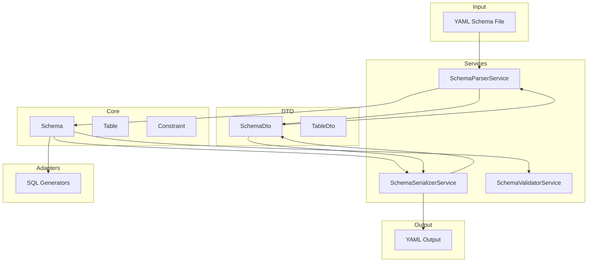
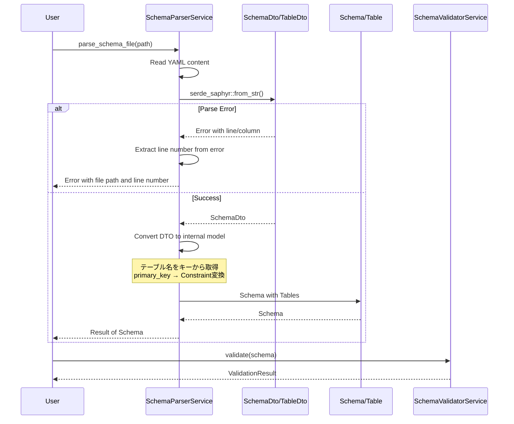
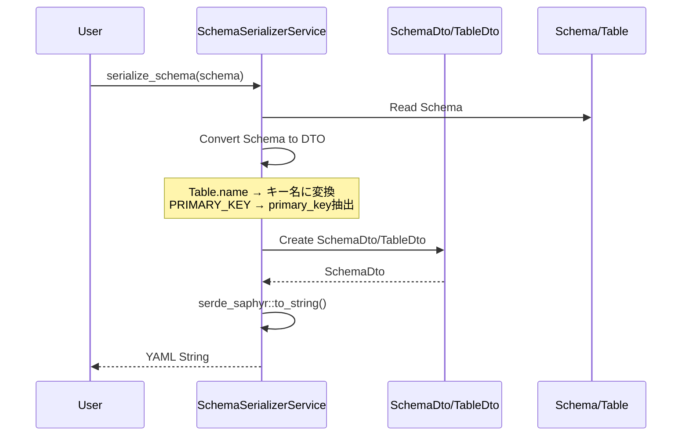
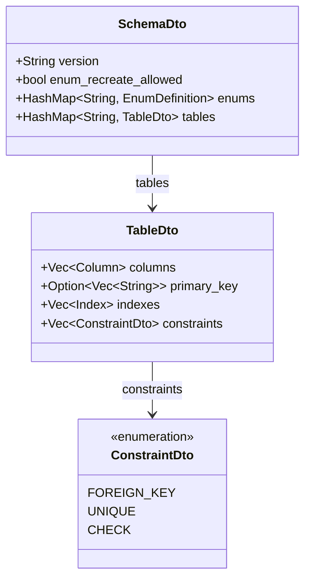

# Design Document

## Overview

**Purpose**: この機能はスキーマ定義YAMLの構文を改善し、バックエンドエンジニアにより直感的で簡潔なスキーマ定義体験を提供します。

**Users**: バックエンドエンジニアがデータベーススキーマを定義する際に、冗長な記述を排除し、より読みやすいYAML構文を使用できるようになります。

**Impact**: SchemaParserServiceの内部実装を変更し、DTOパターンを導入することで、YAML構文と内部モデルを分離します。シリアライズ出力も同様にDTO経由で行います。

### Goals
- テーブル名をYAMLキー名から取得し、`name`フィールドの冗長性を排除
- `primary_key`フィールドを`constraints`から独立させ、直感的な定義を実現
- `indexes`と`constraints`フィールドをオプショナル化し、シンプルなテーブル定義を可能に
- シリアライズ出力時に新構文形式（`name`なし、`primary_key`独立）で出力
- 構文エラー時に行番号を含む明確なエラーメッセージを提供

### Non-Goals
- 既存構文との後方互換性（ユーザーがまだいないため不要）
- 内部モデル（`Schema`, `Table`, `Constraint`）の変更
- SQL Generatorの変更

## Architecture

### Existing Architecture Analysis

現在のアーキテクチャでは、`SchemaParserService`がYAMLファイルを直接`Schema`構造体にデシリアライズしています：

```
YAML File → serde_saphyr::from_str → Schema (内部モデル)
```

**現在の制約**:
- `Table`構造体の`name`フィールドが必須
- `indexes`と`constraints`フィールドが必須
- `PRIMARY_KEY`は`constraints`リスト内に定義

### Architecture Pattern & Boundary Map



**Architecture Integration**:
- **Selected pattern**: DTOパターン — YAML構造と内部モデルの分離（読み込み・書き出し両方向）
- **Domain/feature boundaries**: DTO層はServicesレイヤー内に配置、Coreには影響なし
- **Existing patterns preserved**: Layered Architecture、serde-saphyrによるYAMLパース/シリアライズ
- **New components rationale**: DTO構造体はYAML構文の変更を内部モデルから隔離
- **Steering compliance**: パニックフリーエラーハンドリング、型安全性の原則を維持

### Technology Stack

| Layer | Choice / Version | Role in Feature | Notes |
|-------|------------------|-----------------|-------|
| Services | Rust 1.92+ | DTO⇔Schemaの双方向変換ロジック | 新規DTOモジュール追加 |
| Data Processing | serde 1.x + serde-saphyr 0.0.16 | YAML⇔DTO デ/シリアライズ | 既存依存、変更なし |
| Error Handling | thiserror 2.x | カスタムパースエラー（行番号付き） | 既存依存 |

## System Flows

### Parse Flow (YAML → Schema)



### Serialize Flow (Schema → YAML)



## Requirements Traceability

| Requirement | Summary | Components | Interfaces | Flows |
|-------------|---------|------------|------------|-------|
| 1.1 | YAMLキー名をテーブル名として使用 | SchemaParserService, TableDto | parse_schema_file | Parse Flow |
| 1.2 | nameフィールド廃止 | TableDto | - | - |
| 1.3 | シリアライズ時にnameを出力しない | SchemaSerializerService, TableDto | serialize_schema | Serialize Flow |
| 2.1 | primary_keyフィールドのパース | TableDto | - | Parse Flow |
| 2.2 | primary_key → Constraint変換 | SchemaParserService | convert_dto_to_schema | Parse Flow |
| 2.3 | constraints内PRIMARY_KEY廃止 | TableDto | - | - |
| 2.4 | PRIMARY KEY SQL生成 | - (変更なし) | - | - |
| 2.5 | primary_keyシリアライズ | SchemaSerializerService | convert_schema_to_dto | Serialize Flow |
| 3.1-3.5 | indexesオプショナル化 | TableDto | - | Parse Flow |
| 4.1-4.6 | constraintsオプショナル化 | TableDto | - | Parse Flow |
| 5.1 | primary_keyカラム存在検証 | SchemaValidatorService | validate | バリデーション |
| 5.2 | columns必須エラー | SchemaParserService | - | Parse Flow |
| 5.3 | 構文エラー行番号 | SchemaParserService | parse_with_line_info | Parse Flow |

## Components and Interfaces

| Component | Domain/Layer | Intent | Req Coverage | Key Dependencies | Contracts |
|-----------|--------------|--------|--------------|------------------|-----------|
| SchemaDto | Services/DTO | YAMLスキーマの中間表現 | 1.1, 1.3, 2.1, 2.5, 3.1, 4.1 | serde (P0) | - |
| TableDto | Services/DTO | YAMLテーブルの中間表現 | 1.2, 1.3, 2.1, 2.3, 2.5, 3.1-3.5, 4.1-4.6 | serde (P0) | - |
| SchemaParserService | Services | DTO→内部モデル変換、行番号付きエラー | 1.1, 2.2, 5.2, 5.3 | SchemaDto (P0), Schema (P0) | Service |
| SchemaSerializerService | Services | 内部モデル→DTO変換、YAML出力 | 1.3, 2.5 | Schema (P0), SchemaDto (P0) | Service |
| SchemaValidatorService | Services | primary_keyカラム検証 | 5.1 | Schema (P0) | Service |

### Services/DTO

#### SchemaDto

| Field | Detail |
|-------|--------|
| Intent | YAMLファイルの構造を表現するDTO（読み込み・書き出し両対応） |
| Requirements | 1.1, 1.3, 2.1, 2.5, 3.1, 4.1 |

**Responsibilities & Constraints**
- YAML構造を忠実に表現
- デシリアライズ・シリアライズ両方向で使用
- serde属性でオプショナルフィールドを処理

**Dependencies**
- External: serde 1.x — デ/シリアライズ (P0)

**Contracts**: Service [x]

##### Service Interface
```rust
/// YAML スキーマ用DTO
#[derive(Debug, Clone, Serialize, Deserialize)]
pub struct SchemaDto {
    pub version: String,

    #[serde(default, skip_serializing_if = "is_false")]
    pub enum_recreate_allowed: bool,

    #[serde(default, skip_serializing_if = "HashMap::is_empty")]
    pub enums: HashMap<String, EnumDefinition>,

    pub tables: HashMap<String, TableDto>,
}
```
- Preconditions: 有効なYAML文字列（デシリアライズ時）、有効なSchemaDto（シリアライズ時）
- Postconditions: 全フィールドが初期化される
- Invariants: `tables`は空でも可

#### TableDto

| Field | Detail |
|-------|--------|
| Intent | YAMLテーブル定義の中間表現（読み込み・書き出し両対応） |
| Requirements | 1.2, 1.3, 2.1, 2.3, 2.5, 3.1-3.5, 4.1-4.6 |

**Responsibilities & Constraints**
- `name`フィールドを持たない（キー名から取得/へ変換）
- `primary_key`フィールドで主キーを直接定義
- `indexes`と`constraints`はオプショナル
- シリアライズ時に空の`indexes`/`constraints`は出力しない

**Dependencies**
- External: serde 1.x — デ/シリアライズ (P0)

**Contracts**: Service [x]

##### Service Interface
```rust
/// YAML テーブル定義用DTO
#[derive(Debug, Clone, Serialize, Deserialize)]
pub struct TableDto {
    /// カラム定義（必須）
    pub columns: Vec<Column>,

    /// 主キーカラム名のリスト（オプショナル）
    #[serde(default, skip_serializing_if = "Option::is_none")]
    pub primary_key: Option<Vec<String>>,

    /// インデックス定義（オプショナル、デフォルト: 空）
    #[serde(default, skip_serializing_if = "Vec::is_empty")]
    pub indexes: Vec<Index>,

    /// 制約定義（オプショナル、デフォルト: 空）
    /// PRIMARY_KEYはここに含まない
    #[serde(default, skip_serializing_if = "Vec::is_empty")]
    pub constraints: Vec<ConstraintDto>,
}

/// 制約DTO（PRIMARY_KEY以外）
#[derive(Debug, Clone, Serialize, Deserialize)]
#[serde(tag = "type")]
pub enum ConstraintDto {
    FOREIGN_KEY {
        columns: Vec<String>,
        referenced_table: String,
        referenced_columns: Vec<String>,
    },
    UNIQUE {
        columns: Vec<String>,
    },
    CHECK {
        columns: Vec<String>,
        check_expression: String,
    },
}
```
- Preconditions: `columns`が存在すること（デシリアライズ時）
- Postconditions: オプショナルフィールドはデフォルト値で初期化
- Invariants: `primary_key`がNoneの場合、バリデーションでエラー

### Services

#### SchemaParserService（拡張）

| Field | Detail |
|-------|--------|
| Intent | DTO→内部モデル変換、キー名からテーブル名設定、行番号付きエラー |
| Requirements | 1.1, 2.2, 5.2, 5.3 |

**Responsibilities & Constraints**
- `SchemaDto`から`Schema`への変換
- HashMapのキー名を`Table.name`に設定
- `primary_key`を`Constraint::PRIMARY_KEY`に変換
- serde_saphyrエラーから行番号を抽出してエラーメッセージに含める

**Dependencies**
- Inbound: CLI Commands — スキーマファイルのパース (P0)
- Outbound: Core Models — Schema, Table, Constraint (P0)
- External: serde-saphyr 0.0.16 — YAMLパース (P0)

**Contracts**: Service [x]

##### Service Interface
```rust
impl SchemaParserService {
    /// YAMLファイルをパースしてSchemaを返す
    pub fn parse_schema_file(&self, file_path: &Path) -> Result<Schema>;

    /// ディレクトリ内の全YAMLファイルをパースしてマージ
    pub fn parse_schema_directory(&self, schema_dir: &Path) -> Result<Schema>;

    /// SchemaDto → Schema 変換（内部メソッド）
    fn convert_dto_to_schema(&self, dto: SchemaDto) -> Result<Schema>;

    /// TableDto → Table 変換（内部メソッド）
    fn convert_table_dto(
        &self,
        table_name: String,
        dto: TableDto
    ) -> Result<Table>;

    /// serde_saphyrエラーから行番号を抽出（内部メソッド）
    fn extract_line_from_error(&self, error: &serde_saphyr::Error) -> Option<usize>;
}
```
- Preconditions: ファイルパスが有効であること
- Postconditions: 変換後のSchemaは内部モデルの不変条件を満たす
- Invariants: `primary_key`が定義されていれば`Constraint::PRIMARY_KEY`が生成される

**Implementation Notes**
- Integration: 既存の`parse_schema_file`メソッドを拡張し、DTO経由でパース
- Validation: `columns`未定義時は早期エラー、`primary_key`カラム存在確認はValidatorに委譲
- Error Line Extraction: `serde_saphyr::Error`の`Display`実装から行番号を正規表現で抽出
- Risks: serde_saphyrのエラーメッセージ形式に依存（将来のバージョンで変更される可能性）

##### Error Line Extraction Strategy
```rust
/// serde_saphyrエラーから行番号を抽出
///
/// serde_saphyrのエラーメッセージ形式: "... at line X column Y"
fn extract_line_from_error(&self, error: &serde_saphyr::Error) -> Option<usize> {
    let error_msg = error.to_string();
    // 正規表現: "at line (\d+)"
    let re = regex::Regex::new(r"at line (\d+)").ok()?;
    re.captures(&error_msg)
        .and_then(|caps| caps.get(1))
        .and_then(|m| m.as_str().parse().ok())
}

/// エラーメッセージのフォーマット
fn format_parse_error(
    &self,
    file_path: &Path,
    error: serde_saphyr::Error
) -> anyhow::Error {
    match self.extract_line_from_error(&error) {
        Some(line) => anyhow::anyhow!(
            "Failed to parse YAML at {}:{}: {}",
            file_path.display(),
            line,
            error
        ),
        None => anyhow::anyhow!(
            "Failed to parse YAML at {}: {}",
            file_path.display(),
            error
        ),
    }
}
```

#### SchemaSerializerService（新規）

| Field | Detail |
|-------|--------|
| Intent | 内部モデル→DTO変換、新構文形式でYAML出力 |
| Requirements | 1.3, 2.5 |

**Responsibilities & Constraints**
- `Schema`から`SchemaDto`への変換
- `Table.name`をHashMapのキーに変換
- `Constraint::PRIMARY_KEY`を`TableDto.primary_key`に抽出
- 空の`indexes`/`constraints`はYAML出力に含めない

**Dependencies**
- Inbound:
  - `export` コマンド — DB→YAML エクスポート時に新構文で出力 (P0)
  - `generate` コマンド — `.schema_snapshot.yaml` を新構文形式で保存 (P0)
- Outbound: DTO — SchemaDto, TableDto (P0)
- External: serde-saphyr 0.0.16 — YAMLシリアライズ (P0)

**Contracts**: Service [x]

##### Service Interface
```rust
/// スキーマシリアライザーサービス
#[derive(Debug, Clone)]
pub struct SchemaSerializerService;

impl SchemaSerializerService {
    /// 新しいSchemaSerializerServiceを作成
    pub fn new() -> Self;

    /// SchemaをYAML文字列にシリアライズ
    pub fn serialize_to_string(&self, schema: &Schema) -> Result<String>;

    /// SchemaをYAMLファイルに出力
    pub fn serialize_to_file(&self, schema: &Schema, file_path: &Path) -> Result<()>;

    /// Schema → SchemaDto 変換（内部メソッド）
    fn convert_schema_to_dto(&self, schema: &Schema) -> SchemaDto;

    /// Table → TableDto 変換（内部メソッド）
    fn convert_table_to_dto(&self, table: &Table) -> TableDto;

    /// Constraint::PRIMARY_KEY を抽出（内部メソッド）
    fn extract_primary_key(&self, constraints: &[Constraint]) -> Option<Vec<String>>;

    /// PRIMARY_KEY以外のConstraintをConstraintDtoに変換（内部メソッド）
    fn convert_constraints_to_dto(
        &self,
        constraints: &[Constraint]
    ) -> Vec<ConstraintDto>;
}
```
- Preconditions: 有効なSchema
- Postconditions: 新構文形式のYAML文字列が生成される
- Invariants: `Constraint::PRIMARY_KEY`は`primary_key`フィールドに出力、`constraints`には含まれない

**Implementation Notes**
- Integration:
  - `src/cli/commands/export.rs` — エクスポート出力を`SchemaSerializerService`経由に変更
  - `src/services/migration_generator.rs` — `.schema_snapshot.yaml`保存を`SchemaSerializerService`経由に変更
- Validation: 出力前のバリデーションは不要（内部モデルは既に検証済み）
- Risks: なし（単純な変換処理）

##### Conversion Logic
```rust
/// Table → TableDto 変換
fn convert_table_to_dto(&self, table: &Table) -> TableDto {
    TableDto {
        columns: table.columns.clone(),
        primary_key: self.extract_primary_key(&table.constraints),
        indexes: table.indexes.clone(),
        constraints: self.convert_constraints_to_dto(&table.constraints),
    }
}

/// PRIMARY_KEY制約を抽出
fn extract_primary_key(&self, constraints: &[Constraint]) -> Option<Vec<String>> {
    constraints.iter().find_map(|c| {
        if let Constraint::PRIMARY_KEY { columns } = c {
            Some(columns.clone())
        } else {
            None
        }
    })
}

/// PRIMARY_KEY以外の制約をDTOに変換
fn convert_constraints_to_dto(
    &self,
    constraints: &[Constraint]
) -> Vec<ConstraintDto> {
    constraints
        .iter()
        .filter_map(|c| match c {
            Constraint::PRIMARY_KEY { .. } => None, // 除外
            Constraint::FOREIGN_KEY { columns, referenced_table, referenced_columns } => {
                Some(ConstraintDto::FOREIGN_KEY {
                    columns: columns.clone(),
                    referenced_table: referenced_table.clone(),
                    referenced_columns: referenced_columns.clone(),
                })
            }
            Constraint::UNIQUE { columns } => {
                Some(ConstraintDto::UNIQUE { columns: columns.clone() })
            }
            Constraint::CHECK { columns, check_expression } => {
                Some(ConstraintDto::CHECK {
                    columns: columns.clone(),
                    check_expression: check_expression.clone(),
                })
            }
        })
        .collect()
}
```

#### SchemaValidatorService（拡張）

| Field | Detail |
|-------|--------|
| Intent | primary_keyカラムの存在検証 |
| Requirements | 5.1 |

**Responsibilities & Constraints**
- `primary_key`に指定されたカラムがテーブルに存在するか検証
- 既存のプライマリキー検証ロジックは変更なし

**Dependencies**
- Inbound: SchemaParserService — 変換後のSchema (P0)

**Contracts**: Service [x]

##### Service Interface
```rust
impl SchemaValidatorService {
    /// スキーマ全体の検証（既存メソッド、ロジック変更なし）
    pub fn validate(&self, schema: &Schema) -> ValidationResult;
}
```
- Preconditions: 有効なSchema
- Postconditions: ValidationResultにエラー/警告が含まれる
- Invariants: 変換後のSchemaは既存のバリデーションロジックで検証可能

## Data Models

### Domain Model

変更なし。既存の`Schema`, `Table`, `Column`, `Index`, `Constraint`モデルを継続使用。

### Logical Data Model

**DTO構造（新規）**:



**変換マッピング**:

| 方向 | From | To | 変換ロジック |
|------|------|-----|-------------|
| Parse | HashMap key | Table.name | キー名を`name`に設定 |
| Parse | TableDto.primary_key | Constraint::PRIMARY_KEY | 存在時のみ生成 |
| Parse | ConstraintDto | Constraint | 型タグで判別 |
| Serialize | Table.name | HashMap key | `name`をキーに変換 |
| Serialize | Constraint::PRIMARY_KEY | TableDto.primary_key | 抽出して設定 |
| Serialize | Constraint (非PK) | ConstraintDto | フィルタして変換 |

### Data Contracts & Integration

**新YAML構文例**:
```yaml
version: "1.0"
tables:
  users:  # ← テーブル名（キー名）
    columns:
      - name: id
        type:
          kind: INTEGER
        nullable: false
        auto_increment: true
      - name: email
        type:
          kind: VARCHAR
          length: 255
        nullable: false
    primary_key:  # ← 独立フィールド
      - id
    indexes:      # ← オプショナル（空なら出力されない）
      - name: idx_users_email
        columns:
          - email
        unique: true
    # constraints: 省略可能（空なら出力されない）
```

## Error Handling

### Error Strategy
- serde-saphyrのパースエラーから行番号を抽出し、ファイルパス+行番号形式でエラーを返す
- `columns`未定義時は専用エラーメッセージ
- 変換エラーはanyhowの`Context`で詳細情報を付加

### Error Categories and Responses

**User Errors (Parse Errors)**:
| エラー種別 | メッセージ形式 | 例 |
|-----------|--------------|-----|
| YAML構文エラー | "Failed to parse YAML at {path}:{line}: {details}" | "Failed to parse YAML at schema/users.yaml:15: expected ':' but found '-'" |
| columns未定義 | "Table '{name}' requires columns field" | "Table 'users' requires columns field" |
| 行番号取得不可 | "Failed to parse YAML at {path}: {details}" | フォールバック |

**Business Logic Errors**:
- `primary_key`に存在しないカラム → SchemaValidator が検出

### Monitoring
- 既存のエラーロギング機構を使用
- パニックフリー設計を維持

## Testing Strategy

### Unit Tests
- `SchemaDto`/`TableDto`のデシリアライズテスト
- `SchemaDto`/`TableDto`のシリアライズテスト（`name`なし、`primary_key`独立を確認）
- `convert_dto_to_schema`変換ロジックテスト
- `convert_schema_to_dto`変換ロジックテスト
- `primary_key` ⇔ `Constraint::PRIMARY_KEY`双方向変換テスト
- オプショナルフィールド省略時のデフォルト値テスト
- 空フィールドのシリアライズ除外テスト
- エラーケース（columns未定義、不正構文）テスト
- 行番号抽出ロジックテスト

### Integration Tests
- 新構文YAMLファイルのパーステスト
- パース→シリアライズの往復テスト（round-trip）
- 既存バリデーションとの連携テスト
- SQL Generator出力確認テスト

### E2E Tests
- `example/schema/`ファイルの新構文更新後の動作確認
- `export`コマンドでの新構文出力確認
- `generate`コマンドでの`.schema_snapshot.yaml`新構文出力確認
