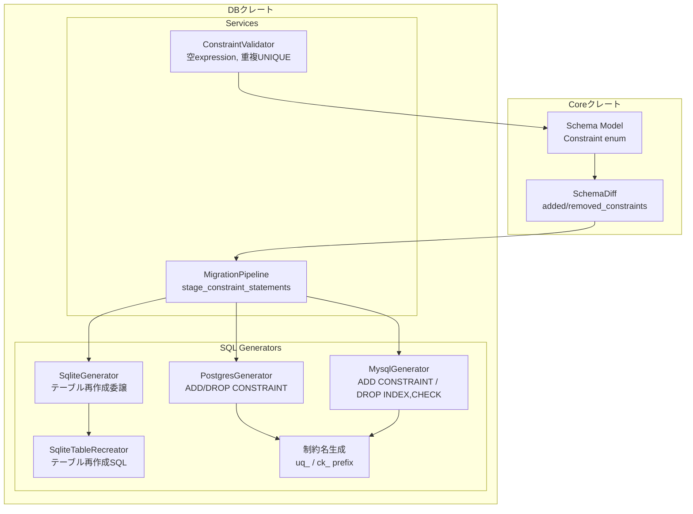
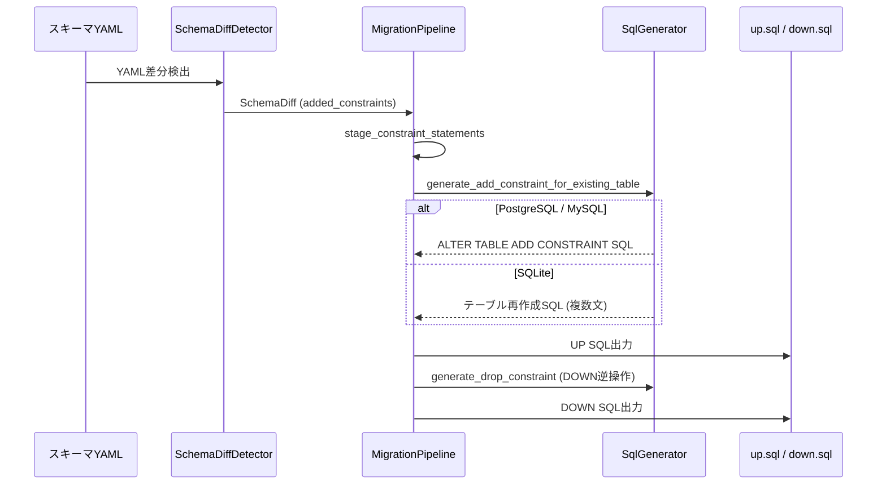
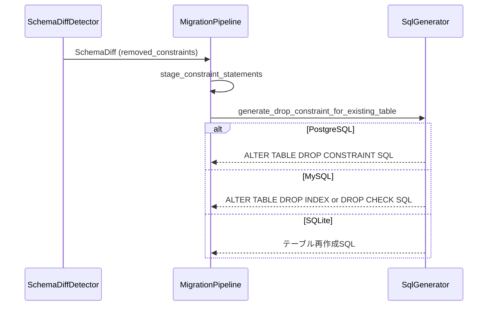
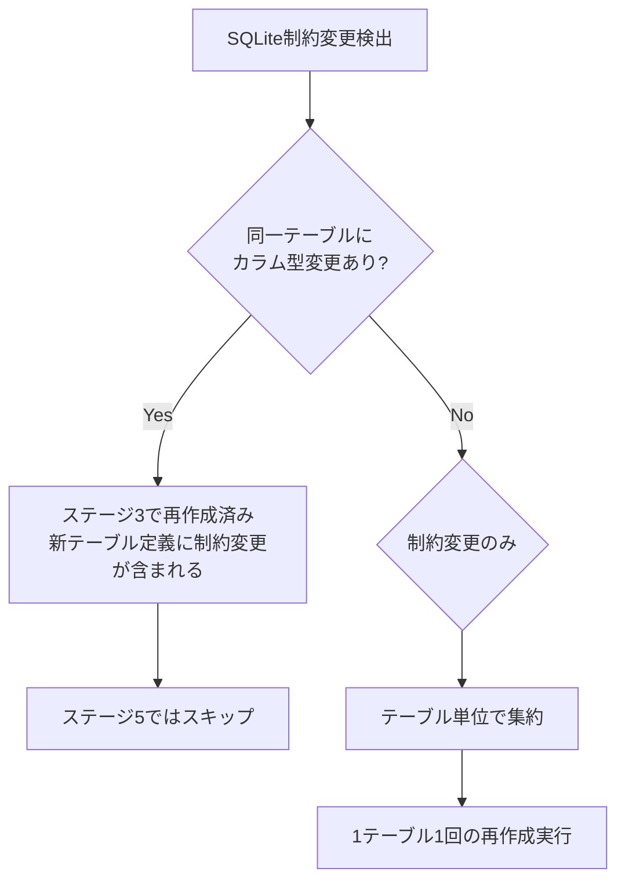

# 設計ドキュメント: UNIQUE・CHECK制約マイグレーション

## 概要

**目的**: 本機能は、既存テーブルへのUNIQUE制約およびCHECK制約の追加・削除マイグレーションを自動生成する機能を提供する。

**ユーザー**: バックエンドエンジニアおよびDevOpsチームが、スキーマYAMLの制約変更からマイグレーションSQLを自動生成するワークフローで利用する。

**影響**: 現在FOREIGN KEYのみ対応しているSQL Generatorの制約操作メソッドを拡張し、UNIQUE・CHECK制約をサポートする。また、マイグレーションパイプラインに制約削除処理を追加する。

### ゴール
- PostgreSQL・MySQL・SQLiteの3方言でUNIQUE・CHECK制約の追加/削除SQLを生成する
- 既存のマイグレーションパイプラインにシームレスに統合する
- up.sql/down.sqlの双方向マイグレーションを生成する
- 制約定義のバリデーションを拡充する（空expression、重複UNIQUE）

### 非ゴール
- 制約の変更（ALTER）マイグレーション（追加と削除の組み合わせで対応）
- PRIMARY KEY制約の追加/削除（別機能として扱う）
- 名前付き制約のリネームマイグレーション
- パフォーマンスに関するインデックス最適化の提案

## アーキテクチャ

### 既存アーキテクチャ分析

現在のアーキテクチャは以下の通り構成されている:

- **制約モデル**: `Constraint` enum（`schema.rs`）にUNIQUE・CHECKは既にモデル化済み
- **差分検出**: `SchemaDiffDetector` が `added_constraints` / `removed_constraints` を検出済み
- **SQL生成**: `SqlGenerator` トレイトの `generate_add/drop_constraint_for_existing_table` がFK以外は空文字列を返す
- **パイプライン**: `stage_constraint_statements` が `added_constraints` のみ処理。`removed_constraints` は未処理

維持すべきパターン:
- `SqlGenerator` トレイトによる方言分離
- `MigrationPipeline` のステージベース処理
- FK制約で確立された `generate_add/drop_constraint_for_existing_table` のインターフェース
- SQLiteの `SqliteTableRecreator` によるテーブル再作成パターン

### アーキテクチャパターン & 境界マップ



**アーキテクチャ統合**:
- **選択パターン**: 既存コンポーネント拡張（FK実装パターンの踏襲）
- **ドメイン境界**: SQL生成は各方言Generatorに閉じ、パイプラインは方言非依存
- **既存パターン維持**: `SqlGenerator` トレイト、ステージベースパイプライン、テーブル再作成パターン
- **新コンポーネント**: なし（全て既存コンポーネントの拡張）

### 技術スタック

| レイヤー | 選択 / バージョン | 本機能での役割 | 備考 |
|---|---|---|---|
| Core Domain | strata-core（既存） | Constraint enum、SchemaDiff | 変更なし |
| SQL生成 | strata-db adapters（既存） | 方言別SQL生成 | match式にアーム追加 |
| パイプライン | strata-db services（既存） | ステージベースSQL結合 | removed_constraints処理追加 |
| バリデーション | strata-db services（既存） | 制約定義検証 | 新チェックルール追加 |
| ハッシュ | sha2 0.10（既存） | 制約名切り詰め | 既存のFK命名ロジックを再利用 |

## システムフロー

### UNIQUE/CHECK制約追加のUPマイグレーション生成フロー



### 制約削除のUPマイグレーション生成フロー



**主要な分岐ポイント**: SQLiteは全ての制約変更にテーブル再作成パターンを使用する。PostgreSQL・MySQLはALTER TABLE文で直接操作する。MySQLはUNIQUE削除に `DROP INDEX`、CHECK削除に `DROP CHECK` を使用する点がPostgreSQLと異なる。

## 要件トレーサビリティ

| 要件 | 概要 | コンポーネント | インターフェース | フロー |
|---|---|---|---|---|
| 1.1 | UNIQUE追加 ALTER TABLE SQL生成（PG/MySQL） | PostgresGenerator, MysqlGenerator | `generate_add_constraint_for_existing_table` | UP制約追加 |
| 1.2 | UNIQUE制約名 `uq_{table}_{columns}` 自動生成 | ConstraintNameGenerator | `generate_uq_constraint_name` | — |
| 1.3 | 複合UNIQUE制約の単一ALTER TABLE文生成 | PostgresGenerator, MysqlGenerator | `generate_add_constraint_for_existing_table` | UP制約追加 |
| 1.4 | SQLite UNIQUE追加テーブル再作成 | SqliteGenerator, SqliteTableRecreator | `generate_add_constraint_for_existing_table` | UP制約追加 |
| 2.1 | PG UNIQUE削除 DROP CONSTRAINT | PostgresGenerator | `generate_drop_constraint_for_existing_table` | UP制約削除 |
| 2.2 | MySQL UNIQUE削除 DROP INDEX | MysqlGenerator | `generate_drop_constraint_for_existing_table` | UP制約削除 |
| 2.3 | SQLite UNIQUE削除テーブル再作成 | SqliteGenerator, SqliteTableRecreator | `generate_drop_constraint_for_existing_table` | UP制約削除 |
| 2.4 | UNIQUE追加のdown.sqlロールバック | MigrationPipeline | `generate_down` | DOWN逆操作 |
| 2.5 | UNIQUE削除のdown.sqlロールバック | MigrationPipeline | `generate_down` | DOWN逆操作 |
| 3.1 | CHECK追加 ALTER TABLE SQL生成（PG/MySQL） | PostgresGenerator, MysqlGenerator | `generate_add_constraint_for_existing_table` | UP制約追加 |
| 3.2 | CHECK制約名 `ck_{table}_{columns}` 自動生成 | ConstraintNameGenerator | `generate_ck_constraint_name` | — |
| 3.3 | SQLite CHECK追加テーブル再作成 | SqliteGenerator, SqliteTableRecreator | `generate_add_constraint_for_existing_table` | UP制約追加 |
| 4.1 | PG CHECK削除 DROP CONSTRAINT | PostgresGenerator | `generate_drop_constraint_for_existing_table` | UP制約削除 |
| 4.2 | MySQL CHECK削除 DROP CHECK | MysqlGenerator | `generate_drop_constraint_for_existing_table` | UP制約削除 |
| 4.3 | SQLite CHECK削除テーブル再作成 | SqliteGenerator, SqliteTableRecreator | `generate_drop_constraint_for_existing_table` | UP制約削除 |
| 4.4 | CHECK追加のdown.sqlロールバック | MigrationPipeline | `generate_down` | DOWN逆操作 |
| 4.5 | CHECK削除のdown.sqlロールバック | MigrationPipeline | `generate_down` | DOWN逆操作 |
| 5.1 | 他のスキーマ変更と同一マイグレーションファイル | MigrationPipeline | `generate_up` / `generate_down` | 全ステージ統合 |
| 5.2 | 適切なステージ順序での実行 | MigrationPipeline | `stage_constraint_statements` | ステージ5 |
| 5.3 | dry-runモードでのプレビュー表示 | MigrationPipeline（既存） | — | 既存フロー |
| 6.1 | UNIQUE制約の存在しないカラム参照検証 | ConstraintValidator（既存） | — | — |
| 6.2 | CHECK制約の存在しないカラム参照検証 | ConstraintValidator（既存） | — | — |
| 6.3 | CHECK制約の空check_expression検証 | ConstraintValidator | `validate_check_expression` | — |
| 6.4 | 重複UNIQUE制約の警告 | ConstraintValidator | `validate_duplicate_unique` | — |

## コンポーネントとインターフェース

| コンポーネント | ドメイン/レイヤー | 目的 | 要件カバレッジ | 主要な依存 | コントラクト |
|---|---|---|---|---|---|
| generate_uq_constraint_name | Adapters / SQL Generator | UNIQUE制約名生成 | 1.2 | sha2 (P2) | Service |
| generate_ck_constraint_name | Adapters / SQL Generator | CHECK制約名生成 | 3.2 | sha2 (P2) | Service |
| PostgresGenerator（拡張） | Adapters / SQL Generator | PG用UNIQUE/CHECK ADD/DROP SQL | 1.1, 1.3, 2.1, 3.1, 4.1 | NameGen (P0) | Service |
| MysqlGenerator（拡張） | Adapters / SQL Generator | MySQL用UNIQUE/CHECK ADD/DROP SQL | 1.1, 1.3, 2.2, 3.1, 4.2 | NameGen (P0) | Service |
| SqliteGenerator（拡張） | Adapters / SQL Generator | SQLite用テーブル再作成委譲 | 1.4, 2.3, 3.3, 4.3 | SqliteTableRecreator (P0) | Service |
| MigrationPipeline（拡張） | Services / Pipeline | removed_constraints処理追加 | 2.4, 2.5, 4.4, 4.5, 5.1, 5.2 | SqlGenerator (P0) | Service |
| ConstraintValidator（拡張） | Services / Validator | 空expression、重複UNIQUE検証 | 6.3, 6.4 | Schema (P0) | Service |

### Adaptersレイヤー: SQL Generators

#### 制約名生成関数

| フィールド | 詳細 |
|---|---|
| 目的 | UNIQUE制約名（`uq_`プレフィックス）とCHECK制約名（`ck_`プレフィックス）を生成する |
| 要件 | 1.2, 3.2 |
| 配置 | `src/db/src/adapters/sql_generator/mod.rs` |

**責務と制約**
- `uq_{table}_{columns}` 形式でUNIQUE制約名を生成する
- `ck_{table}_{columns}` 形式でCHECK制約名を生成する
- 63文字（`MAX_IDENTIFIER_LENGTH`）を超える場合はSHA-256ハッシュ付きで切り詰める
- 同一入力に対して決定論的に同一の制約名を返す

**依存**
- Outbound: sha2 — ハッシュ生成 (P2)

**コントラクト**: Service [x]

##### サービスインターフェース

```rust
/// UNIQUE制約名を生成
///
/// `uq_{table_name}_{columns}`形式で名前を生成する。
/// 63文字を超える場合は、末尾にハッシュを付けて切り詰める。
fn generate_uq_constraint_name(
    table_name: &str,
    columns: &[String],
) -> String;

/// CHECK制約名を生成
///
/// `ck_{table_name}_{columns}`形式で名前を生成する。
/// 63文字を超える場合は、末尾にハッシュを付けて切り詰める。
fn generate_ck_constraint_name(
    table_name: &str,
    columns: &[String],
) -> String;
```

- 事前条件: `table_name` は空でないこと。`columns` は1つ以上の要素を持つこと
- 事後条件: 返却値は63文字以内。同一入力に対して常に同一値を返す
- 不変条件: プレフィックスは `uq_`（UNIQUE）/ `ck_`（CHECK）で固定

**実装ノート**
- 既存の `generate_fk_constraint_name` のハッシュ切り詰めロジックを内部ヘルパーとして共有可能
- FK版と異なり `referenced_table` パラメータは不要

---

#### PostgresGenerator（拡張）

| フィールド | 詳細 |
|---|---|
| 目的 | PostgreSQL方言でのUNIQUE/CHECK制約のADD/DROP SQL生成 |
| 要件 | 1.1, 1.3, 2.1, 3.1, 4.1 |
| 配置 | `src/db/src/adapters/sql_generator/postgres.rs` |

**責務と制約**
- UNIQUE制約追加: `ALTER TABLE "table" ADD CONSTRAINT "uq_table_col" UNIQUE ("col1", "col2")`
- CHECK制約追加: `ALTER TABLE "table" ADD CONSTRAINT "ck_table_col" CHECK (expression)`
- UNIQUE制約削除: `ALTER TABLE "table" DROP CONSTRAINT IF EXISTS "uq_table_col"`
- CHECK制約削除: `ALTER TABLE "table" DROP CONSTRAINT IF EXISTS "ck_table_col"`
- 複合UNIQUE制約は単一のALTER TABLE文で生成する

**依存**
- Inbound: MigrationPipeline — SQL生成の呼び出し元 (P0)
- Outbound: generate_uq/ck_constraint_name — 制約名生成 (P0)

**コントラクト**: Service [x]

##### サービスインターフェース

```rust
// SqlGenerator トレイト実装（既存メソッドの拡張）
impl SqlGenerator for PostgresSqlGenerator {
    fn generate_add_constraint_for_existing_table(
        &self,
        table_name: &str,
        constraint: &Constraint,
    ) -> String {
        // match constraint に UNIQUE / CHECK アームを追加
        // 既存のFOREIGN KEYアームはそのまま維持
    }

    fn generate_drop_constraint_for_existing_table(
        &self,
        table_name: &str,
        constraint: &Constraint,
    ) -> String {
        // match constraint に UNIQUE / CHECK アームを追加
        // PostgreSQLは全て DROP CONSTRAINT IF EXISTS で統一
    }
}
```

- 事前条件: `table_name` は有効なテーブル名。`constraint` はUNIQUE, CHECK, またはFOREIGN_KEY
- 事後条件: 有効なPostgreSQL DDL文を返す。PRIMARY_KEYは空文字列を返す
- 不変条件: 識別子は全てダブルクォートで囲む

**実装ノート**
- 既存の `_ => String::new()` をUNIQUE・CHECKアームに置換し、PRIMARY_KEYのみ空文字列を返す

---

#### MysqlGenerator（拡張）

| フィールド | 詳細 |
|---|---|
| 目的 | MySQL方言でのUNIQUE/CHECK制約のADD/DROP SQL生成 |
| 要件 | 1.1, 1.3, 2.2, 3.1, 4.2 |
| 配置 | `src/db/src/adapters/sql_generator/mysql.rs` |

**責務と制約**
- UNIQUE制約追加: `` ALTER TABLE `table` ADD CONSTRAINT `uq_table_col` UNIQUE (`col1`, `col2`) ``
- CHECK制約追加: `` ALTER TABLE `table` ADD CONSTRAINT `ck_table_col` CHECK (expression) ``
- UNIQUE制約削除: `` ALTER TABLE `table` DROP INDEX `uq_table_col` ``（MySQLではUNIQUEはINDEXとして扱われる）
- CHECK制約削除: `` ALTER TABLE `table` DROP CHECK `ck_table_col` ``（MySQL 8.0.16+）

**依存**
- Inbound: MigrationPipeline — SQL生成の呼び出し元 (P0)
- Outbound: generate_uq/ck_constraint_name — 制約名生成 (P0)

**コントラクト**: Service [x]

##### サービスインターフェース

```rust
impl SqlGenerator for MysqlSqlGenerator {
    fn generate_add_constraint_for_existing_table(
        &self,
        table_name: &str,
        constraint: &Constraint,
    ) -> String {
        // match constraint に UNIQUE / CHECK アームを追加
    }

    fn generate_drop_constraint_for_existing_table(
        &self,
        table_name: &str,
        constraint: &Constraint,
    ) -> String {
        // UNIQUE: ALTER TABLE DROP INDEX
        // CHECK: ALTER TABLE DROP CHECK
        // FOREIGN_KEY: ALTER TABLE DROP FOREIGN KEY（既存）
    }
}
```

- 事前条件: 同PostgresGenerator
- 事後条件: 有効なMySQL DDL文を返す
- 不変条件: 識別子は全てバッククォートで囲む。DROP構文は制約種類ごとに異なる

**実装ノート**
- MySQL の DROP 構文が制約種類ごとに異なる点が主な差異。FK: `DROP FOREIGN KEY`、UNIQUE: `DROP INDEX`、CHECK: `DROP CHECK`

---

#### SqliteGenerator（拡張）

| フィールド | 詳細 |
|---|---|
| 目的 | SQLite方言でのUNIQUE/CHECK制約変更をテーブル再作成パターンで実現 |
| 要件 | 1.4, 2.3, 3.3, 4.3 |
| 配置 | `src/db/src/adapters/sql_generator/sqlite.rs` |

**責務と制約**
- SQLiteは `ALTER TABLE ADD/DROP CONSTRAINT` を全くサポートしないため、テーブル再作成パターンを使用する
- `SqliteTableRecreator::generate_table_recreation_with_old_table` を呼び出し、新しいテーブル定義（制約変更後）で再作成する
- 再作成SQLは複数文（PRAGMA, BEGIN, CREATE, INSERT, DROP, RENAME, INDEX, COMMIT, PRAGMA）となる
- **同一テーブルに複数の制約変更がある場合、テーブル再作成は1回に集約する**（重複再作成の回避）

**依存**
- Inbound: MigrationPipeline — SQL生成の呼び出し元 (P0)
- Outbound: SqliteTableRecreator — テーブル再作成SQL生成 (P0)

**コントラクト**: Service [x]

##### サービスインターフェース

SQLiteの制約変更は `generate_add/drop_constraint_for_existing_table`（単一制約のみ受け取る）では実現できないため、パイプラインレベルで処理する。SqliteGenerator の当該メソッドは引き続き空文字列を返す。

```rust
impl SqlGenerator for SqliteSqlGenerator {
    fn generate_add_constraint_for_existing_table(
        &self,
        table_name: &str,
        constraint: &Constraint,
    ) -> String {
        // SQLiteでは常に空文字列を返す
        // 制約変更はパイプラインレベルでテーブル再作成として処理される
        String::new()
    }

    fn generate_drop_constraint_for_existing_table(
        &self,
        table_name: &str,
        constraint: &Constraint,
    ) -> String {
        // 同上
        String::new()
    }
}
```

**実装ノート**
- SQLiteの制約変更はテーブル全体の定義（旧・新）が必要なため、パイプラインの `stage_constraint_statements` でSQLite固有の分岐を行う（詳細は下記MigrationPipeline参照）
- 既存のカラム型変更（`generate_alter_column_type_with_old_table`）と同様のパターンを制約変更にも適用する

---

### Servicesレイヤー: パイプライン・バリデーション

#### MigrationPipeline（拡張）

| フィールド | 詳細 |
|---|---|
| 目的 | `removed_constraints` の処理追加とSQLite制約変更の統合（カラム型変更との重複再作成回避を含む） |
| 要件 | 2.4, 2.5, 4.4, 4.5, 5.1, 5.2 |
| 配置 | `src/db/src/services/migration_pipeline/index_constraint_stages.rs`, `mod.rs` |

**責務と制約**
- `stage_constraint_statements` に `removed_constraints` のDROP処理を追加する（UP方向）
- `generate_down` に `removed_constraints` のADD処理を追加する（DOWN方向: 削除された制約を復元）
- SQLite方言の場合、制約変更があるテーブルに対してテーブル再作成パターンを適用する
- **SQLiteテーブル再作成の重複回避**: 同一テーブルに対するカラム型変更（ステージ3）と制約変更（ステージ5）が同時に発生する場合、テーブル再作成が2回実行されることを防ぐ
- 既存のステージ順序（ステージ5: 制約操作）を維持する

**依存**
- Inbound: generate_up / generate_down — パイプライン実行 (P0)
- Outbound: SqlGenerator — SQL生成 (P0)
- Outbound: SqliteTableRecreator — SQLite再作成（SQLite方言時のみ）(P0)

**コントラクト**: Service [x]

##### サービスインターフェース

```rust
impl<'a> MigrationPipeline<'a> {
    /// ステージ5: constraint_statements - 制約追加/削除
    ///
    /// PostgreSQL/MySQL: SqlGeneratorのadd/drop メソッドで個別SQL生成
    /// SQLite: テーブル再作成パターンでテーブル単位に一括処理
    pub(super) fn stage_constraint_statements(
        &self,
        generator: &dyn SqlGenerator,
    ) -> Vec<String> {
        // PostgreSQL/MySQL パス:
        // 1. added_constraints の ADD 処理（既存ロジック拡張）
        // 2. removed_constraints の DROP 処理（新規）

        // SQLite パス:
        // 1. テーブル単位で制約変更を集約
        //    (added_constraints + removed_constraints をテーブル名でグループ化)
        // 2. 制約変更があるテーブルについてカラム型変更の有無を確認
        //    → ステージ3で既にテーブル再作成済みなら、ステージ5ではスキップ
        // 3. テーブル再作成が未実行の場合のみ
        //    SqliteTableRecreator::generate_table_recreation_with_old_table を呼び出し
        //    new_schema から新テーブル定義、old_schema から旧テーブル定義を取得
    }
}
```

**SQLiteテーブル再作成の重複回避メカニズム**:



SQLiteでカラム型変更と制約変更が同一テーブルに同時発生する場合:
- ステージ3（`stage_table_statements`）でのテーブル再作成時に、`new_schema` から取得するテーブル定義には制約変更後の状態が反映されている（`new_schema` はスキーマYAMLの最新状態を表すため）
- したがって、ステージ3のテーブル再作成で制約変更も暗黙的に適用される
- ステージ5では、カラム型変更が発生したテーブルをスキップすることで重複再作成を回避する
- 判定方法: `table_diff.modified_columns` にカラム型変更が含まれるかチェック（既存の `has_type_change` メソッドを再利用）

**generate_down のSQLite処理**:

```rust
// generate_down 内での制約処理
impl<'a> MigrationPipeline<'a> {
    pub fn generate_down(&self) -> Result<(String, ValidationResult), PipelineStageError> {
        // ... 既存のカラム・インデックス逆処理 ...

        // 追加された制約を削除（Down方向で逆操作）
        for constraint in &table_diff.added_constraints {
            // PostgreSQL/MySQL: generate_drop_constraint_for_existing_table
            // SQLite: テーブル再作成（old_schema のテーブル定義で再作成）
        }

        // 削除された制約を復元（Down方向で逆操作）【新規】
        for constraint in &table_diff.removed_constraints {
            // PostgreSQL/MySQL: generate_add_constraint_for_existing_table
            // SQLite: テーブル再作成（old_schema のテーブル定義で再作成）
        }

        // SQLite DOWN方向のテーブル再作成:
        // - new_table = old_schema のテーブル定義（DOWN = 旧状態に戻す）
        // - old_table = new_schema のテーブル定義（DOWN = 現在の状態から戻す）
        // MigrationPipeline は old_schema / new_schema を
        // フィールド（mod.rs の構造体）として保持しているため直接参照可能
    }
}
```

- 事前条件: `self.diff` が有効な `SchemaDiff` を保持。SQLiteテーブル再作成時は `self.old_schema` / `self.new_schema` が設定済み
- 事後条件: 全ての `added_constraints` と `removed_constraints` がSQLに変換される。SQLiteはテーブル再作成SQLが生成される。同一テーブルに対する再作成は最大1回
- 不変条件: ステージ順序を変更しない。制約操作はステージ5で実行される

**実装ノート**
- SQLite重複再作成回避: `modified_columns` に型変更があるテーブルはステージ3で再作成済みなのでステージ5ではスキップする。この判定は `has_type_change` メソッド（既存）で行う
- DOWN方向のSQLite処理: `old_schema` のテーブル定義を `new_table` パラメータ、`new_schema` のテーブル定義を `old_table` パラメータとして `SqliteTableRecreator::generate_table_recreation_with_old_table` に渡す。これにより旧状態へのロールバックが実現される
- DOWN方向でもカラム型変更との重複再作成回避は同様に適用する

---

#### ConstraintValidator（拡張）

| フィールド | 詳細 |
|---|---|
| 目的 | CHECK制約の空expression検証と重複UNIQUE制約の警告 |
| 要件 | 6.3, 6.4 |
| 配置 | `src/db/src/services/schema_validator/constraint_validator.rs` |

**責務と制約**
- CHECK制約の `check_expression` が空文字列の場合にバリデーションエラーを報告する
- 同一テーブルに同じカラム構成のUNIQUE制約が複数定義されている場合に警告を報告する
- 既存のカラム参照検証（6.1, 6.2）はそのまま維持する

**依存**
- Inbound: SchemaValidatorService — バリデーション実行 (P0)
- Outbound: Schema — スキーマモデル参照 (P0)

**コントラクト**: Service [x]

##### サービスインターフェース

```rust
/// CHECK制約のcheck_expressionが空でないことを検証
fn validate_check_expression(schema: &Schema) -> ValidationResult;

/// 同一テーブル内の重複UNIQUE制約を検出して警告
fn validate_duplicate_unique_constraints(schema: &Schema) -> ValidationResult;
```

- 事前条件: `schema` が有効なSchemaオブジェクト
- 事後条件: 空expressionの場合は `ValidationError` を返す。重複UNIQUEの場合は `ValidationWarning` を返す
- 不変条件: 既存のカラム参照検証に影響しない

**実装ノート**
- 重複UNIQUE検出: 各テーブル内のUNIQUE制約のカラムリストをソートして比較し、同一構成を検出する
- 空expression検証: `check_expression.trim().is_empty()` でチェック

## データモデル

### ドメインモデル

既存の `Constraint` enum はそのまま使用する。新規のデータ構造は不要。

```rust
// 既存（変更なし）
pub enum Constraint {
    PRIMARY_KEY { columns: Vec<String> },
    FOREIGN_KEY { columns: Vec<String>, referenced_table: String, referenced_columns: Vec<String> },
    UNIQUE { columns: Vec<String> },
    CHECK { columns: Vec<String>, check_expression: String },
}
```

制約名は SQL Generator 内で動的に生成され、永続化されない。命名規則:
- UNIQUE: `uq_{table}_{col1}_{col2}` （63文字超はハッシュ切り詰め）
- CHECK: `ck_{table}_{col1}_{col2}` （同上）
- FOREIGN KEY: `fk_{table}_{cols}_{ref_table}` （既存）

## エラーハンドリング

### エラー戦略

既存の `ValidationError` / `ValidationResult` パターンに準拠する。

### エラーカテゴリと応答

**ユーザーエラー（バリデーション）**:
- UNIQUE制約が存在しないカラムを参照 → `ValidationError::Reference`（既存）
- CHECK制約が存在しないカラムを参照 → `ValidationError::Reference`（既存）
- CHECK制約のcheck_expressionが空 → `ValidationError` 新規追加、メッセージ例: `"CHECK制約のcheck_expressionが空です: テーブル '{table}' の制約"`
- 重複UNIQUE制約 → `ValidationWarning` 新規追加、メッセージ例: `"テーブル '{table}' に同一カラム構成のUNIQUE制約が重複しています: [{columns}]"`

**システムエラー**:
- SQLiteテーブル再作成失敗 → `PipelineStageError`（既存パターン）
- テーブル定義取得失敗（old_schema/new_schema未設定） → `PipelineStageError`

## テスト戦略

### ユニットテスト
- **制約名生成**: `generate_uq_constraint_name` / `generate_ck_constraint_name` の正常系・切り詰め・決定性テスト（既存FKテストに準拠）
- **PostgreSQL SQL生成**: UNIQUE/CHECK の ADD/DROP 各パターン（単一カラム、複合カラム）
- **MySQL SQL生成**: UNIQUE ADD、CHECK ADD、DROP INDEX（UNIQUE削除）、DROP CHECK（CHECK削除）
- **SQLite SQL生成**: テーブル再作成パターンの出力検証（UNIQUE/CHECK含むCREATE TABLE）
- **バリデーション**: 空expression検出、重複UNIQUE検出

### 統合テスト
- **パイプラインUP**: UNIQUE/CHECK追加のUP SQL生成（3方言）
- **パイプラインDOWN**: UNIQUE/CHECK追加時のDOWN SQL生成（逆操作としてDROP）
- **パイプラインUP削除**: UNIQUE/CHECK削除のUP SQL生成（3方言）
- **パイプラインDOWN削除**: UNIQUE/CHECK削除時のDOWN SQL生成（逆操作としてADD）
- **混合変更**: カラム追加 + UNIQUE制約追加が同一マイグレーションに含まれるケース

### エッジケース
- 長い制約名（63文字超）のハッシュ切り詰め
- SQLiteテーブル再作成時のデータ保全
- 同一テーブルに複数の制約変更が同時に存在するケース（SQLiteで1回の再作成に集約されること）
- SQLiteでカラム型変更 + 制約変更が同一テーブルに同時発生するケース（ステージ3で再作成済みのためステージ5でスキップされること）
- SQLite DOWN方向のロールバック（old_schema/new_schemaの入れ替えが正しく機能すること）
