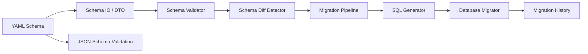

# Design Document

## Overview
本機能は、Strata の Schema-as-Code ワークフローにビュー（View）を統合し、YAML での宣言、検証、差分検出、マイグレーション生成・適用、エクスポートまでを一貫して扱えるようにする。既存のテーブル・ENUM 管理と同様に、ビューもバージョン管理可能なスキーマ要素として扱う。

利用者は、ビュー定義を YAML で記述し、`validate/generate/apply/rollback/status/export` の既存 CLI ワークフローでビューを扱える。SQL パースには踏み込まず、参照関係は `depends_on` の明示宣言により検証することで実装コストと安定性のバランスを取る。

### Goals
- ビュー定義を YAML と JSON Schema に統合し、検証と補完を可能にする
- 既存の差分検出/マイグレーション生成にビュー変更を組み込む
- 依存関係（depends_on）に基づいた検証と適用順序の整合を行う
- 既存 CLI ワークフローとの一貫性を保つ

### Non-Goals
- SQL パーサーによる参照解析
- マテリアライズドビューのサポート（未サポートとしてエラー）
- ビュー定義の意味的最適化や自動チューニング

## Architecture

### Existing Architecture Analysis
- スキーマモデルは `core` クレートで定義され、YAML から DTO を経由してドメインモデルに変換される
- 検証は `schema_validator` サービス群でモジュール化されている
- 差分検出は `schema_diff_detector` で実施され、マイグレーション生成パイプラインへ渡される
- SQL 生成は方言別ジェネレータに委譲される
- 既存ワークフローは `validate/generate/apply/rollback/status/export`

### Architecture Pattern & Boundary Map
**Architecture Integration**:
- Selected pattern: 既存の層分離（CLI → Services → Core → Adapters）を踏襲
- Domain/feature boundaries: View は Schema の一要素として Core に追加し、検証・差分・SQL生成を各サービス層で拡張
- Existing patterns preserved: DTO 変換、バリデーション分割、方言ジェネレータ
- New components rationale: view_validator, view_diff, view_sql_generator など、既存のモジュール構造に合わせた拡張
- Steering compliance: 宣言性・安全性・方言抽象化を維持

### Technology Stack

| Layer | Choice / Version | Role in Feature | Notes |
|-------|------------------|-----------------|-------|
| Frontend / CLI | clap 4.5 | 既存 CLI ワークフロー継続 | 変更なし |
| Backend / Services | Rust 1.92 | 検証/差分/生成の拡張 | 既存構成 |
| Data / Storage | YAML + JSON Schema | View 定義の入力/補完 | 新規キー追加 |
| Infrastructure / Runtime | tokio + sqlx | 既存 DB 操作 | 変更なし |

## System Flows



- View 定義は DTO 変換後に検証され、depends_on に基づく整合チェックと循環検出を実施
- 差分検出では View 追加/更新/削除/rename を抽出
- 方言に応じて `CREATE OR REPLACE` か `DROP+CREATE` を選択

## Requirements Traceability

| Requirement | Summary | Components | Interfaces | Flows |
|-------------|---------|------------|------------|-------|
| 1 | View 定義宣言と YAML/JSON Schema 統合 | Schema Model, Schema IO, JSON Schema | DTO/Serde | Flowchart |
| 2 | depends_on 検証・循環検出 | view_validator | Validation | Flowchart |
| 3 | 差分/マイグレーション生成と方言戦略 | schema_diff_detector, migration_pipeline, sql_generator | Service | Flowchart |
| 4 | apply/rollback/履歴 | database_migrator | Service | Flowchart |
| 5 | export 対応 | database_introspector | Adapter | Flowchart |
| 6 | 既存CLI整合 | CLI commands | CLI | Flowchart |

## Components and Interfaces

| Component | Domain/Layer | Intent | Req Coverage | Key Dependencies (P0/P1) | Contracts |
|-----------|--------------|--------|--------------|--------------------------|-----------|
| View Model | Core | View を Schema の要素として表現 | 1,3 | serde (P0) | State |
| View DTO | Services/Schema IO | YAML/JSON Schema との入出力 | 1,5 | serde-saphyr (P0) | Service |
| view_validator | Services/Validator | depends_on 検証・循環検出 | 2,6 | Schema Model (P0) | Service |
| view_diff | Services/Diff | View 追加/更新/削除/rename | 3 | Schema Model (P0) | Service |
| view_sql_generator | Adapters/SQL | 方言別 SQL 生成 | 3,4 | Dialect (P0) | Service |
| view_migration_stage | Services/Migration | View 用マイグレーション生成 | 3,4 | view_diff (P0) | Service |
| view_export | Adapters/Introspector | DB から View 定義取得 | 5 | sqlx (P0) | Service |
| CLI integration | CLI | コマンド整合 | 6 | existing commands (P0) | CLI |

### Core

#### View Model
| Field | Detail |
|-------|--------|
| Intent | Schema に View を追加し、宣言・差分・生成の基盤とする |
| Requirements | 1,3 |

**Responsibilities & Constraints**
- `View` は `name`, `definition`, `depends_on`, `renamed_from` を保持
- `depends_on` は明示宣言であり、SQL パースは行わない
- `renamed_from` は既存の rename 追跡と同様の扱い

**Contracts**: State

### Services

#### view_validator
| Field | Detail |
|-------|--------|
| Intent | View 依存関係の検証と循環検出 |
| Requirements | 2,6 |

**Responsibilities & Constraints**
- `depends_on` の参照先が `tables/views` に存在するか検証
- 依存グラフを構築し循環を検出（トポロジカルソートで循環判定）
- 依存順序はトポロジカルソート + 宣言順の安定ソートを採用
- `depends_on` 未指定の場合は参照解析を行わない

**Contracts**: Service

#### view_diff
| Field | Detail |
|-------|--------|
| Intent | View 追加/更新/削除/rename の差分抽出 |
| Requirements | 3 |

**Responsibilities & Constraints**
- 差分判定は definition の正規化比較
- 正規化は空白・改行・連続スペースの差異のみを除去する最小ルールとする

**Contracts**: Service

#### view_migration_stage
| Field | Detail |
|-------|--------|
| Intent | View の差分からマイグレーションを生成 |
| Requirements | 3,4 |

**Responsibilities & Constraints**
- 依存順序に基づいて操作順を整合
- 変更時は方言に応じた SQL を生成

**Contracts**: Service

### Adapters

#### view_sql_generator
| Field | Detail |
|-------|--------|
| Intent | 方言別の View SQL 生成 |
| Requirements | 3,4 |

**Responsibilities & Constraints**
- PostgreSQL/MySQL: `CREATE OR REPLACE VIEW`
- SQLite: `DROP VIEW` + `CREATE VIEW`
- 変更時の down.sql には旧定義を含める

**Contracts**: Service

#### view_export (Database Introspector)
| Field | Detail |
|-------|--------|
| Intent | DB から View 定義を取得し Schema へ反映 |
| Requirements | 5 |

**Responsibilities & Constraints**
- 方言差異のある View 定義は警告/エラーとして扱う
- マテリアライズドビューは未サポートでエラー

**Contracts**: Service

## Data Models

### Domain Model
- `Schema` に `views: BTreeMap<String, View>` を追加
- `View` 構造: `name`, `definition`, `depends_on`, `renamed_from`
- 不変条件: `definition` は非空、`name` は命名規則に準拠

### Logical Data Model
**YAML 形式 (例)**:
```yaml
views:
  active_users:
    definition: "SELECT * FROM users WHERE active = true"
    depends_on: [users]
```

**JSON Schema**:
- `views` セクションを追加し `definition` と `depends_on` を定義

## Error Handling

### Error Strategy
- 入力不備は `validate` 時に検出し、既存のレポート形式で返す

### Error Categories and Responses
- User Errors: definition 欠落、依存先不在、循環依存 → 検証エラー
- System Errors: DB 取得失敗、SQL 生成失敗 → 既存の CLI エラー出力
- Destructive Changes: ビュー削除は破壊的変更として扱い、既存ポリシーに従って警告/ブロックを行う

### Monitoring
- 既存の tracing を利用し、View 関連の差分・生成ログを追加

## Testing Strategy

### Unit Tests
- View モデルのシリアライズ/デシリアライズ
- depends_on 検証（存在/不在/循環）
- definition 正規化ルールの比較

### Integration Tests
- 生成されたマイグレーションの SQL（方言別）
- 依存順序の適用順
- rollback の down.sql が旧定義を含むこと

### E2E Tests
- YAML → validate → generate → apply → rollback の一連フロー
- export でビューが YAML に含まれること

## Optional Sections

### Performance & Scalability
- View 定義は軽量であるため特別な性能要件は不要

### Migration Strategy
- 既存スキーマに View を導入する場合、差分生成と apply を段階的に実施
